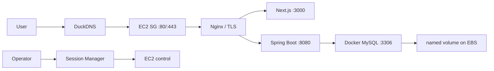

# PawCycle 초기 AWS Production 아키텍처

PawCycle의 초기 AWS Production은 서울 Region의 한 EC2에 Nginx, Next.js, Spring Boot와 MySQL을 Docker Compose로 함께 운영하는 구조였다. 처음부터 Load Balancer, ECS/EKS, Auto Scaling이나 RDS를 도입하지 않았다. 작은 서비스에서 배포 대상과 비용을 단순하게 유지하고, 실제 운영 문제를 측정한 뒤 다음 기술을 선택한다는 원칙이었다.

외부에는 80과 443만 열었다. SSH 22는 기본 폐쇄하고 SSM을 운영 접속 기본 경로로 사용했다. 필요 시 현재 운영자 public IP 한 주소만 임시로 열도록 Runbook에 제한했다. MySQL 3306, Backend 8080과 Frontend 3000은 host public interface에 publish하지 않았다.

## EC2, EBS와 network 선택

OPS-009의 초기 계약은 Ubuntu 24.04, x86_64 `t3.small`, encrypted gp3 40 GiB root EBS, Elastic IP와 IMDSv2 required였다. Root EBS는 instance 종료 시 자동 삭제하지 않도록 두어 실수 종료의 data 손실을 줄였지만, 고아 volume 비용을 별도로 관리해야 했다. 이후 RDS 검토 문서는 Application host를 `t3.medium`으로 기록한다. Instance 확장 시점과 직접 원인은 현재 근거에서 확인하지 못했다.

기존 VPC와 public subnet을 사용했고, 신규 NAT Gateway나 Load Balancer는 만들지 않았다. EC2는 package repository, Docker Hub와 GHCR 같은 외부 endpoint에 outbound internet으로 접근했다. 이 구조는 단순하지만 EC2와 public IPv4 비용, host 방어와 patch 책임이 운영자에게 남는다. 당시 GHCR package의 Public visibility와 anonymous pull 여부는 별도 비민감 근거로 독립 확인되지 않았으므로 public package였다고 확정하지 않는다.

## Compose network와 service 소유권

초기 Production Compose에는 네 service가 있었다.

| Service | Network | Host publish | 영속 상태 |
| --- | --- | --- | --- |
| `proxy` | edge, app | 80, 443 | certificate와 ACME volume read-only |
| `frontend` | app | 없음 | 없음 |
| `backend` | app, data | 없음 | runtime env file |
| `mysql` | data | 없음 | Production named volume |

`app`과 `data` network는 내부 network였다. Frontend는 DB network에 연결하지 않고 Backend만 `mysql:3306`으로 접근했다. Docker network 내부 service name을 datasource host로 사용했으며 TLS는 비활성화했다. Database까지 같은 host 내부에 있었기 때문에 network round trip과 비용은 작았지만 EC2 장애가 Application과 DB를 동시에 중단시킬 수 있었다.

각 container에 health check, restart policy, log rotation과 resource limit을 두었다. 이 limit은 later capacity test에서 중요한 장애 조건이 되었다. Backend의 640 MiB memory limit과 0.75 CPU 계약은 250 RPS에서 cgroup OOM과 연결됐다.

## Nginx, DNS와 HTTPS

Nginx는 TLS를 종료하고 `/api/**`를 Backend, 그 밖의 path를 Frontend로 proxy했다. 인증서 발급 전 bootstrap HTTP, Let's Encrypt HTTP-01, certificate SAN 검증, candidate Nginx config test, HTTPS 활성화와 외부 smoke를 순서대로 수행했다.

HTTPS가 활성화되면 80의 일반 요청은 443으로 redirect하고 ACME challenge path만 유지했다. Container 내부 별도 listener를 release smoke에 사용해 외부 DNS와 무관한 Application route를 확인했고, external HTTPS smoke는 DNS·certificate·Security Group까지 포함한 경계를 검증했다.

Certificate 발급·수동 갱신·재부팅 복구는 실제 운영에서 확인됐다. 다만 자동 갱신 schedule, certificate backup과 unknown Host 외부 검증은 당시 미완료였다. “HTTPS가 한 번 됐다”와 “장기 certificate lifecycle이 자동 운영된다”를 구분했다.

## 단일 EC2 구조의 의미

이 architecture는 초기 운영에 필요한 모든 것을 한 host에 모아 이해와 비용을 줄였다. Application release와 MySQL data를 같은 Compose project에서 볼 수 있고, SSM 하나로 진단할 수 있었다. 반면 다음 책임이 결합됐다.

- EC2/EBS/Docker daemon 장애가 모든 service에 영향을 준다.
- Host memory 부족이 Application, MySQL과 restore 검증 사이의 경쟁으로 이어진다.
- MySQL patch·backup·restore와 volume 보호를 직접 운영한다.
- Blue/Green 없이 single release를 교체하므로 짧은 중단 가능성이 있다.
- High availability, automatic failover와 multi-instance session은 제공하지 않는다.

PawCycle은 이 한계를 추상적인 설계 결함으로만 다루지 않았다. 최초 release는 [PR #59](https://github.com/guseoh/pawcycle-commerce/pull/59)에서 활성화·내외부 HTTP smoke·재부팅 복구까지 확인했고, HTTPS는 저장소 기반을 만든 [PR #60](https://github.com/guseoh/pawcycle-commerce/pull/60)과 실제 발급·갱신·재부팅 복구를 기록한 [PR #61](https://github.com/guseoh/pawcycle-commerce/pull/61)로 준비와 실행 증거를 분리했다. 이후 S3 isolated restore, 실제 Application rollback, EC2 alarm, 별도 Observability host와 RDS 전환을 순서대로 추가했다. RDS 전환은 [[04. Docker MySQL에서 RDS Single-AZ까지]], 전체 선택은 [[09. PawCycle Architecture Decision과 Trade-off]]에서 이어진다.

Architecture snapshot의 직접 근거는 [PR #57](https://github.com/guseoh/pawcycle-commerce/pull/57), [PR #58](https://github.com/guseoh/pawcycle-commerce/pull/58), [PR #64](https://github.com/guseoh/pawcycle-commerce/pull/64)와 역사적 `docs/architecture/production-operations-overview.md`다.
