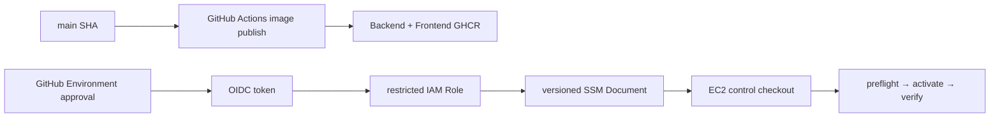
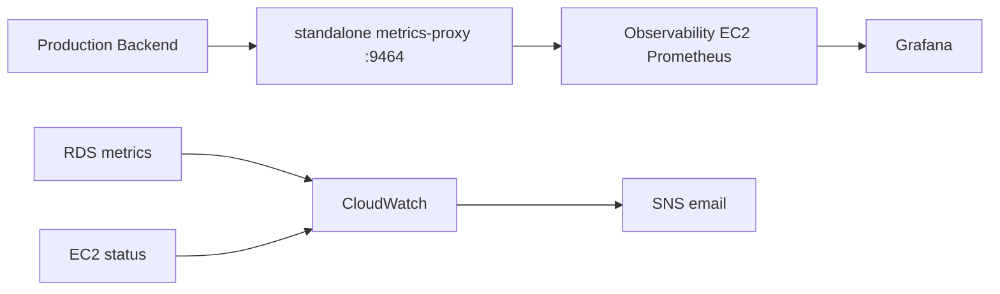

# PawCycle 배포 보안과 관측성

PawCycle의 배포는 “GitHub Actions가 EC2에 SSH해서 Compose를 다시 띄운다”는 구조가 아니었다. Image build, Production 실행 승인, AWS credential, EC2 command와 release activation을 분리했다.

## Release와 Secret 경계

Backend와 Frontend image는 같은 40자 commit SHA tag와 revision label을 사용했다. EC2 preflight는 registry digest를 확인하고 SHA별 image record를 mode 600으로 저장했다. 같은 SHA가 과거와 다른 digest를 가리키면 기존 기록을 덮어쓰지 않고 중단했다. MySQL과 Nginx base image도 digest로 고정했다.

Production Secret은 SSM Parameter Store SecureString에 두고 instance role로 읽었다. Materializer는 MySQL과 Backend env file을 분리했고 Backend에 root password를 넣지 않았다. 새 bundle을 완성한 뒤 current symlink를 교체했으며 file permission, 필수 key, multi-line과 empty value를 검증했다.

이 방식은 Secret을 repository와 image에서 분리했지만 EC2 root-only file에는 평문이 남았다. 따라서 host root compromise까지 해결하는 구조는 아니었다. Runtime env를 log나 issue에 출력하지 않고, Secret value가 아니라 parameter path와 존재 여부만 evidence로 남겼다.

## OIDC와 SSM 배포

[PR #126](https://github.com/guseoh/pawcycle-commerce/pull/126)은 GitHub Environment 승인 뒤 OIDC로 AWS Role을 assume하고 제한된 SSM Document를 호출하는 계약을 추가했다. Workflow input은 target SHA뿐이며 instance ID나 arbitrary shell을 받지 않았다. Target은 고정 tag로 선택하고, Role·Region·Document version은 Environment configuration으로 통제했다.

SSM Document는 immutable version을 전진시키고, 실패하면 GitHub Environment가 가리키는 version을 이전 안정 version으로 되돌렸다. 실제 v1~v6 troubleshooting은 [[06. SSM 배포 자동화 Troubleshooting]]에 정리했다.

Deploy preflight는 현재 release와 target release, Compose/Nginx 계약, runtime bundle, image digest와 migration approval을 running container 변경 전에 확인했다. Activation은 MySQL·Backend·Frontend health, proxy recreate, 내부 `/products`와 `/api/products`, HTTPS 상태를 확인한 뒤 마지막에 `current-sha`를 기록했다. 실패하면 preflight를 통과한 이전 release의 Application image로 복귀했으며 MySQL volume이나 schema를 자동 rollback하지 않았다.

## CloudWatch와 Prometheus/Grafana의 역할

AWS resource에는 CloudWatch를 사용했다. [PR #65](https://github.com/guseoh/pawcycle-commerce/pull/65)은 EC2 `StatusCheckFailed` alarm과 SNS email 계약을 준비했고, [PR #68](https://github.com/guseoh/pawcycle-commerce/pull/68)은 수동 `set-alarm-state`의 ALARM·OK 전이와 email 수신을 실제 확인했다. 이는 notification path 검증이지 실제 EC2 장애 감지·복구 시험은 아니었다. RDS 전환 뒤에는 CloudWatch의 CPUUtilization, DatabaseConnections, FreeableMemory, ReadLatency와 ReadIOPS를 capacity test에 사용했다.

Application signal은 Micrometer/Prometheus/Grafana로 수집했다. JVM heap·non-heap·GC·thread, Hikari active/pending, availability와 business metric을 별도 Observability EC2에서 보았다. Application EC2의 memory 여유가 작아 same-host full stack을 피했다. 이는 장애 영역 분리뿐 아니라 Application host 자원 경쟁을 줄이는 결정이었다.

Production Backend의 actuator endpoint를 public으로 열지 않았다. 별도 `metrics-proxy`가 `/actuator/prometheus`만 전달하고 다른 path는 404로 거부했다. Observability EC2의 Security Group만 private target에 접근하게 했으며 Prometheus와 Grafana UI는 tunnel을 전제로 public port를 열지 않았다.

## 관측성 구축 중 발견한 결함

첫째, Prometheus Compose command가 실제 Docker Compose v5.1.4에서 의도한 shell script 하나가 아니라 여러 argument로 분해됐다. Prometheus가 exit 1로 반복 재시작했고, 명시적인 `sh -ec` exec-form으로 수정하고 rendered command 회귀 검증을 추가했다. [PR #143](https://github.com/guseoh/pawcycle-commerce/pull/143)에 근거가 있다.

둘째, metrics-proxy가 Application release Compose에 포함돼 있었다. Observability bridge 하나를 활성화하려면 최신 control의 Application code와 Flyway 변경까지 함께 가져와야 했고, 관측 작업이 DB migration boundary와 결합됐다. `infra/production-metrics-proxy`를 standalone Compose project로 분리해 기존 Application network를 external로 참조하도록 바꿨다. Backend container가 교체돼 IP가 바뀌어도 Docker DNS로 새 address를 해석하는 lifecycle test를 추가했다.

[Issue #144](https://github.com/guseoh/pawcycle-commerce/issues/144)의 실제 운영 결과는 Application 네 container와 release state, MySQL volume을 바꾸지 않고 metrics-proxy만 추가했고 Prometheus target이 `down → up`으로 전환됐음을 기록한다. 이 시점의 AWS Production Observability는 `Production Verified`였다.

운영 안전성 검증도 배포 성공과 분리했다. [PR #69](https://github.com/guseoh/pawcycle-commerce/pull/69)은 HTTPS origin, TTY credential, CSRF·session rotation과 logout을 확인하는 비파괴 smoke를 준비했고, [PR #73](https://github.com/guseoh/pawcycle-commerce/pull/73)은 실제 Production에서 공개 HTTPS, 익명 거부, 로그인·`/me`, logout과 stale session 거부가 통과했음을 기록했다. [PR #72](https://github.com/guseoh/pawcycle-commerce/pull/72)는 실행 중 Application SHA와 배포 Control SHA를 분리해 보조 운영 script 변경이 Application release identity를 왜곡하지 않도록 했다. 다만 새 Control의 저장소 준비와 실제 Production 채택은 별개였고, PR #75~#77은 그 실행 공백 때문에 전체 운영 기준선 확정을 보류했다.

AWS 종료 뒤 이 실행 경로는 active contract에서 철거됐다. 과거 성공을 현재 실행 가능 상태로 해석하지 않는다.
