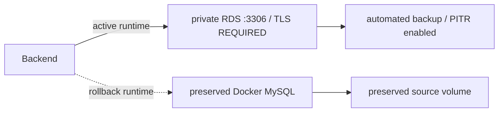

# Docker MySQL에서 RDS Single-AZ까지

PawCycle은 처음부터 RDS를 사용하지 않았다. 초기 Production에서는 Application과 MySQL 8.4가 같은 EC2와 EBS, Docker daemon을 공유했다. 이 구조는 초기 비용과 배포 복잡도를 줄였지만 DB host·engine lifecycle, logical backup과 restore, host 장애를 직접 책임져야 했다.

OPS-013에서 private S3 logical backup과 isolated restore를 실제 검증한 뒤에도 automated backup과 PITR은 없었다. Backup을 만들 수 있다는 사실과 운영 DB가 손상됐을 때 빠르게 복구할 수 있다는 사실은 달랐다. EC2 자체의 장애가 Application과 DB를 함께 멈추는 failure domain도 남았다.

## RDS를 정답으로 두지 않은 비교

[Issue #152](https://github.com/guseoh/pawcycle-commerce/issues/152)는 먼저 세 선택지를 비교했다.

| 기준 | Docker MySQL 유지 | RDS Single-AZ | RDS Multi-AZ |
| --- | --- | --- | --- |
| Host·engine 운영 | 직접 | AWS 관리 범위 확대 | AWS 관리 범위 확대 |
| App/DB host 분리 | 없음 | 있음 | 있음 |
| Automated backup/PITR | 직접 구현 | 제공 가능 | 제공 가능 |
| AZ 장애 자동 failover | 없음 | 없음 | Standby failover |
| Migration 위험 | 없음 | 있음 | 있음 |
| 비용 | 기존 EC2 안에서 작음 | DB instance·storage 비용 | Primary+standby 비용 증가 |
| 전체 HA | 단일 EC2 SPOF | App EC2와 DB가 각각 SPOF | App EC2 SPOF가 그대로 남음 |

결정은 private RDS MySQL 8.4 Single-AZ, 작은 ARM class와 최소 gp3 storage였다. Public access를 끄고 RDS SG inbound 3306 source를 Production EC2 SG로 제한했다. DB subnet group은 RDS 요구에 따라 서로 다른 두 AZ의 isolated subnet을 포함했지만 active DB는 Application EC2와 같은 AZ를 우선했다. 이는 EC2↔RDS cross-AZ data transfer와 latency를 피하려는 선택이었다.

Multi-AZ는 Database HA를 높이지만 Application이 단일 EC2/AZ인 상황에서 end-to-end HA를 만들지는 못한다. 당시 비용과 실제 availability 요구 증거가 부족해 defer했다. Read replica, RDS Proxy, Application multi-instance와 `VERIFY_CA`/`VERIFY_IDENTITY` hardening도 별도 결정으로 남겼다.

지속 결정은 [ARCH-013](https://github.com/guseoh/pawcycle-commerce/blob/df74023e96a3afe37219ecd50d48adac8b7b3c60/docs/adr/ARCH-013-rds-single-az.md), 준비 범위는 [Issue #153](https://github.com/guseoh/pawcycle-commerce/issues/153)과 [PR #154](https://github.com/guseoh/pawcycle-commerce/pull/154)에 있다.

## Network와 datasource 계약

Docker MySQL runtime은 `mysql:3306`과 TLS disabled를 사용했다. RDS runtime은 private RDS endpoint, 3306과 `sslMode=REQUIRED`를 사용했다. 기존 source Docker volume을 rollback source로 유지하기 위해 두 runtime bundle을 독립적으로 materialize했다. Docker와 RDS의 credential이 같을 필요는 없지만 각 bundle 안의 MySQL user/password와 Backend datasource credential은 일치해야 했다.



Read-only preflight는 실제 resource를 바꾸지 않고 EC2/VPC/subnet/orderability와 RDS SG rule을 검사했다. Windows AWS CLI 출력의 CRLF 때문에 실제 SG membership이 맞는데도 비교가 실패한 문제는 별도 수정했다. Resource 생성은 [Issue #157](https://github.com/guseoh/pawcycle-commerce/issues/157)의 명시 승인 아래 수행됐고, private Single-AZ, encryption, 최소 storage와 7일 automated backup retention을 기록했다.

## Rehearsal과 cutover 경계

Migration Runbook은 다음 순서를 정의했다.

```text
base read-only preflight
→ RDS SG 생성 후 full preflight
→ source backup identity와 isolated restore 재확인
→ RDS rehearsal import
→ schema / Flyway / core table manifest 비교
→ Backend datasource rehearsal와 API smoke
→ PRODUCTION_CUTOVER=false evidence
```

Production cutover는 rehearsal과 분리했다. Scheduler와 write를 멈추고 final consistency backup/import를 수행한 뒤 evidence를 `CUTOVER/true`로 다시 만들고, 같은 Application SHA를 RDS runtime으로 활성화하는 구조였다. 실패하면 preserved Docker runtime과 source volume으로 같은 Application SHA를 다시 활성화하도록 했다. Source Docker MySQL과 volume은 stabilization 동안 삭제하지 않았다.

실제 rehearsal 중 materialized env quoting 문제가 발생해 [PR #160](https://github.com/guseoh/pawcycle-commerce/pull/160)으로 수정했다. 이후 same-SHA runtime activation, Scheduler preflight의 잘못된 DB target, MySQL client stdin 문제를 PR #163~165로 수정했다. 상세 실패 과정은 [[07. RDS Migration Troubleshooting]]에 정리했다.

## 실제 전환에 대해 확정할 수 있는 범위

[Issue #158](https://github.com/guseoh/pawcycle-commerce/issues/158)은 최신 조회에서도 Open이고, final consistency import와 cutover 전체를 한 번에 정리한 독립 실행 보고서는 찾지 못했다. 따라서 exact cutover 시각, downtime과 source/target fingerprint 전체를 확정하지 않는다.

그러나 다음 사실은 확인된다.

- PR #163은 실제 Production RDS cutover에서 same-SHA activation이 막힌 결함을 수정한다.
- PR #164는 “Production RDS cutover 이후” Scheduler preflight가 preserved Docker MySQL을 잘못 보던 문제를 수정한다.
- 2026-08-22 [Issue #168](https://github.com/guseoh/pawcycle-commerce/issues/168)의 실제 Production capacity test는 단일 Backend + RDS 경로와 RDS CloudWatch metric을 기록한다.

따라서 8월 22일까지 Production Application이 RDS를 사용했다는 것은 `Production Verified` evidence다. 다만 migration rehearsal과 cutover 절차 전체가 독립적으로 완결됐다고 확대하지 않는다. PITR 설정은 생성 시 적용됐지만 별도 RDS restore exercise와 RPO/RTO 측정은 확인되지 않았다.

AWS 일반 개념은 [[07. RDS MySQL과 Managed Database]]에서 설명한다.
