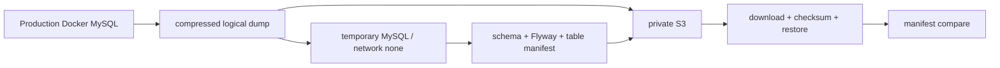

# PawCycle Backup과 Restore 운영

PawCycle의 backup 작업은 S3에 dump를 올리는 것으로 끝나지 않았다. Docker MySQL의 일관된 logical dump를 만들고, 같은 image의 격리 MySQL에 먼저 restore해 schema·Flyway·핵심 table manifest를 만든 뒤, S3에서 다시 내려받은 object set으로 같은 결과가 나오는지 검증했다.

## S3와 IAM 경계

Backup 저장소는 서울 Region의 전용 private S3 bucket이었다. Public Access Block 4개를 적용하고 SSE-S3 `AES256`, versioning disabled, 특정 prefix 14일 lifecycle을 사용했다. Instance role은 bucket 속성 read와 지정 prefix의 object put/get만 허용하고 delete나 wildcard bucket 권한을 넣지 않았다.

Versioning disabled와 14일 보존은 당시 비용·단순성을 우선한 선택이었다. 실수 삭제의 과거 version 복원, cross-region, 장기 archive와 ransomware 관점의 immutable backup을 제공하지 않았다. 이 한계를 완료 보고서에 남겼다.

실제 bucket name, account, role, object key와 backup ID는 repository 밖 운영 기록에서만 관리했다. 이 문서도 그 식별자를 기록하지 않는다.

## Backup과 isolated restore 흐름

Backup은 migration과 DDL이 없는 저부하 시점에만 실행했다. `--single-transaction`, `--quick`, `--skip-lock-tables`를 사용했고, dump 이후 live DB가 아니라 dump를 복원한 임시 DB에서 manifest를 만들었다. 일반 row write가 계속되더라도 dump와 manifest 시점을 맞추기 위한 결정이었다.

Upload 전후 object size, encryption과 SHA-256 checksum을 확인했다. Completion marker는 dump, manifest와 checksum을 모두 올리고 다시 내려받아 검증한 뒤 마지막에 기록했다. Marker가 없는 object set은 restore 입력으로 사용하지 않았다.

임시 restore container는 Production과 같은 pinned MySQL image, `network none`, host port 없음, 고유 named volume과 root-only temporary credential file을 사용했다. Production volume은 mount하지 않았다. Schema fingerprint, Flyway fingerprint/history와 `members`, `products`, `skus`, `subscriptions` count를 비교했지만 raw row와 실제 count 값은 log에 남기지 않았다.

## 2026-07-24 실제 운영 검증

[PR #62](https://github.com/guseoh/pawcycle-commerce/pull/62)가 backup/restore 계약을 준비했고, [PR #63](https://github.com/guseoh/pawcycle-commerce/pull/63)과 [Production verification report](https://github.com/guseoh/pawcycle-commerce/blob/df74023e96a3afe37219ecd50d48adac8b7b3c60/docs/reports/OPS-013/production-verification-2026-07-24.md)는 실제 실행과 미실행 경계를 다음처럼 기록한다.

- S3 Region·owner·PAB·encryption·versioning·lifecycle 계약 PASS
- EC2 instance role 최소 권한 확인
- Production logical backup, upload와 integrity PASS
- S3 재다운로드 object set의 isolated restore PASS
- Schema·Flyway·핵심 table count 일치
- Production MySQL container와 volume 보존
- Temporary restore container·volume·work directory cleanup
- Application 복구 뒤 네 service health와 HTTPS·public API smoke PASS

Host memory가 부족해 proxy·frontend·backend를 잠시 중지했고, 2 GiB temporary swap을 만들었다가 사용량 0 MiB를 확인하고 제거했다. Application 중지 전제는 원래 Runbook의 기본 정책이 아니며 사용자가 짧은 서비스 중단을 승인한 일회성 예외였다. 이 경험은 backup tool의 memory preflight와 “같은 host에서 restore 검증”의 한계를 보여 준다.

## Candidate Production restore 준비

이후 OPS-025는 backup을 새 candidate named volume에 restore하고, write를 중단한 뒤 active MySQL volume을 전환하며 실패하면 source volume으로 복귀하는 Runbook을 준비했다. Source와 candidate volume을 모두 보존하고, `active-mysql-volume` state가 이후 deploy/rollback에서도 조용히 기본 volume으로 되돌아가지 않게 했다.

Application rollback과 DB restore는 분리했다. `rollback.sh`는 Backend/Frontend image만 바꾸고 schema downgrade나 volume 전환을 하지 않는다. DB 복원은 별도 lock, manifest, Application SHA와 외부 HTTPS 검증을 요구했다.

Actual Production DB restore가 실행됐다는 근거는 없다. 따라서 아래는 미검증으로 남긴다.

- Production active DB에 logical restore
- 실제 RTO와 중단 시간
- 자동 backup schedule과 실패 alert
- Cross-region·장기 보존과 versioned recovery
- EBS 또는 source volume 물리 장애에서의 복구
- RDS automated backup의 별도 PITR restore exercise

Backup을 `Verified`로 표현할 수 있지만 Actual Production restore를 `Production Verified`로 표현할 수 없는 이유다. 일반 개념은 [[05. S3 기반 백업과 복구]]를 참고한다.
