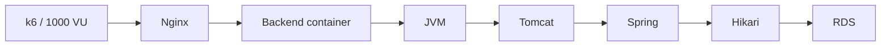

# 250 RPS Production 장애 분석

2026-08-22 PawCycle은 외부 desktop load generator에서 Production public HTTPS의 read-only `GET /api/products`를 단계적으로 호출했다. 목표는 최대 숫자를 만드는 것이 아니라 현재 단일 Backend + RDS 경로의 known-good 단계와 first-failure를 찾는 것이었다.

실행 범위와 원본 결과는 [Issue #168](https://github.com/guseoh/pawcycle-commerce/issues/168)에 있다. Scheduler, runtime, RDS, Secret, DNS와 TLS 설정은 바꾸지 않았고, 실행 전후 Production `READY`, Observability `NORMAL`과 Prometheus target `up`을 확인했다.

## 부하 결과

| Target RPS | Actual RPS | p50 | p95 | p99 | Max | Error | Dropped | 판정 |
| ---: | ---: | ---: | ---: | ---: | ---: | ---: | ---: | --- |
| 25 | 25.00 | 9.55 ms | 14.75 ms | 68.78 ms | 208.06 ms | 0% | 0 | PASS |
| 50 | 50.00 | 9.06 ms | 15.23 ms | 137.72 ms | 358.19 ms | 0% | 0 | PASS |
| 100 | 100.00 | 8.64 ms | 18.06 ms | 45.31 ms | 336.06 ms | 0% | 0 | PASS |
| 150 | 149.99 | 8.55 ms | 16.82 ms | 60.56 ms | 293.12 ms | 0% | 0 | PASS |
| 200 | 199.99 | 8.24 ms | 15.39 ms | 58.27 ms | 181.71 ms | 0% | 0 | PASS |
| 250 | 236.89 | 303.88 ms | 4217.93 ms | 5745.12 ms | 6990.74 ms | 6.88% | 1,572 | FAIL |

이 측정의 known-good step은 200 RPS이고 first-failed step은 250 RPS다. 정확한 saturation threshold는 `200 < threshold <= 250`이며 더 좁히기 위한 추가 부하는 실행하지 않았다. End-to-end 결과에는 desktop, network, Nginx, Backend와 RDS가 모두 포함되므로 236.89 RPS를 Application이나 RDS의 독립 최대 처리량으로 표현하지 않는다.

## 가설을 계층별로 좁힌 순서



250 RPS에서 k6는 1000 active VU 상한에 도달하고 `Insufficient VUs`를 기록했다. 하지만 이는 응답 지연으로 VU가 오래 묶인 결과일 수 있어 root cause로 두지 않았다.

Prometheus 30초 sample에서는 Backend `process_cpu_usage=1.0`, system CPU 약 0.99, Hikari max=10, active peak=10, pending peak=189가 보였다. JVM live thread는 평소 35~46 수준에서 140, 이후 216~217까지 증가했다가 부하 종료와 process restart 뒤 25로 돌아왔다.

처음에는 CPU와 Hikari pool, 작은 RDS가 후보였다. 그러나 Backend container의 `RestartCount=1`과 새 `StartedAt`이 이상 시계열과 일치했다. CPU 최대값 중 일부는 restart 직후 JVM startup을 포함할 수 있어 CPU 포화를 최초 원인으로 확정하지 않았다.

## 결정적 증거: memory cgroup OOM

Kernel log는 같은 시각에 Backend container memory cgroup OOM을 기록했다.

```text
http-nio-8080 worker invoked oom-killer
task=java
Memory cgroup out of memory
Java process killed
```

당시 Backend container limit은 640 MiB, CPU limit은 0.75였고 JVM에는 `MaxRAMPercentage=65.0`과 `ExitOnOutOfMemoryError`가 적용돼 있었다. Kernel evidence의 Java RSS는 약 646 MiB anon과 26 MiB file이었다.

Prometheus의 JVM memory는 heap used 약 274 MiB / max 약 402 MiB, non-heap used 약 152 MiB였다. Heap이 max에 도달한 전형적 Java heap OOM이 아니었다. Heap과 non-heap 외에도 thread native stack, code cache/JIT, libc/native allocation, TLS/socket buffer가 container memory에 포함된다. Thread가 217까지 증가하고 Hikari pending이 189였으므로 request queueing과 native memory pressure가 640 MiB cgroup limit 초과에 기여했을 가능성이 컸다.

증거로 확인되는 시간 흐름은 `부하와 응답 지연 증가 → thread·Hikari pending 증가 → memory cgroup OOM 기록 → Java kill → Backend restart`다. 다만 thread 증가가 OOM에 기여한 정확한 byte 수나 Hikari 대기가 최초 trigger였다는 사실까지 계측한 것은 아니다. 그래서 동시성·native memory pressure는 기여 가능성으로 두고, kernel OOM과 restart만 직접 failure mechanism으로 확정했다.

Root cause 수준의 판정은 다음과 같았다.

- 직접 failure mechanism: Backend container memory cgroup OOM
- 결과: kernel이 Java process kill, restart policy가 Backend 재시작
- 동반 압력: Hikari active 10/max 10, pending 189, JVM thread 217
- heap 자체 max 도달: 근거 없음
- CPU가 최초 원인: 재시작 영향 때문에 확정하지 않음

## RDS 병목 가설을 버린 근거

같은 구간의 RDS CloudWatch metric은 다음 범위였다.

- CPUUtilization: 약 8.35~11.69%
- DatabaseConnections: 10
- FreeableMemory: 약 165.9~183.6 MB
- ReadLatency: 대부분 0, 관측 최대 약 1.54 ms
- ReadIOPS: 대부분 매우 낮고 관측 최대 약 1.35 IOPS

`DatabaseConnections=10`은 Hikari max 10과 일치했지만 RDS connection capacity가 10에서 포화됐다는 뜻은 아니었다. RDS CPU, latency와 IOPS에 saturation evidence가 없었다. 따라서 작은 `db.t4g.micro`라는 configuration만으로 RDS를 확장하지 않았고, first bottleneck은 Backend container memory로 판정했다.

Hikari pending은 실제 Application 내부 대기를 보여 주지만 pool size 자체가 root cause라는 뜻도 아니다. Pool을 키우면 DB concurrency와 thread/native memory pressure가 더 커질 수 있다. 다음 분석은 request concurrency, Tomcat thread, connection hold time과 container/JVM memory budget을 같은 workload에서 분리하는 것이어야 했다.

## 장애 종료와 재발 방지 경계

부하 뒤 Backend는 healthy로 복구됐고 API, metrics proxy, release coordination, Production `READY`, Observability `NORMAL`과 Prometheus target `up`을 확인했다. 설정을 즉석에서 키우거나 RDS scale-up을 하지 않았다.

이 사례의 핵심은 metric을 많이 모은 것이 아니라 가설을 버릴 근거를 함께 사용한 것이다. Client VU 부족, CPU 100%, Hikari pending과 작은 RDS 모두 그럴듯했지만, kernel OOM log와 restart timestamp가 직접 failure mechanism을 확정했고 RDS metric이 DB saturation 가설을 배제했다.

관련 일반 학습은 [[08. CloudWatch와 계층별 관측성]]과 [[10. 비용과 가용성과 장애 대응]]을 참고한다.
