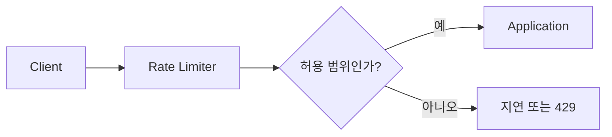
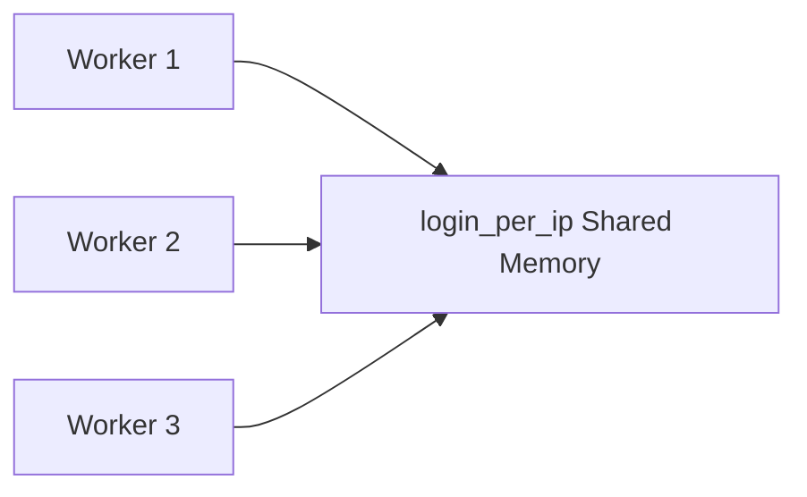

# 로그인 보안과 Rate Limiting

PawCycle에서 로그인 보안을 강화하려고 할 때 가장 먼저 떠올릴 수 있는 방법 중 하나가 **Rate Limiting(요청 속도 제한)**이다. 하지만 단순히 “로그인 요청을 몇 번 이상 보내면 막는다” 정도로 이해하면, 왜 이 기능이 필요한지와 어떤 문제를 해결하는지 제대로 판단하기 어렵다.

Rate Limiting은 보안 기능이면서 동시에 **서비스의 자원을 보호하는 트래픽 제어 기법**이다. 특히 로그인 요청은 일반 조회 API와 다르게 비밀번호 검증이라는 계산 비용이 들어가고, 공격자가 인증 정보를 반복해서 시험할 수 있는 지점이기 때문에 별도의 보호가 필요하다.

이 글에서는 먼저 로그인 Endpoint가 왜 공격 대상이 되는지 살펴보고, Brute Force·Password Spraying·Credential Stuffing이 어떻게 다른지 구분한다. 그 다음 비밀번호 해시인 BCrypt가 왜 일부러 느리게 동작하는지, 그 특성이 왜 Rate Limiting 필요성과 연결되는지 설명한다. 마지막으로 Rate Limiting의 기본 원리와 Nginx의 `limit_req`가 요청을 어떤 방식으로 제어하는지까지 이어서 본다.

PawCycle에 실제로 어떤 코드를 적용하는지는 별도 문서인 [[02. PawCycle 로그인 Rate Limiting 적용]]에서 다룬다.

---

## 로그인 Endpoint가 특별히 보호되어야 하는 이유

웹 애플리케이션에는 수많은 Endpoint가 있다. 상품 목록을 조회하거나 카테고리를 조회하는 API도 있고, 주문을 생성하거나 결제를 승인하는 API도 있다. 그중 로그인 Endpoint는 사용자가 **자신이 누구인지 증명하는 인증 경계(Authentication Boundary)**라는 점에서 조금 다르다.

로그인 요청은 보통 다음과 같은 구조를 가진다.

```text
Client
  ↓
로그인 ID 또는 Email
Password
  ↓
Authentication Logic
  ↓
사용자 조회
Password Hash 비교
  ↓
성공 또는 실패
```

정상 사용자는 자신의 계정 정보로 몇 번 정도 로그인할 뿐이다. 반면 공격자는 이 Endpoint를 자동화해서 수천 번, 수만 번 호출할 수 있다. 로그인 Endpoint가 아무 제한 없이 요청을 받아들인다면 공격자는 서버가 허용하는 최대 속도까지 인증 정보를 계속 시험할 수 있다.

여기서 중요한 점은 “로그인을 여러 번 시도한다”는 하나의 표현 안에 서로 다른 공격이 섞여 있다는 것이다.

### Brute Force

**Brute Force(무차별 대입 공격)**는 하나의 계정에 대해 많은 비밀번호 후보를 계속 대입하는 방식이다.

예를 들어 공격자가 `user@example.com`이라는 계정을 알고 있다고 가정하자.

```text
user@example.com + password1
user@example.com + password2
user@example.com + password3
user@example.com + qwer1234
user@example.com + ...
```

공격자는 정답을 모르기 때문에 가능한 후보를 계속 바꿔 가며 시도한다. 사용자의 비밀번호가 짧거나 흔한 패턴이면 성공 확률이 높아질 수 있다.

Brute Force에서 공격의 중심은 **하나의 계정에 많은 비밀번호를 시도한다는 점**이다.

> 참고 자료  
> - [OWASP Authentication Cheat Sheet](https://cheatsheetseries.owasp.org/cheatsheets/Authentication_Cheat_Sheet.html) — 로그인 Throttling과 인증 공격 방어의 기준을 확인하기 좋다.  
> - [무차별 대입 공격 탐지 원리와 실무 대응 로그 분석](https://myitnotepad.tistory.com/entry/BruteForce-%EA%B3%B5%EA%B2%A9%EC%9D%B4%EB%9E%80) — Brute Force가 실제 로그에서 어떻게 보이는지 한글로 살펴보기 좋다.

### Password Spraying

**Password Spraying**은 방향이 반대다. 하나의 계정에 수많은 비밀번호를 넣는 것이 아니라, 공격자가 몇 개의 흔한 비밀번호를 정한 뒤 많은 계정에 넓게 뿌린다.

```text
password = "Password123!"

user1@example.com → 실패
user2@example.com → 실패
user3@example.com → 성공?
user4@example.com → 실패
...
```

왜 이렇게 할까?

서비스가 “한 계정에서 로그인 실패 5회가 발생하면 잠금” 같은 정책을 사용한다고 가정해 보자. 하나의 계정에 비밀번호를 수백 개 넣으면 금방 차단될 수 있다. 하지만 계정을 계속 바꾸면서 각 계정에는 한두 번만 요청하면 단순한 계정별 실패 횟수 제한을 우회하기 쉬워진다.

따라서 로그인 보안을 설계할 때는 단순히 **계정 하나에서 몇 번 실패했는가**만 보는 것으로 모든 공격을 막을 수 없다.

### Credential Stuffing

**Credential Stuffing(크리덴셜 스터핑)**은 비밀번호를 추측하는 공격과 성격이 조금 다르다.

공격자는 다른 서비스에서 이미 유출된 ID와 비밀번호 조합을 확보하고, 그 조합을 그대로 다른 서비스의 로그인 화면에 자동으로 대입한다.

```text
다른 서비스에서 유출

user1@example.com / qwer1234!
user2@example.com / hello123!
user3@example.com / pawpaw2025!

              ↓

PawCycle 로그인 API에 자동 대입
```

사용자가 여러 사이트에서 같은 비밀번호를 재사용했다면 공격자는 비밀번호를 새로 알아낼 필요가 없다. 이미 유출된 조합이 그대로 동작하는지만 확인하면 된다.

이 공격이 중요한 이유는 **IP 하나당 몇 번** 같은 단순한 제한으로 완전히 막기 어렵기 때문이다. 현대적인 Bot은 여러 IP나 Proxy를 사용해서 로그인 요청을 분산시킬 수 있다. 따라서 IP 기반 Rate Limiting은 Credential Stuffing의 전체 해결책이라기보다 **첫 번째 방어선**이라고 보는 것이 정확하다.

> 참고 자료  
> - [Credential Stuffing이란? - Cloudflare](https://www.cloudflare.com/learning/bots/what-is-credential-stuffing/) — Credential Stuffing과 Brute Force의 차이를 그림과 함께 설명한다.  
> - [Credential Stuffing 정리 - IT 공부 블로그](https://madash.tistory.com/category/%EB%B3%B4%EC%95%88%EC%9A%A9%EC%96%B4) — 한글로 공격 방식과 탐지 포인트를 보기 좋다.  
> - [Authentication Failures Secure Coding](https://aiarchitect.tistory.com/59) — Brute Force, Credential Stuffing, Password Spraying, Enumeration을 서로 다른 공격 축으로 비교한다.

---

## 계정 존재 여부도 정보가 될 수 있다

로그인 실패 응답을 만들 때 흔히 다음과 같이 구현하고 싶어진다.

```java
Member member = memberRepository.findByEmail(email)
    .orElseThrow(InvalidCredentialsException::new);

if (!passwordEncoder.matches(password, member.getPasswordHash())) {
    throw new InvalidCredentialsException();
}
```

겉으로 보면 틀린 코드가 아니다. 존재하지 않는 회원은 실패시키고, 존재하는 회원은 비밀번호를 확인한다.

하지만 처리 시간이 달라질 수 있다.

```text
존재하지 않는 Email
→ DB 조회
→ 바로 실패
→ 비교적 빠름

존재하는 Email + 틀린 Password
→ DB 조회
→ BCrypt 비교
→ 실패
→ 상대적으로 느림
```

공격자가 단 한 번의 요청만 보고 회원 존재 여부를 알아내기는 어렵다. 하지만 요청을 여러 번 보내고 평균 응답 시간을 비교하면 통계적으로 차이를 추측할 가능성이 생긴다.

이처럼 공격자가 시스템의 응답 메시지, 상태 코드, 처리 시간 같은 차이를 통해 **어떤 계정이 실제로 존재하는지 알아내는 것**을 Account Enumeration(계정 열거) 문제와 연결해서 볼 수 있다.

그래서 로그인 실패 응답은 보통 다음 두 가지를 지향한다.

첫째, “이메일이 없습니다”와 “비밀번호가 틀렸습니다”를 외부에 구분해서 알려주지 않는다. 사용자는 둘 다 “인증 정보가 올바르지 않습니다”처럼 동일한 실패를 받는다.

둘째, 가능한 경우 내부 처리 경로의 차이도 줄인다. 존재하지 않는 사용자에게도 실제 비밀번호 Hash와 비슷한 비용의 dummy Hash를 비교하도록 만들어 처리 시간 차이를 줄일 수 있다.

PawCycle은 현재 이 방식을 사용한다. 실제 프로젝트 연결은 두 번째 문서에서 코드를 직접 보며 설명한다.

> 참고 자료  
> - [OWASP Authentication Cheat Sheet - Authentication Responses](https://cheatsheetseries.owasp.org/cheatsheets/Authentication_Cheat_Sheet.html) — 사용자 존재 여부를 노출하지 않는 일반화된 인증 실패 응답을 설명한다.

---

## BCrypt는 왜 일부러 느리게 동작하는가

Rate Limiting을 이해하려면 PawCycle이 사용하는 **BCrypt**를 같이 이해해야 한다.

일반적인 Hash 함수에서 빠른 계산은 장점이다. 파일 무결성을 검사하거나 데이터의 식별값을 만들 때는 같은 입력을 빠르게 Hash로 바꿀 수 있을수록 처리량이 높아진다.

하지만 비밀번호 저장에서는 상황이 다르다.

공격자가 DB를 탈취해 다음과 같은 Hash 값을 얻었다고 생각해 보자.

```text
사용자 비밀번호 Hash = X
```

공격자는 원본 비밀번호를 직접 복호화하는 대신 후보 비밀번호를 계속 Hash해서 비교할 수 있다.

```text
"123456"      → Hash → X와 비교
"password"    → Hash → X와 비교
"qwer1234"    → Hash → X와 비교
...
```

Hash 계산이 지나치게 빠르면 공격자도 후보를 매우 빠르게 시험할 수 있다.

그래서 BCrypt 같은 **Password Hashing Function**은 일반 Hash와 달리 의도적으로 계산 비용을 높인다. 비밀번호 하나를 검증하는 데 일정한 CPU 비용을 들게 만들어 공격자가 대량의 후보를 시험하기 어렵게 만드는 것이다.

이것이 비밀번호 보호에는 좋은 특성이다.

하지만 서버 입장에서 보면 다른 의미도 생긴다.

```text
로그인 요청 1회
→ BCrypt 계산 1회

로그인 요청 10,000회
→ BCrypt 계산 10,000회
```

즉 공격자가 로그인 Endpoint를 반복 호출하면 계정 탈취 시도뿐 아니라 서버 CPU를 계속 소비시킬 수 있다. 특히 PawCycle처럼 존재하지 않는 계정에도 dummy BCrypt 비교를 수행하면, 공격자가 임의의 이메일을 보내도 일정한 BCrypt 비용이 발생한다.

이것은 dummy Hash 설계가 잘못됐다는 뜻이 아니다. Account Enumeration을 줄이는 방어와 CPU 보호는 서로 다른 문제다.

```text
dummy BCrypt
→ 계정 존재 여부 추측을 어렵게 함

Rate Limiting
→ 무제한 BCrypt 호출을 줄임
```

두 방어는 서로 대체하는 관계가 아니라 **서로 다른 공격 면을 보호하는 계층적 방어**라고 이해하는 것이 좋다.

> 참고 자료  
> - [Spring Security Password Storage](https://docs.spring.io/spring-security/reference/features/authentication/password-storage.html) — BCrypt 같은 adaptive one-way function을 왜 사용하는지 설명한다.  
> - [OWASP Password Storage Cheat Sheet](https://cheatsheetseries.owasp.org/cheatsheets/Password_Storage_Cheat_Sheet.html) — 비밀번호 Hash가 공격자의 대입 비용을 높이는 이유를 확인하기 좋다.

---

## Rate Limiting은 무엇을 제한하는가

**Rate Limiting**은 일정한 시간 동안 특정 주체가 요청할 수 있는 속도나 양을 제한하는 기법이다.

예를 들어 IP 주소를 기준으로 제한한다면 개념적으로 다음과 같은 상태를 관리한다.

```text
203.0.113.10 → 현재 요청 상태
203.0.113.11 → 현재 요청 상태
203.0.113.12 → 현재 요청 상태
```

그리고 정책이 허용하는 속도를 초과하면 요청을 늦추거나 거부한다.



여기서 중요한 것은 “보안 공격만 막는 기능”으로 좁게 생각하지 않는 것이다.

Rate Limiter는 다음과 같은 목적으로 사용할 수 있다.

- 로그인 자동화 공격의 속도를 줄인다.
- API를 무제한 호출하는 Client를 제한한다.
- 특정 Backend나 외부 API가 감당할 수 있는 처리량을 넘지 않도록 보호한다.
- 순간적인 트래픽 폭증이 전체 서비스 장애로 전파되는 것을 줄인다.

LINE Engineering의 Rate Limiter 사례에서도 핵심 목적은 컴포넌트에 과부하가 걸리지 않게 하면서 전체 서비스 품질을 유지하는 것이다. PawCycle은 LINE처럼 초대규모 분산 Rate Limiter가 필요한 것은 아니지만, **Rate Limiter를 왜 시스템 보호 장치로 보는지** 이해하는 데 좋은 사례다.

> 참고 자료 / 그림  
> - [LINE Engineering - 고 처리량 분산 비율 제한기](https://engineering.linecorp.com/ko/blog/high-throughput-distributed-rate-limiter/) — Rate Limiter를 서비스 과부하 보호 관점에서 설명하며 여러 구조 그림이 포함돼 있다.  
> - [Cloudflare - Rate Limiting](https://www.cloudflare.com/ko-kr/application-services/products/rate-limiting/) — 로그인 Brute Force와 API 남용을 Rate Limiting이 어떻게 완화하는지 한글로 설명하고 작동 방식 그림을 제공한다.

---

## 무엇을 기준으로 요청을 묶을 것인가

Rate Limiter는 요청만 세면 되는 것처럼 보이지만 먼저 결정해야 하는 것이 있다.

**누구의 요청을 같은 그룹으로 계산할 것인가?**

이 기준을 Key라고 생각할 수 있다.

가장 단순한 방법은 Client IP다.

```text
Key = IP

203.0.113.10 → 자신의 Rate 상태
203.0.113.11 → 자신의 Rate 상태
```

인증 전 로그인 Endpoint에서는 아직 “이 요청이 실제 어느 Member의 요청인지” 신뢰할 수 없기 때문에 IP는 사용하기 쉬운 Key다.

하지만 IP는 사람과 일대일 대응하지 않는다.

회사, 학교, 통신사 NAT 환경에서는 여러 사용자가 하나의 공인 IP를 공유할 수 있다.

```text
User A ─┐
User B ─┼→ NAT → 하나의 Public IP
User C ─┘
```

반대로 공격자는 여러 Proxy나 Bot을 사용해 IP를 분산할 수 있다.

```text
Bot A / IP A ─┐
Bot B / IP B ─┼→ 같은 계정 공격
Bot C / IP C ─┘
```

따라서 IP 기반 Rate Limiting은 구현하기 쉬운 1차 방어지만 완벽한 사용자 식별 수단은 아니다.

이 한계를 이해하지 않고 “IP당 10회면 Credential Stuffing이 해결된다”고 생각하면 안 된다.

> 참고 자료  
> - [Cloudflare Rate Limiting Best Practices](https://developers.cloudflare.com/waf/rate-limiting-rules/best-practices/) — 로그인 Endpoint에서 IP 기반 제한을 사용하는 예와 여러 단계의 방어 전략을 볼 수 있다.  
> - [Cloudflare - Private Rate Limiting](https://blog.cloudflare.com/private-rate-limiting/) — IP 기반 제한이 공유 IP 사용자에게 부작용을 만들 수 있다는 점을 설명한다.

---

## Rate Limiting 알고리즘을 왜 알아야 하는가

“1분에 10회”라는 말은 단순해 보이지만 실제 구현 방식에 따라 요청이 허용되는 모습이 달라진다.

대표적인 알고리즘으로는 Fixed Window, Sliding Window, Token Bucket, Leaky Bucket 등이 있다.

여기서는 모든 알고리즘을 깊게 공부하는 것이 목적이 아니다. PawCycle에서 Nginx `limit_req`를 사용할 때 필요한 정도만 구분한다.

### Fixed Window

예를 들어 1분 단위로 Counter를 관리한다.

```text
12:00:00 ~ 12:00:59 → 최대 10개
12:01:00 ~ 12:01:59 → 최대 10개
```

구현은 단순하지만 Window 경계 문제가 있다.

12:00:59에 10개 요청을 보내고 12:01:00에 다시 10개를 보내면 매우 짧은 시간에 20개가 통과할 수 있다.

### Token Bucket

일정 속도로 Token을 채우고 요청 하나가 Token 하나를 사용한다고 생각할 수 있다.

```text
Bucket: [● ● ● ● ●]

요청 1개
→ Token 하나 사용

시간 경과
→ Token 다시 보충
```

Bucket에 Token이 쌓여 있다면 순간적인 Burst를 허용할 수 있다는 특징이 있다.

### Leaky Bucket

물이 들어오고 일정한 속도로 빠져나가는 통을 생각하면 이해하기 쉽다.

```text
요청 요청 요청
 ↓    ↓    ↓

┌───────────┐
│ 요청 대기  │
│ 요청 대기  │
└─────┬─────┘
      ↓
   일정 속도
```

입력 요청이 순간적으로 몰려도 처리 속도를 평탄하게 만드는 데 초점을 둔다.

Nginx 공식 설명은 `limit_req`를 **Leaky Bucket 방식**으로 설명한다. 다만 `burst`, `nodelay` 옵션을 어떻게 사용하는지에 따라 사용자에게 보이는 처리 방식은 단순한 “항상 줄 세워서 일정 간격으로 처리”와 달라질 수 있다.

> 참고 자료  
> - [Nginx 공식 - ngx_http_limit_req_module](https://nginx.org/en/docs/http/ngx_http_limit_req_module.html) — Nginx Rate Limiting 동작의 기준 문서다.  
> - [Rate Limiter 알고리즘 정리](https://wo-dbs.tistory.com/421) — Fixed Window, Sliding 방식, Token Bucket, Leaky Bucket의 차이를 한글로 비교하기 좋다.

---

## Nginx의 `limit_req_zone`은 무엇을 정의하는가

Nginx에서 요청 제한을 만들 때 먼저 다음과 같은 설정을 볼 수 있다.

```nginx
limit_req_zone $binary_remote_addr
    zone=login_per_ip:10m
    rate=10r/m;
```

이 코드는 실제 요청을 즉시 차단하는 코드라기보다, **어떤 기준으로 요청 상태를 기억하고 어떤 Rate를 사용할지 정의하는 코드**다.

세 부분을 나눠서 보자.

### `$binary_remote_addr`

Rate Limiting Key로 Client IP를 사용한다.

`$remote_addr`도 IP 주소를 표현하지만 문자열 형태다. `$binary_remote_addr`는 주소를 고정 크기의 Binary 형태로 저장해서 Shared Memory를 효율적으로 사용할 수 있다.

### `zone=login_per_ip:10m`

Nginx는 Client별 상태를 기억해야 한다.

```text
login_per_ip shared memory

IP A → 제한 상태
IP B → 제한 상태
IP C → 제한 상태
```

이 상태를 저장하는 Shared Memory Zone의 이름을 `login_per_ip`, 크기를 10MB로 잡겠다는 뜻이다.

Shared Memory라는 점이 중요하다. Nginx는 여러 Worker Process가 요청을 처리할 수 있기 때문이다.



Worker마다 별도의 Rate 상태를 갖는다면 같은 IP의 요청이 서로 다른 Worker로 분배됐을 때 제한 기준이 흔들릴 수 있다. Shared Zone을 사용하면 Worker들이 같은 상태를 바라본다.

### `rate=10r/m`

장기적으로 허용할 요청 속도를 설정한다.

`10r/m`은 문자 그대로 **분당 10 Requests의 Rate**를 의미한다.

다만 이것을 “매분 Counter를 0으로 초기화하는 Fixed Window”로 이해하면 안 된다. Nginx는 `limit_req`를 Leaky Bucket 기반으로 설명하며, excess 요청 상태를 시간에 따라 계산한다.

그래서 실제 사용자 경험을 결정하려면 `rate`만 보지 말고 `burst`와 `nodelay`까지 함께 봐야 한다.

---

## `burst`는 정상적인 순간 요청을 위한 여유다

사용자는 항상 일정한 간격으로 요청하지 않는다.

로그인을 예로 들면 사용자가 비밀번호를 잘못 입력하고 곧바로 다시 시도할 수 있다.

```text
로그인 시도
→ 오타 발견
→ 2초 뒤 다시 시도
→ Caps Lock 확인
→ 다시 시도
```

평균 Rate를 매우 엄격하게 적용하면 정상 사용자의 이런 짧은 Burst도 불편하게 만들 수 있다.

그래서 Nginx는 `burst`를 제공한다.

```nginx
limit_req zone=login_per_ip burst=5;
```

이 설정에서 `burst=5`는 Rate를 넘어선 excess 요청을 어느 정도까지 허용할지를 정한다.

단, `nodelay`가 없는 기본 동작에서는 excess 요청을 모두 즉시 Backend로 보내는 것이 아니라 Rate에 맞춰 지연시킬 수 있다.

---

## `nodelay`를 넣으면 무엇이 달라지는가

```nginx
limit_req zone=login_per_ip burst=5 nodelay;
```

`nodelay`를 사용하면 Burst 범위 안의 요청을 Rate 간격에 맞춰 기다리게 하지 않고 즉시 처리할 수 있다.

사용자 입장에서는 다음처럼 이해하면 된다.

```text
허용 가능한 순간 Burst
→ 기다리지 않고 통과

Burst 한도까지 모두 사용한 상태에서 추가 요청
→ 거절
```

여기서 중요한 것은 `nodelay`가 Rate Limiting을 꺼버리는 옵션이 아니라는 점이다. Burst 슬롯을 즉시 사용할 수 있게 하지만 Nginx는 excess 상태를 계속 추적하고, 시간이 지나 Rate에 맞게 여유가 회복돼야 다시 지속적으로 요청을 받을 수 있다.

즉 `rate`, `burst`, `nodelay`는 서로 별개의 값이 아니라 함께 이해해야 한다.

> 참고 자료  
> - [Nginx 공식 - Rate Limiting](https://nginx.org/en/docs/http/ngx_http_limit_req_module.html) — `burst`, `nodelay`, `delay`, `limit_req_status`의 정확한 정의를 확인한다.  
> - [2GB 서버를 지키는 가장 싼 방법 Rate Limiter 도입기](https://wo-dbs.tistory.com/422) — Nginx `burst + nodelay`를 실제 저사양 서버 보호에 적용한 한글 사례다.

---

## `rate`, `burst`, `nodelay`를 시간축으로 이해하기

이 세 옵션은 문장으로만 읽으면 쉽게 오해한다. 특히 `rate=10r/m`을 “1분 동안 10개까지는 아무 때나 통과한다”라고 이해하면 Nginx의 실제 동작과 차이가 생긴다.

`10r/m`은 평균적으로 약 6초에 한 요청을 처리할 수 있는 Rate다. 여기에 `burst=5 nodelay`를 함께 사용하면 정상적인 순간 요청 몇 개를 바로 통과시킬 수 있지만, 그 순간 사용한 여유가 즉시 사라지는 것은 아니다. 시간이 지나 Rate에 맞춰 excess 상태가 줄어들어야 다시 여유가 생긴다.

예를 들어 한 IP에서 아주 짧은 순간에 로그인 요청이 연속으로 들어온다고 생각해 보자.

```text
rate = 10r/m  → 평균적으로 6초에 1개 수준
burst = 5
nodelay

0.0초  요청 A
0.1초  요청 B
0.2초  요청 C
0.3초  요청 D
0.4초  요청 E
0.5초  요청 F
0.6초  요청 G ...
```

첫 요청은 현재 Rate에 따라 정상 처리된다. 뒤이어 거의 동시에 들어온 요청은 `burst`가 허용하는 excess 범위 안이라면 `nodelay` 때문에 기다리지 않고 바로 통과할 수 있다. 하지만 짧은 시간에 요청이 계속 들어와 excess가 `burst` 한도를 넘으면 이후 요청은 거절된다.

여기서 핵심은 `burst=5`를 단순히 “항상 추가로 5개를 공짜로 허용한다”라고 생각하지 않는 것이다. Burst는 **순간적인 초과 요청을 흡수하는 여유**이고, 사용한 여유는 설정된 Rate에 따라 시간이 지나면서 회복된다.

따라서 다음 두 Client는 같은 총 요청 수를 보내더라도 다르게 보일 수 있다.

```text
Client A
1분 동안 요청을 드문드문 보냄
→ Rate 상태가 시간에 따라 회복될 여지가 큼

Client B
1초 안에 요청을 몰아서 보냄
→ Burst를 빠르게 소모
→ 한도를 넘으면 거절될 가능성이 큼
```

이 차이가 바로 Rate Limiting을 단순한 “분당 Counter”로 보면 안 되는 이유다.

> 참고 자료
> - [Nginx 공식 - ngx_http_limit_req_module](https://nginx.org/en/docs/http/ngx_http_limit_req_module.html) — excess 요청을 Rate에 따라 처리하고 `burst`, `nodelay`가 어떻게 영향을 주는지 확인한다.
> - [Rate Limiter - Leaky Bucket과 nodelay](https://wo-dbs.tistory.com/421) — 시간 간격과 Burst를 한글 예제로 이해하기 좋다.

## Rate Limiting과 Account Lockout은 같은 기능이 아니다

로그인 공격을 막는 방법으로 “비밀번호를 5번 틀리면 계정을 30분 잠근다” 같은 Account Lockout도 떠올릴 수 있다. 하지만 Rate Limiting과 목적과 위험이 다르다.

Rate Limiting은 **요청의 속도**를 제한한다. 예를 들어 하나의 IP가 너무 빠르게 로그인 요청을 반복하면 일정 속도 이상을 막는다.

Account Lockout은 **계정 자체의 인증 가능 상태**를 바꾼다. 실패 횟수가 일정 기준을 넘으면 정상 비밀번호를 입력해도 일정 시간 로그인할 수 없게 한다.

Account Lockout은 한 계정에 대한 Brute Force에는 강한 방어가 될 수 있지만 새로운 위험도 만든다. 공격자가 피해자의 Email만 알고 있어도 일부러 틀린 비밀번호를 반복해서 계정을 잠그면, 계정을 탈취하지 않고도 정상 사용자의 로그인을 막는 서비스 거부 상황을 만들 수 있다.

```text
공격자
→ victim@example.com + 틀린 비밀번호 반복
→ 계정 잠금
→ 실제 사용자는 정상 비밀번호를 알아도 로그인 불가
```

따라서 PawCycle처럼 아직 로그인 공격에 대한 운영 데이터가 없는 단계에서는 계정 상태를 바꾸는 강한 정책부터 넣기보다, Public Ingress에서 반복 요청의 속도를 줄이는 Rate Limiting을 먼저 검토하는 것이 더 작은 변경이다.

나중에 실제 공격 패턴이 확인되면 IP, 계정, Device 신호, MFA 등을 결합한 더 강한 방어를 검토할 수 있지만 그것은 별도의 근거가 필요한 다음 단계다.

> 참고 자료
> - [OWASP Authentication Cheat Sheet - Login Throttling](https://cheatsheetseries.owasp.org/cheatsheets/Authentication_Cheat_Sheet.html) — 로그인 실패 제한과 Account Lockout의 주의점을 함께 설명한다.

## 왜 429 Too Many Requests를 사용하는가

Rate Limit에 걸린 요청은 애플리케이션 자체가 고장 난 요청과 의미가 다르다.

`503 Service Unavailable`은 일반적으로 서버가 현재 요청을 정상 처리할 수 없는 상태를 나타낸다.

반면 `429 Too Many Requests`는 Client가 일정 시간 안에 너무 많은 요청을 보냈다는 의미를 표현한다.

```text
503
→ 서비스 자체가 현재 가용하지 않음

429
→ Client의 요청 빈도가 허용 범위를 초과함
```

로그인 Rate Limiting은 후자의 의미가 더 정확하다.

Nginx `limit_req`의 기본 reject status는 503이기 때문에 API 의미를 분명하게 하려면 다음처럼 명시할 수 있다.

```nginx
limit_req_status 429;
```

이렇게 하면 Frontend나 운영 로그에서도 “Backend 장애”와 “Rate Limit 정책에 의한 거절”을 구분하기 쉬워진다.

---

## Rate Limiting만으로 로그인 보안이 끝나지는 않는다

IP 기반 Rate Limiting은 값싼 1차 방어다. 그렇지만 이것 하나만으로 모든 인증 공격을 막을 수는 없다.

공격자가 IP를 분산하면 각 IP는 제한 이하의 요청만 보내면서 전체 공격량을 늘릴 수 있다. 반대로 하나의 공인 IP를 여러 정상 사용자가 공유하는 환경에서는 너무 낮은 제한값이 정상 사용자를 함께 막을 수도 있다.

따라서 로그인 보안은 여러 계층으로 생각해야 한다.

```text
Rate Limiting
  ↓
일반화된 인증 실패 응답
  ↓
안전한 Password Hash
  ↓
Session 보호
  ↓
필요할 경우 MFA / Bot 탐지 / 추가 인증
```

PawCycle에서는 현재 단일 Production 인스턴스와 Nginx Ingress가 이미 존재한다. 따라서 처음부터 Redis 기반 분산 Rate Limiter나 WAF를 도입하기보다, 지금 구조에서 가장 작은 변경을 적용하고 실제 효과와 부작용을 검증하는 것이 프로젝트 원칙에 맞다.

다음 문서에서는 이 개념을 현재 PawCycle 코드와 연결한다.

[[02. PawCycle 로그인 Rate Limiting 적용]]
