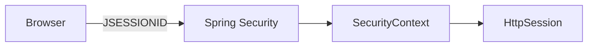
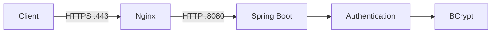
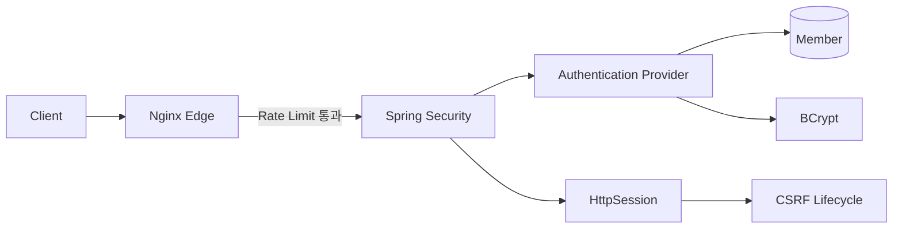

# 로그인 보안과 Rate Limiting

로그인은 단순히 이메일과 비밀번호를 비교하는 기능이 아니다. 사용자가 자신이 누구인지 증명하고, 그 결과를 바탕으로 이후 요청에 권한을 부여하기 시작하는 **인증 경계(Authentication Boundary)**다.

PawCycle의 로그인 흐름을 보면 이 경계에서 여러 보안 문제가 동시에 만난다. 비밀번호를 반복해서 추측하는 공격을 막아야 하고, 로그인에 성공한 사용자의 인증 상태를 안전하게 유지해야 하며, 브라우저가 자동으로 전송하는 Session Cookie를 악용하는 요청도 막아야 한다. 또한 로그인 요청 자체가 BCrypt 계산을 유발하기 때문에 인증 공격은 계정 탈취뿐 아니라 서버 자원 소비 문제로도 이어질 수 있다.

그래서 로그인 보안은 하나의 기능으로 해결하는 것이 아니라 여러 방어를 겹쳐서 구성한다.

```text
비밀번호 검증
→ 계정 열거 완화
→ Session 보호
→ CSRF 방어
→ 로그인 요청 속도 제한
→ Public Edge 보안 헤더
```

PawCycle은 이 구조를 한 번에 새로 만든 것이 아니다. 기존 인증 구조를 먼저 해체해서 확인한 뒤, 이미 충분한 부분은 유지하고 실제로 비어 있던 외부 요청 경계만 보완했다.

실제 PawCycle 설계와 구현 결과는 [[02. PawCycle Authentication - Edge Security]]에서 연결해서 본다.

---

## 로그인 Endpoint가 특별히 공격받는 이유

정상 사용자는 자신의 계정으로 몇 번 로그인할 뿐이다. 반면 공격자는 로그인 Endpoint를 자동화해서 매우 많은 요청을 보낼 수 있다.

대표적인 공격을 구분하면 다음과 같다.

**Brute Force**는 한 계정에 많은 비밀번호를 계속 대입한다.

```text
user@example.com + password1
user@example.com + password2
user@example.com + qwer1234
...
```

**Password Spraying**은 방향이 반대다. 흔한 비밀번호 몇 개를 많은 계정에 넓게 시도한다.

```text
Password123!

user1@example.com
user2@example.com
user3@example.com
...
```

이 방식은 단순 계정 잠금 정책을 우회하기 쉽다. 한 계정에 실패를 집중시키지 않기 때문이다.

**Credential Stuffing**은 다른 서비스에서 유출된 계정과 비밀번호 조합을 그대로 시험한다. 사용자가 여러 서비스에서 같은 비밀번호를 재사용한다면 공격자는 비밀번호를 새로 추측할 필요조차 없다.

이 세 공격은 방식이 다르기 때문에 한 가지 방어로 모두 막을 수 없다. IP 기반 Rate Limiting은 특히 자동 요청의 속도를 낮추는 첫 방어선으로 유용하지만, 여러 IP를 사용하는 분산 공격까지 해결하지는 못한다.

> 참고  
> - [OWASP Authentication Cheat Sheet](https://cheatsheetseries.owasp.org/cheatsheets/Authentication_Cheat_Sheet.html)
> - [OWASP Credential Stuffing Prevention Cheat Sheet](https://cheatsheetseries.owasp.org/cheatsheets/Credential_Stuffing_Prevention_Cheat_Sheet.html)

---

## 계정 존재 여부도 정보가 될 수 있다

로그인 실패를 처리할 때 다음처럼 구현하면 코드 자체는 자연스럽다.

```java
Member member = memberRepository.findByEmail(email)
    .orElseThrow(InvalidCredentialsException::new);

if (!passwordEncoder.matches(password, member.getPasswordHash())) {
    throw new InvalidCredentialsException();
}
```

하지만 처리 경로가 달라진다.

```text
존재하지 않는 이메일
→ DB 조회
→ 바로 실패

존재하는 이메일 + 잘못된 비밀번호
→ DB 조회
→ BCrypt 비교
→ 실패
```

BCrypt 비교는 의도적으로 계산 비용이 큰 작업이므로 두 경로의 평균 응답 시간에 차이가 생길 수 있다. 공격자가 충분한 요청을 보내 통계적으로 차이를 비교하면 특정 계정이 실제로 존재하는지 추측하는 데 이용할 수 있다.

그래서 로그인 실패 응답은 두 층에서 차이를 줄이는 편이 좋다.

첫째, 외부 메시지와 상태를 통일한다. “가입되지 않은 이메일입니다”와 “비밀번호가 틀렸습니다”를 따로 알려주지 않고 같은 인증 실패로 응답한다.

둘째, 내부 계산 경로도 가능한 범위에서 비슷하게 만든다. 존재하지 않는 이메일에도 미리 준비한 dummy password hash를 BCrypt로 비교하면, 계정 존재 여부에 따른 처리 시간 차이를 줄일 수 있다.

PawCycle의 현재 인증 Provider도 이 구조를 사용한다.

```java
Optional<Member> candidate = memberRepository.findByEmail(email);

String passwordHash =
    candidate.map(Member::getPasswordHash)
        .orElse(dummyPasswordHash);

boolean passwordMatches =
    passwordEncoder.matches(password, passwordHash);

if (candidate.isEmpty() || !passwordMatches) {
    throw new InvalidCredentialsException();
}
```

이 설계는 계정 열거 위험을 줄이는 데 도움이 되지만 새로운 비용도 만든다. 존재하지 않는 이메일을 반복해서 보내도 BCrypt가 수행되기 때문이다.

즉 다음 두 문제는 서로 다르다.

```text
dummy BCrypt
→ 계정 존재 여부 추측을 어렵게 함

Rate Limiting
→ 공격자가 BCrypt 계산을 무제한 발생시키는 것을 줄임
```

하나를 제거해서 다른 문제를 해결하는 것이 아니라 서로 다른 공격 면을 각자 방어한다.

> 참고  
> - [Spring Security Password Storage](https://docs.spring.io/spring-security/reference/features/authentication/password-storage.html)
> - [OWASP Password Storage Cheat Sheet](https://cheatsheetseries.owasp.org/cheatsheets/Password_Storage_Cheat_Sheet.html)

---

## Session 인증은 무엇을 저장하는가

PawCycle은 JWT가 아니라 **HttpSession 기반 인증**을 사용한다.

로그인에 성공하면 서버가 인증된 사용자의 SecurityContext를 Session에 보관하고, 브라우저는 이후 요청에서 `JSESSIONID` Cookie를 전송한다.



Session 방식에서는 서버가 인증 상태를 가지고 있기 때문에 Logout이나 Session 만료 같은 상태를 서버가 직접 제어하기 쉽다. 반대로 서버가 Session 상태를 보관해야 하므로 나중에 Multi-instance로 확장할 때 Session 공유나 Sticky Session 같은 새로운 문제가 생길 수 있다.

중요한 점은 “JWT가 더 최신이므로 JWT로 바꾼다”는 식으로 판단하면 안 된다는 것이다. 현재 PawCycle은 브라우저 기반 Commerce 애플리케이션이고, 서버가 Session 상태를 관리하는 현재 구조가 제품 요구를 충족하고 있다. JWT로 바꿔야 할 실제 문제는 아직 확인되지 않았다.

따라서 이번 보안 단계에서는 Session 방식을 유지했다.

---

## Session Fixation은 왜 Session ID를 바꾸는가

공격자가 미리 생성한 Session ID를 피해자가 그대로 사용한 상태에서 로그인하도록 유도할 수 있다면, 로그인 후에도 같은 Session ID가 유지되는 시스템에서는 공격자가 그 Session을 재사용할 위험이 생긴다. 이것이 **Session Fixation** 문제다.

Spring Security는 인증 성공 시 Session ID를 변경하는 전략을 제공한다.

PawCycle은 `changeSessionId`를 사용한다.

```java
.sessionManagement(
    session ->
        session.sessionFixation(
            fixation -> fixation.changeSessionId()
        )
);
```

또 로그인 성공 처리에도 `ChangeSessionIdAuthenticationStrategy`가 포함되어 있다.

핵심은 기존 사용자 상태를 버리는 것이 아니라 **인증 전 Session ID를 인증 후에도 그대로 신뢰하지 않는 것**이다.

```text
로그인 전
JSESSIONID = A

로그인 성공
→ changeSessionId()

로그인 후
JSESSIONID = B
```

Spring Security 공식 문서에서도 `changeSessionId`는 Servlet Container의 `HttpServletRequest.changeSessionId()`를 이용해 Session Fixation을 방어하는 방식으로 설명한다.

> 참고  
> - [Spring Security Session Management](https://docs.spring.io/spring-security/reference/servlet/authentication/session-management.html)
> - [SessionFixationConfigurer API](https://docs.spring.io/spring-security/reference/api/java/org/springframework/security/config/annotation/web/configurers/SessionManagementConfigurer.SessionFixationConfigurer.html)

---

## Cookie 속성도 인증 경계의 일부다

PawCycle의 `JSESSIONID`는 다음 정책을 사용한다.

```properties
server.servlet.session.cookie.http-only=true
server.servlet.session.cookie.same-site=lax
server.servlet.session.cookie.secure=true
server.servlet.session.cookie.path=/
server.servlet.session.timeout=30m
```

각 속성은 역할이 다르다.

**HttpOnly**는 JavaScript가 Session Cookie를 직접 읽지 못하도록 제한한다. 이것만으로 XSS를 막는 것은 아니지만, XSS가 발생했을 때 Cookie 탈취 난도를 높인다.

**Secure**는 HTTPS 연결에서만 Cookie를 전송하도록 한다. Production 인증 상태가 평문 HTTP를 통해 노출되지 않게 하는 기본 조건이다.

**SameSite=Lax**는 다른 사이트에서 시작된 일부 교차 사이트 요청에 Cookie가 자동으로 포함되는 범위를 줄인다. 다만 SameSite만으로 모든 CSRF 문제를 해결한다고 보면 안 된다.

**30분 Session timeout**은 사용하지 않는 Session이 무기한 살아 있지 않도록 한다.

Cookie 속성은 각각 작은 설정처럼 보이지만 Session 인증에서는 인증 상태 자체를 운반하는 중요한 경계다.

---

## Session 인증에서 CSRF가 중요한 이유

브라우저는 같은 사이트에 요청할 때 Cookie를 자동으로 포함한다.

이 자동 동작 때문에 사용자가 공격자 사이트를 보고 있을 때 공격자 페이지가 PawCycle의 상태 변경 요청을 유도할 수 있다면 문제가 생긴다. 브라우저가 PawCycle Session Cookie를 자동으로 붙여 버릴 수 있기 때문이다.

CSRF 방어의 핵심은 **Cookie처럼 브라우저가 자동으로 붙이지 않는 별도의 값을 상태 변경 요청에 요구하는 것**이다.

PawCycle은 `HttpSessionCsrfTokenRepository`를 사용하고 Header 이름을 `X-CSRF-TOKEN`으로 지정한다.

```java
HttpSessionCsrfTokenRepository repository =
    new HttpSessionCsrfTokenRepository();

repository.setHeaderName("X-CSRF-TOKEN");
```

로그인 성공 시에는 이전 CSRF Token을 그대로 유지하지 않고 Session 인증 전략에서 Token을 회전한다.

```java
new CompositeSessionAuthenticationStrategy(
    List.of(
        new ChangeSessionIdAuthenticationStrategy(),
        new CsrfAuthenticationStrategy(csrfTokenRepository)
    )
);
```

Spring Security 공식 문서도 인증 성공과 Logout 이후 기존 CSRF Token이 지워지므로 JavaScript Client가 새 Token을 다시 받아야 한다고 설명한다.

PawCycle Frontend도 이 lifecycle을 따르고 있기 때문에 이번 보안 작업에서는 CSRF 구조를 바꾸지 않았다.

> 참고  
> - [Spring Security CSRF](https://docs.spring.io/spring-security/reference/servlet/exploits/csrf.html)
> - [OWASP CSRF Prevention Cheat Sheet](https://cheatsheetseries.owasp.org/cheatsheets/Cross-Site_Request_Forgery_Prevention_Cheat_Sheet.html)

---

## CORS와 CSRF는 같은 문제가 아니다

CORS는 **다른 Origin의 JavaScript가 응답을 읽을 수 있는지**를 브라우저가 통제하도록 서버가 허용 범위를 알려주는 정책이다.

CSRF는 사용자가 인증된 상태에서 **브라우저가 자동으로 인증 정보를 포함하는 점을 악용해 상태 변경 요청을 보내는 문제**다.

둘은 자주 같이 등장하지만 역할이 다르다.

현재 PawCycle Production은 Frontend와 API가 하나의 Public Origin 아래에서 동작한다.

```text
https://pawcycle.duckdns.org/
https://pawcycle.duckdns.org/api/**
```

별도 Cross-Origin Client를 지원할 요구가 없기 때문에 Backend에 허용 Origin 목록을 새로 만들 이유도 없다.

이번 보안 작업에서는 CORS 설정을 추가하지 않고, 외부 Origin 요청에 `Access-Control-Allow-Origin`과 `Access-Control-Allow-Credentials`가 생기지 않는 회귀 테스트만 추가했다.

즉 보안 강화라고 해서 불필요한 CORS 설정을 추가하지 않았다.

---

## Rate Limiting은 무엇을 제한하는가

Rate Limiting은 특정 기준으로 요청 속도를 제한하는 방법이다.

로그인에서는 인증 전 사용자를 신뢰할 수 없기 때문에 Client IP가 가장 단순한 첫 번째 Key가 될 수 있다.

```text
203.0.113.10 → 자신의 제한 상태
203.0.113.11 → 자신의 제한 상태
203.0.113.12 → 자신의 제한 상태
```

하지만 IP와 사용자는 일대일 관계가 아니다.

회사나 학교처럼 여러 사용자가 하나의 Public IP를 공유할 수도 있고, 공격자는 반대로 여러 IP를 사용해 요청을 분산할 수 있다.

그래서 IP 기반 제한은 **완전한 인증 공격 방어가 아니라 첫 번째 Edge 방어**로 보는 것이 정확하다.

---

## Nginx `limit_req`는 고정된 분당 횟수 Counter가 아니다

PawCycle에서 선택한 Nginx 설정은 다음과 같다.

```nginx
limit_req_zone $binary_remote_addr
    zone=login_per_ip:10m
    rate=10r/m;
```

Nginx 공식 문서는 `limit_req`를 **Leaky Bucket 방식**으로 설명한다.

따라서 `10r/m`을 다음처럼 이해하면 잘못이다.

```text
00초에 Counter = 0
→ 10개까지 허용
→ 60초가 되면 Counter = 0
```

그런 Fixed Window가 아니라 요청이 들어오는 속도와 excess 상태를 계속 계산한다.

`$binary_remote_addr`는 Client IP를 Binary 형태로 저장하는 Key다. 문자열 IP보다 Shared Memory를 효율적으로 사용할 수 있다.

`zone=login_per_ip:10m`은 Nginx Worker들이 함께 보는 Shared Memory Zone이다. 여러 Worker가 같은 Client의 제한 상태를 공유해야 요청이 어느 Worker로 배정되든 같은 정책을 적용할 수 있다.

실제 로그인 Location에서는 다음 설정을 사용한다.

```nginx
limit_req zone=login_per_ip burst=5 nodelay;
```

**burst=5**는 평균 Rate를 순간적으로 넘은 excess 요청을 일정 범위까지 받아들일 수 있게 한다.

**nodelay**는 burst 범위의 요청을 일부러 대기시키지 않는다. 허용 가능한 burst는 즉시 처리하고, 한계를 넘은 요청은 거부한다.

이 구조 때문에 “10r/m + burst=5니까 처음 15개는 무조건 성공하고 16번째부터 실패한다”고 해석하면 안 된다. 실제 테스트에서도 이 오해가 CI 실패로 이어졌고, 해당 과정은 [[../트러블슈팅/01. Nginx Rate Limiting 회귀 테스트 설계 오류]]에 따로 정리했다.

> 참고  
> - [Nginx ngx_http_limit_req_module](https://nginx.org/en/docs/http/ngx_http_limit_req_module.html)
> - [LINE Engineering - 고처리량 분산 Rate Limiter](https://engineering.linecorp.com/ko/blog/high-throughput-distributed-rate-limiter/)

---

## 왜 Nginx에서 먼저 제한하는가

PawCycle Production에서 Backend 8080은 외부에 직접 공개되지 않고 Nginx가 Public Ingress 역할을 한다.



Spring Filter나 Application 코드에서도 Rate Limiting을 구현할 수 있다. 하지만 현재 문제는 반복 로그인 요청이 Spring Boot와 BCrypt까지 무제한 도달한다는 것이다.

따라서 Nginx에서 먼저 차단하면 거절할 요청은 Backend 자원을 소비하기 전에 끝낼 수 있다.

이 선택은 “Rate Limiting은 항상 Nginx가 정답”이라는 뜻이 아니다. 나중에 Multi-instance, Load Balancer, 여러 Edge Node가 등장하면 IP 추출과 분산 Rate 상태를 다시 설계해야 한다.

현재 단일 Public Nginx 구조에서는 가장 작은 해결책이 Nginx였다.

---

## 429는 단순 에러 코드가 아니라 계약이다

Nginx `limit_req`가 요청을 거절했을 때 단순 HTML 오류 페이지를 반환하면 PawCycle Frontend의 API Client가 기존 JSON 오류 계약으로 처리하지 못할 수 있다.

그래서 PawCycle은 Edge에서 거절하더라도 애플리케이션과 같은 형태의 오류 계약을 사용한다.

```json
{
  "code": "RATE_LIMITED",
  "message": "로그인 요청이 너무 많습니다. 잠시 후 다시 시도해 주세요.",
  "fieldErrors": []
}
```

HTTP Status는 `429 Too Many Requests`다.

이렇게 하면 Frontend는 별도 예외 경로를 만들지 않고 기존 `ApiError` 처리 흐름을 사용할 수 있다.

또 운영 측면에서도 429와 503을 구분할 수 있다.

```text
429 증가
→ Rate Limit 정책 초과 요청 증가

503 증가
→ Upstream/서비스 장애 가능성 조사
```

Status Code가 관측 신호로도 사용되는 이유다.

---

## Edge Security Header는 왜 Nginx에서 통일했는가

Spring Security는 Backend 응답에 여러 기본 Security Header를 제공한다. 하지만 PawCycle의 Public 응답은 Backend API만 있는 것이 아니다. Next.js Frontend 응답도 Nginx를 통과한다.

따라서 Public HTTPS 경계 전체에 동일한 최소 Header를 보장하려면 Nginx가 자연스러운 위치다.

PawCycle이 적용한 기본 계약은 다음과 같다.

```text
Strict-Transport-Security: max-age=31536000; includeSubDomains
X-Content-Type-Options: nosniff
X-Frame-Options: DENY
X-XSS-Protection: 0
Referrer-Policy: strict-origin-when-cross-origin
```

**HSTS**는 브라우저가 해당 Host를 HTTPS로만 접근하도록 기억하게 한다.

**X-Content-Type-Options: nosniff**는 브라우저가 선언된 Content-Type을 무시하고 다른 형식으로 추측하는 동작을 제한한다.

**X-Frame-Options: DENY**는 페이지가 다른 Frame 안에 렌더링되는 것을 막아 Clickjacking 위험을 줄인다.

**X-XSS-Protection: 0**은 오래된 브라우저의 XSS Auditor 계열 기능을 명시적으로 비활성화한다. 현대 브라우저에서는 이 기능이 폐기됐고, Spring Security도 기본값으로 0을 사용한다.

**Referrer-Policy: strict-origin-when-cross-origin**은 같은 Origin에서는 필요한 Referrer 정보를 유지하면서 Cross-Origin 요청에서는 전체 경로 대신 Origin 수준으로 줄인다.

Backend가 이미 같은 Header를 보내는 경우에는 Nginx가 upstream Header를 숨기고 Public Edge에서 하나의 값만 다시 부여해 중복을 피한다.

> 참고  
> - [Spring Security Security HTTP Response Headers](https://docs.spring.io/spring-security/reference/servlet/exploits/headers.html)
> - [MDN HTTP Headers](https://developer.mozilla.org/en-US/docs/Web/HTTP/Reference/Headers)

---

## CSP를 이번에 넣지 않은 이유

Content-Security-Policy는 XSS와 Content Injection 완화에 매우 중요한 방어다. 하지만 아무 값이나 붙이면 되는 Header가 아니다.

Next.js의 Script 실행 방식, Inline Script, Image Source, 외부 결제 SDK 같은 실제 리소스 출처를 함께 확인해야 한다.

예를 들어 너무 단순하게 다음을 추가하면:

```text
Content-Security-Policy: default-src 'self'
```

Next.js Runtime이나 향후 외부 결제 Script가 차단될 수 있다.

그래서 PawCycle에서는 기본 Edge Header를 먼저 적용하고, CSP는 Frontend/XSS 검토에서 실제 Resource Source를 확인한 뒤 별도로 설계하기로 했다.

이것도 보안 기능을 많이 넣는 것보다 **현재 구조에서 안전하게 검증할 수 있는 범위를 먼저 적용한다**는 원칙에 따른 선택이다.

---

## Authentication / Edge Security를 하나의 계층으로 보기

이번 단계의 핵심은 각각의 기술을 따로 외우는 것이 아니다.



각 계층은 다른 문제를 담당한다.

- BCrypt와 dummy hash는 비밀번호 저장과 계정 열거 위험을 다룬다.
- Session ID 회전은 Session Fixation을 다룬다.
- Cookie 속성은 Session 전달 경계를 보호한다.
- CSRF Token은 브라우저의 자동 Cookie 전송을 악용하는 요청을 막는다.
- Same-Origin/CORS 정책은 불필요한 Cross-Origin 접근을 열지 않는다.
- Nginx Rate Limiting은 인증 계산까지 도달하는 자동 요청 속도를 줄인다.
- Security Header는 Browser가 Public 응답을 해석하고 렌더링하는 방식을 제한한다.

PawCycle에서는 이 중 이미 충분히 구현된 부분을 다시 작성하지 않았다. **KEEP할 것은 KEEP하고, 실제 빈 경계만 CHANGE했다.**

이 판단 방식이 앞으로 Authorization, Input Validation, Secret, Infrastructure Security를 검토할 때도 그대로 이어진다.
