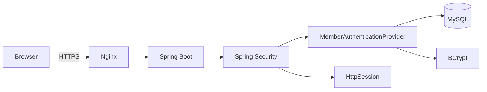
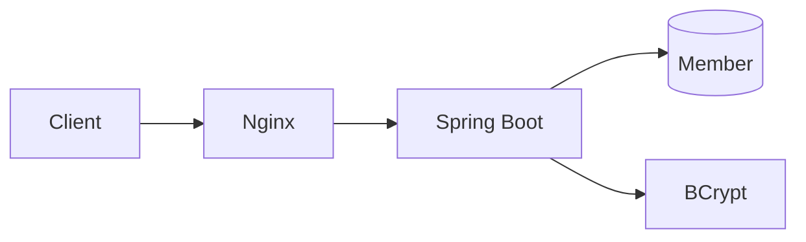

# PawCycle Authentication / Edge Security

AUTH-005는 PawCycle의 인증 구조를 새로 설계한 작업이 아니다. 먼저 현재 로그인·Session·CSRF·Cookie·Nginx 경계를 실제 코드로 다시 해체한 뒤, 이미 방어가 있는 부분은 유지하고 **Public Edge에서 실제로 비어 있던 경계만 최소 수정**한 작업이다.

이 문서의 목적은 “무엇을 추가했는가”보다 **왜 어떤 것은 유지했고, 어떤 것은 바꿨으며, 어떤 것은 보류했는지**를 설명하는 데 있다.

---

## 현재 인증 구조를 먼저 확인한 이유

보안 작업을 시작하면 JWT, OAuth2, MFA, WAF 같은 기술을 먼저 떠올리기 쉽다. 하지만 PawCycle의 기준은 기술 목록을 채우는 것이 아니라 현재 위험을 먼저 확인하는 것이다.

이번 검토에서 기준으로 삼은 질문은 다음과 같다.

```text
현재 인증은 어떻게 동작하는가?
→ 이미 방어되는 공격은 무엇인가?
→ 반복 로그인 요청은 어디까지 도달하는가?
→ Public Edge는 어떤 응답 계약을 보장하는가?
→ 지금 추가해야 할 가장 작은 방어는 무엇인가?
```

그 결과 현재 인증의 핵심 구조는 다음과 같았다.



Backend의 8080 Port는 Public Host에 직접 노출되지 않고, 외부 요청은 Nginx를 거쳐 들어온다. 따라서 로그인 공격을 Backend보다 앞에서 줄일 수 있는 실제 경계가 이미 존재했다.

---

## KEEP: HttpSession 인증

현재 PawCycle은 JWT가 아니라 HttpSession 기반 인증을 사용한다.

Spring Security는 인증 성공 후 SecurityContext를 Session에 저장하고, Browser는 이후 요청에서 `JSESSIONID`를 보낸다.

```text
로그인 성공
→ SecurityContext 생성
→ HttpSession에 저장
→ JSESSIONID 발급
→ 이후 요청에서 Session 복원
```

이번 단계에서는 JWT로 변경하지 않았다.

JWT가 나쁜 것이 아니라 현재 PawCycle에서 JWT가 해결해야 할 구체적인 문제가 확인되지 않았기 때문이다. Browser 기반 Commerce 서비스에서 서버가 로그인 상태와 Logout을 직접 통제하는 현재 Session 구조는 요구사항을 충족하고 있다.

오히려 JWT로 변경하면 Token 만료, Refresh Token, Revocation, 탈취 대응, 저장 위치 같은 새로운 보안 문제가 생긴다.

따라서 현재 판단은 다음과 같다.

```text
Session
→ KEEP

JWT
→ 현재 필요 근거 없음
→ DEFER
```

나중에 Multi-instance 단계에서는 Session 공유 문제가 실제로 등장할 수 있다. 그때도 “JWT로 바꾸면 된다”로 바로 결론 내리지 않고 Sticky Session, 외부 Session Store, Stateless Authentication을 비교해야 한다.

---

## KEEP: 로그인 실패 응답과 dummy BCrypt

현재 `MemberAuthenticationProvider`는 Email 존재 여부와 비밀번호 불일치를 같은 실패로 처리한다.

```java
Optional<Member> candidate = memberRepository.findByEmail(email);

String passwordHash =
    candidate.map(Member::getPasswordHash)
        .orElse(dummyPasswordHash);

boolean passwordMatches =
    passwordEncoder.matches(password, passwordHash);

if (candidate.isEmpty() || !passwordMatches) {
    throw new InvalidCredentialsException();
}
```

존재하지 않는 Email에도 dummy BCrypt 비교를 수행한다.

이 구조는 “없는 계정은 빠르게 실패하고, 있는 계정은 BCrypt 때문에 느리게 실패하는” 차이를 줄여 Account Enumeration 위험을 완화한다.

외부 응답도 Email 존재 여부와 Password 불일치를 구분하지 않고 동일한 `INVALID_CREDENTIALS` 계약을 사용한다.

이 부분은 이미 목적이 명확하고 테스트도 존재했기 때문에 변경하지 않았다.

---

## KEEP: Session Fixation 방어

현재 Security 설정은 로그인 성공 시 Session ID를 변경한다.

```java
.sessionManagement(
    session ->
        session.sessionFixation(
            fixation -> fixation.changeSessionId()
        )
);
```

또 실제 로그인 Session 전략에는 다음 두 동작이 묶여 있다.

```java
new CompositeSessionAuthenticationStrategy(
    List.of(
        new ChangeSessionIdAuthenticationStrategy(),
        new CsrfAuthenticationStrategy(csrfTokenRepository)
    )
);
```

즉 로그인 성공은 단순히 SecurityContext만 저장하는 것이 아니라:

```text
인증 성공
→ Session ID 변경
→ 이전 CSRF Token 정리/회전
→ 인증 상태 저장
```

으로 이어진다.

이 부분 역시 현재 요구에 맞으므로 KEEP했다.

---

## KEEP: Session Cookie

현재 설정은 다음과 같다.

```properties
server.servlet.session.cookie.name=JSESSIONID
server.servlet.session.cookie.http-only=true
server.servlet.session.cookie.same-site=lax
server.servlet.session.cookie.secure=true
server.servlet.session.cookie.path=/
server.servlet.session.timeout=30m
```

Production에서는 Secure Cookie가 기본이다.

현재 Browser 기반 Session 인증에서 이 값들은 합리적인 기본선이며, 이번 작업에서 Cookie 정책을 변경할 근거는 없었다.

특히 SameSite를 무조건 Strict로 올리는 것도 선택하지 않았다. 향후 외부 결제나 다른 Browser Navigation 흐름과 충돌할 수 있기 때문에 Cookie 정책은 실제 사용자 흐름을 기준으로 판단해야 한다.

---

## KEEP: CSRF

PawCycle은 `HttpSessionCsrfTokenRepository`를 사용한다.

```java
HttpSessionCsrfTokenRepository repository =
    new HttpSessionCsrfTokenRepository();

repository.setHeaderName("X-CSRF-TOKEN");
repository.setParameterName("_csrf");
```

Browser는 Session Cookie를 자동으로 보내지만 `X-CSRF-TOKEN` Header는 공격자 사이트가 임의로 자동 전송할 수 없다.

Frontend는 애플리케이션 시작 시 CSRF Token을 획득하고, 로그인과 Logout처럼 SecurityContext와 Session 상태가 변한 뒤 다시 Token을 갱신하는 lifecycle을 이미 가지고 있다.

기존 integration test에서도 CSRF가 없는 상태 변경 요청은 `403 CSRF_INVALID`로 거절되는 것이 고정돼 있다.

따라서 이번 작업은 CSRF 구조를 다시 설계하지 않았다.

---

## KEEP + Regression: CORS

현재 Production 구조는 Same-Origin이다.

```text
https://pawcycle.duckdns.org
├─ Frontend
└─ /api/**
```

Backend에 별도의 Cross-Origin Consumer를 열어야 할 요구가 없다.

그래서 CORS Allow List를 새로 추가하거나 `Access-Control-Allow-Origin: *` 같은 설정을 넣지 않았다.

대신 이번 작업에서 Regression Test를 추가했다.

외부 Origin으로 공개 API를 호출했을 때 다음 Header가 생기지 않는 것을 검증한다.

```text
Access-Control-Allow-Origin
Access-Control-Allow-Credentials
```

즉 CORS에 대해서는 “설정 추가”가 아니라 **현재 닫힌 경계를 앞으로도 실수로 열지 않도록 테스트로 고정**했다.

---

## CHANGE: Login Rate Limiting

실제 빈 경계는 로그인 요청 속도 제한이었다.

기존 흐름에서는 Public Nginx를 통과한 모든 로그인 요청이 Backend까지 전달됐다.



존재하지 않는 Email도 dummy BCrypt를 수행하므로 반복 로그인은 계정 공격뿐 아니라 Backend CPU 소비로 연결될 수 있다.

따라서 Public Nginx에서 정확한 로그인 Endpoint만 별도 Location으로 분리했다.

```nginx
limit_req_zone $binary_remote_addr
    zone=login_per_ip:10m
    rate=10r/m;
```

그리고 Public HTTPS Server에서:

```nginx
location = /api/auth/login {
    limit_req zone=login_per_ip burst=5 nodelay;
    limit_req_status 429;

    ...
}
```

을 적용했다.

왜 `location =`을 사용했는지도 중요하다.

```text
/api/auth/login
→ 로그인 전용 제한

/api/products
/api/cart
/api/orders
...
→ 기존 일반 /api/ 경로
```

문제는 로그인 반복 요청이었으므로 전체 API에 같은 제한을 걸지 않았다.

---

## 왜 IP를 Key로 사용했는가

로그인 전에는 요청자가 실제 어떤 Member인지 신뢰할 수 없다.

그래서 첫 Edge 방어에서는 연결 Client IP를 Key로 사용했다.

```nginx
$binary_remote_addr
```

여기서 `X-Forwarded-For` Header를 Rate Limit Key로 직접 신뢰하지 않았다.

현재 구조에서는 Client가 Nginx에 직접 연결하고 Nginx가 자신의 `$remote_addr`를 기준으로 요청을 구분할 수 있다.

하지만 나중에 OCI Load Balancer를 앞에 두면 구조가 달라진다.

```text
현재
Client → Nginx

향후
Client → OCI Load Balancer → Nginx
```

그때 Nginx의 `$remote_addr`는 Client가 아니라 Load Balancer 주소가 될 수 있다.

따라서 Multi-instance / Load Balancer 단계에서는 **Real IP 신뢰 경계**를 다시 설계해야 한다.

현재 설정을 영구 정답으로 취급하지 않는 이유다.

---

## `10r/m + burst=5 + nodelay`를 어떻게 이해해야 하는가

현재 초기 정책은 다음과 같다.

```nginx
rate=10r/m
burst=5
nodelay
```

이 값을 “1분에 10번 + 추가 5번 = 처음 15번 무조건 성공”으로 해석하면 안 된다.

Nginx `limit_req`는 Leaky Bucket 방식으로 요청의 평균 Rate와 excess를 계속 계산한다.

`burst=5`는 순간적으로 Rate를 넘은 요청을 제한된 범위에서 수용할 수 있게 한다.

`nodelay`는 그 Burst 범위 요청을 대기열에 오래 두지 않고 즉시 처리한다.

그래서 실제 빠른 요청에서는 15회 안에서도 429가 나타날 수 있다.

이 동작을 잘못 Fixed Quota처럼 이해해 처음 Regression Test가 실패했고, 그 과정은 [[../트러블슈팅/01. Nginx Rate Limiting 회귀 테스트 설계 오류]]에 별도로 남겼다.

현재 `10r/m`은 Production에서 충분히 관측한 최종값이 아니다.

지금 단계의 의미는:

```text
합리적인 초기 정책
→ Repository/CI 동작 검증
→ Production 적용 후 실제 429와 정상 사용자 영향 관측
→ 유지 또는 조정
```

이다.

---

## CHANGE: 429 JSON 계약

Nginx가 기본 오류 응답을 그대로 반환하면 Frontend API Client가 기대하는 JSON 오류 계약과 달라질 수 있다.

그래서 Rate Limit 초과도 PawCycle API 오류 형태로 통일했다.

```json
{
  "code": "RATE_LIMITED",
  "message": "로그인 요청이 너무 많습니다. 잠시 후 다시 시도해 주세요.",
  "fieldErrors": []
}
```

Nginx 설정은 Named Location으로 이를 반환한다.

```nginx
location @login_rate_limited {
    default_type application/json;
    return 429 '{"code":"RATE_LIMITED","message":"로그인 요청이 너무 많습니다. 잠시 후 다시 시도해 주세요.","fieldErrors":[]}';
}
```

Frontend의 기존 `ApiError` 흐름은 알려지지 않은 오류 코드라도 `message`를 표시할 수 있기 때문에 Frontend 제품 코드를 별도로 수정할 필요가 없었다.

이것도 이번 작업의 “가장 작은 해결책” 원칙에 해당한다.

---

## CHANGE: Public Edge Security Header

Backend API 응답에는 Spring Security 기본 Header가 존재하지만 Public Frontend 응답까지 같은 정책이 보장되는 것은 아니었다.

PawCycle의 실제 Public Entry Point는 Nginx이므로 HTTPS Server에서 최소 Security Header를 통일했다.

```nginx
add_header Strict-Transport-Security
    "max-age=31536000; includeSubDomains" always;

add_header X-Content-Type-Options "nosniff" always;
add_header X-Frame-Options "DENY" always;
add_header X-XSS-Protection "0" always;
add_header Referrer-Policy "strict-origin-when-cross-origin" always;
```

`always`를 사용한 이유는 정상 200 응답뿐 아니라 401, 403, 429, Upstream 오류 같은 응답에서도 Public Edge Header 계약이 유지되게 하기 위해서다.

Backend가 이미 같은 Header를 보내면 중복될 수 있으므로 Nginx는 upstream의 동일 Header를 숨긴다.

```nginx
proxy_hide_header Strict-Transport-Security;
proxy_hide_header X-Content-Type-Options;
proxy_hide_header X-Frame-Options;
proxy_hide_header X-XSS-Protection;
proxy_hide_header Referrer-Policy;
```

결과적으로 Public Client가 보는 값은 Nginx가 관리하는 하나의 계약으로 정리된다.

---

## 왜 Internal 8081에는 같은 정책을 적용하지 않았는가

Production Nginx에는 Public 80/443 외에 Container 내부 검증을 위한 8081 Server가 존재한다.

이 경로는 사용자 트래픽을 위한 Public Endpoint가 아니라 Deploy / Rollback / Release Smoke 검증이 Public Redirect에 속지 않도록 만든 내부 경계다.

그래서 로그인 Rate Limiting을 8081에 복제하지 않았다.

```text
Public :443
→ 로그인 limiter 적용

Internal :8081
→ 기존 release smoke 계약 유지
```

보안 정책을 모든 Server Block에 기계적으로 복제하지 않고 **경로의 역할에 맞게 적용 범위를 나눈 것**이다.

---

## DEFER: 이번에 넣지 않은 것

이번 작업에서는 다음을 일부러 넣지 않았다.

### Account Lockout

계정 단위 잠금은 Brute Force 방어에 도움이 될 수 있지만 공격자가 특정 사용자의 계정에 실패를 반복해 정상 사용자를 잠그는 DoS 수단으로 악용할 수도 있다.

현재는 IP Edge Limiter부터 적용하고 실제 필요성이 생길 때 별도로 판단한다.

### Account / Email Rate Limiting

IP 기반 제한은 분산 IP 공격에 약하다.

계정 단위 Rate Limiting을 추가하면 이 한계를 일부 보완할 수 있지만, Application 상태 저장과 정책 설계가 추가된다.

현재 단일 Nginx Edge에서 가장 작은 1차 방어부터 적용했다.

### `/api/auth/csrf` Rate Limiting

익명 사용자가 CSRF Endpoint를 반복 호출하면 Session 생성 비용이 발생할 수 있다.

하지만 현재 실제 문제가 측정되지 않았기 때문에 이번 범위에서는 건드리지 않았다.

### CSP

Content-Security-Policy는 중요하지만 Next.js Runtime, Inline Script, Image Source, 향후 외부 결제 SDK 등을 함께 확인해야 한다.

잘못된 CSP는 보안을 강화하면서 동시에 정상 Frontend 실행을 깨뜨릴 수 있다.

따라서 XSS / Frontend Security 검토 시 별도로 설계한다.

### JWT / OAuth2 / MFA

현재 요구에서 Session 인증을 대체해야 할 이유가 없고 OAuth2 로그인이나 MFA도 제품 요구로 승인되지 않았다.

기술 도입 자체를 보안 성과로 보지 않기 때문에 보류했다.

---

## 검증은 설정 문법보다 실제 동작을 봤다

`nginx -t`가 통과하는 것만으로는 Rate Limit이 실제로 동작하는지 알 수 없다.

그래서 `infra/production/test-production-nginx.sh`를 확장해 격리 Docker Network 안에 Mock Backend와 Mock Frontend를 만들고 실제 Nginx Proxy를 실행하도록 했다.

테스트가 확인하는 핵심은 다음과 같다.

```text
HTTP ACME challenge
HTTP → HTTPS redirect
Unknown Host 경계

Public Frontend 응답
→ Security Header 1개씩 존재

Upstream 503
→ 오류 응답에도 Security Header 유지

Public /api/auth/login 반복
→ 200과 429가 실제 limiter 동작에 따라 발생
→ 429 JSON 계약 검증
→ 429에도 Security Header 존재

/api/products
→ Login Limiter 영향 없음

Internal :8081 login
→ Login Limiter 영향 없음

Mock Backend access log
→ Public 429 요청은 Backend까지 전달되지 않았음
```

특히 Backend 전달 수를 단순 상수로 비교하지 않고 실제 Public 200 요청 수와 Internal 성공 요청 수를 합한 값과 비교한다.

```text
expected backend login count
=
public_success_count
+
internal_success_count
```

이 검증 덕분에 Rate Limit이 “429를 반환한다”뿐 아니라 **거절 요청이 실제 Backend CPU와 인증 로직까지 도달하지 않는다**는 목적까지 확인할 수 있다.

---

## AUTH-005에서 실제로 얻은 Evidence

PR:

```text
#296 fix(security): 인증 외부 경계 보안 강화
```

최종 PR HEAD:

```text
39e8f9d432caba1839f5a3324fe3e620348a06ef
```

Merge commit:

```text
6bb1c258b37054576e45ea599126aa753122b8a3
```

Repository Validation에서는 다음이 성공했다.

```text
Commit / PR conventions              PASS
Backend and MySQL                    PASS
Production contract - contracts      PASS
Production contract - compose        PASS
Production contract - auth-lifecycle PASS
Application validation               PASS
PR Metadata Validation               PASS
```

Frontend와 Harness lane은 변경 분류상 정상적으로 Skip됐다.

CodeRabbit은 초기 테스트의 Fixed Quota 가정을 실제 문제로 지적했고, 후속 수정 후 해당 Thread는 Outdated가 되었으며 최신 CI가 통과했다.

PR은 최종적으로 `main`에 병합됐다.

> GitHub  
> - [PR #296](https://github.com/guseoh/pawcycle-commerce/pull/296)

---

## 현재 Evidence 수준

여기서 중요한 구분이 있다.

AUTH-005는 현재:

```text
Implemented
→ YES

Repository Verified
→ YES

Merged to main
→ YES

Production Verified
→ NO
```

이다.

PR에서 사용한 Production Contract Test는 실제 Docker/Nginx 동작을 격리 환경에서 검증했지만 OCI Production Server에 이번 설정을 적용한 것은 아니다.

따라서 “운영 반영 완료”라고 기록하면 안 된다.

실제 Production 적용은 별도 고위험 승인 경계로 남아 있다.

---

## Production 적용 후 확인해야 할 것

Repository에서 동작한다고 해서 운영 정책값까지 최종 확정된 것은 아니다.

Production 적용 후에는 최소 다음을 확인해야 한다.

```text
정상 로그인
→ 기존 Session / CSRF lifecycle 정상

반복 로그인
→ 실제 429 발생

429
→ RATE_LIMITED JSON
→ Security Header 유지

일반 /api/**
→ Login Limiter 영향 없음

운영 관측
→ 429 발생량
→ 정상 사용자 오탐
→ 특정 공유 IP 집중
→ Backend CPU / 로그인 처리량 변화
```

그리고 현재 Nginx가 Client와 직접 연결되는 구조가 바뀌면 Rate Limit Key도 다시 검토해야 한다.

특히 OCI Load Balancer를 앞에 둘 때는 Real IP를 신뢰할 Proxy 범위를 명시하지 않으면 모든 사용자가 같은 Load Balancer IP로 보일 수 있다.

이 문제는 향후 운영 고도화의 Multi-instance / Load Balancer 단계와 연결해서 다시 다룬다.

---

## 최종 판단

AUTH-005에서 최종적으로 내린 판단은 다음과 같다.

| 영역 | 판단 | 이유 |
| --- | --- | --- |
| HttpSession 인증 | KEEP | 현재 제품 요구 충족 |
| BCrypt + dummy hash | KEEP | Password 검증 및 Enumeration 완화 |
| 동일 로그인 실패 응답 | KEEP | 계정 존재 정보 노출 완화 |
| Session ID 회전 | KEEP | Session Fixation 방어 |
| Cookie 정책 | KEEP | 현재 Session 인증에 적합 |
| CSRF | KEEP | Session 기반 상태 변경 보호 |
| CORS | KEEP + Regression | Same-Origin 구조 유지 |
| Login IP Rate Limit | CHANGE | 반복 요청이 Backend/BCrypt까지 무제한 도달 |
| Public Security Header | CHANGE | Frontend/API 공통 Edge 계약 필요 |
| CSP | DEFER | Frontend Resource Source 검토 필요 |
| Account Lockout | DEFER | 계정 잠금 DoS 위험 |
| Account 단위 Limiter | DEFER | 현재 IP 1차 방어부터 적용 |
| JWT/OAuth2/MFA | DEFER | 현재 요구와 문제 근거 없음 |

이번 작업의 핵심은 새로운 보안 기술을 많이 넣은 것이 아니다.

**현재 시스템을 다시 해체해 이미 충분한 부분은 유지하고, 실제 빈 경계만 최소 변경한 뒤 동작 수준으로 검증했다는 것**이 가장 중요한 결과다.

> 참고  
> - [Nginx ngx_http_limit_req_module](https://nginx.org/en/docs/http/ngx_http_limit_req_module.html)
> - [Spring Security Session Management](https://docs.spring.io/spring-security/reference/servlet/authentication/session-management.html)
> - [Spring Security CSRF](https://docs.spring.io/spring-security/reference/servlet/exploits/csrf.html)
> - [Spring Security Security Headers](https://docs.spring.io/spring-security/reference/servlet/exploits/headers.html)
> - [OWASP Authentication Cheat Sheet](https://cheatsheetseries.owasp.org/cheatsheets/Authentication_Cheat_Sheet.html)
