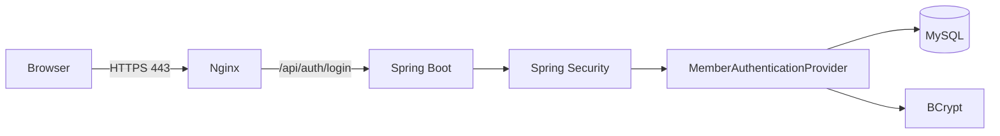
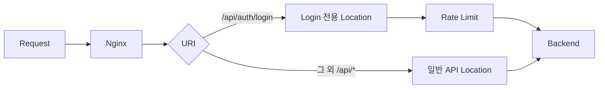

# PawCycle 로그인 Rate Limiting 적용

이 문서는 [[01. 로그인 보안과 Rate Limiting - 개념]]에서 정리한 내용을 현재 PawCycle Production 구조에 실제로 적용하는 과정을 설명한다.

목적은 Nginx 설정 몇 줄을 붙여 넣는 것이 아니다. 현재 로그인 요청이 어디를 통과하는지, 이미 어떤 보안이 적용돼 있는지, 그럼에도 어떤 빈틈이 남아 있는지 확인한 뒤 가장 작은 변경으로 보완한다.

현재 PawCycle에서 중요한 흐름은 다음과 같다.

    왜 필요한가?
    → 현재 상태
    → 실제 위험
    → 가장 작은 해결책
    → 테스트
    → 운영 적용 후 확인
    → 유지 / 조정 / 제외

따라서 Rate Limiting도 “보안 기능이니까 넣는다”에서 출발하지 않는다. 현재 로그인 Endpoint가 무제한 요청을 Backend까지 전달하고 있고, 로그인 검증에는 BCrypt 비용이 발생한다는 실제 구조에서 출발한다.

## 현재 PawCycle 로그인 요청 흐름

Production에서 외부 요청은 먼저 Nginx를 통과한다.



현재 Production Compose에서 Backend는 `8080`을 외부 Host에 publish하지 않고 Docker Network 내부에만 expose한다.

```yaml
backend:
  expose:
    - "8080"

proxy:
  ports:
    - "80:80"
    - "443:443"
```

즉 외부 Client가 정상적인 Production 경로를 사용한다면 Spring Boot의 8080으로 직접 들어오는 것이 아니라 Nginx를 지나야 한다.

이 구조는 Rate Limiting 위치를 결정할 때 중요하다. 외부 요청이 Backend에 도달하기 전에 Nginx가 먼저 요청을 받기 때문이다.

    Internet
       ↓
    Nginx            ← 외부 요청을 가장 먼저 제어할 수 있는 위치
       ↓
    Spring Boot
       ↓
    BCrypt / DB

Backend에 요청이 도달한 뒤 Spring Filter에서 제한하는 방법도 가능하다. 하지만 로그인 공격의 첫 번째 방어로는 Nginx에서 먼저 막는 편이 더 작은 비용으로 Backend 자원을 보호할 수 있다.

> 현재 코드 근거
> - PawCycle: `infra/production/compose.yaml`
> - PawCycle: `infra/production/nginx.https.conf`
> - [Nginx 공식 Rate Limiting Module](https://nginx.org/en/docs/http/ngx_http_limit_req_module.html)

### 현재 Spring Security에서 이미 보호하고 있는 것

Rate Limiting을 추가하기 전에 “현재 보안이 부족하다”라고 뭉뚱그려 판단하면 안 된다. PawCycle에는 이미 여러 인증 방어가 있다.

현재 `SecurityConfig`에서 로그인 Endpoint는 명시적으로 공개되어 있다.

```java
.requestMatchers(HttpMethod.POST, "/api/auth/login")
.permitAll()
```

이 설정 자체는 취약점이 아니다. 로그인은 인증을 받기 위한 Endpoint이므로 인증 전에도 호출할 수 있어야 한다.

또 인증 성공 후에는 Session Fixation을 줄이기 위해 Session ID를 변경한다.

```java
.sessionManagement(
    session ->
        session.sessionFixation(
            fixation -> fixation.changeSessionId()
        )
);
```

CSRF Token은 `HttpSessionCsrfTokenRepository`로 관리하고 `X-CSRF-TOKEN` Header를 사용한다.

```java
HttpSessionCsrfTokenRepository repository =
    new HttpSessionCsrfTokenRepository();

repository.setHeaderName("X-CSRF-TOKEN");
```

인증 성공 시에는 Session ID 변경과 CSRF 전략을 함께 실행한다.

```java
new CompositeSessionAuthenticationStrategy(
    List.of(
        new ChangeSessionIdAuthenticationStrategy(),
        new CsrfAuthenticationStrategy(csrfTokenRepository)
    )
);
```

즉 현재 PawCycle 인증 구조는 단순히 “Session 로그인만 구현된 상태”가 아니다. Session Fixation 방어, CSRF, SecurityContext Session 저장, Admin Role 인가, BCrypt 같은 기본 방어가 이미 있다.

Rate Limiting은 이 구조를 대체하는 기능이 아니라 로그인 Endpoint의 반복 호출이라는 다른 공격 면을 추가로 보호하는 기능이다.

> 프로젝트 코드
> - `backend/src/main/java/com/pawcycle/backend/common/security/SecurityConfig.java`
>
> 개념 참고
> - [Spring Security - Session Management](https://docs.spring.io/spring-security/reference/servlet/authentication/session-management.html)
> - [OWASP Session Management Cheat Sheet](https://cheatsheetseries.owasp.org/cheatsheets/Session_Management_Cheat_Sheet.html)

### 현재 PawCycle은 계정 열거 위험도 줄이고 있다

실제 `MemberAuthenticationProvider`에서는 Email로 Member를 조회한 뒤, 회원이 존재하지 않아도 BCrypt 비교를 수행한다.

```java
Optional<Member> candidate = memberRepository.findByEmail(email);

String passwordHash =
    candidate
        .map(Member::getPasswordHash)
        .orElse(dummyPasswordHash);

boolean passwordMatches =
    passwordEncoder.matches(password, passwordHash);

if (candidate.isEmpty() || !passwordMatches) {
    throw new InvalidCredentialsException();
}
```

`dummyPasswordHash`도 Provider가 만들어질 때 실제 PasswordEncoder로 생성한다.

```java
this.dummyPasswordHash =
    passwordEncoder.encode(UUID.randomUUID().toString());
```

이 구조가 없다면 존재하지 않는 Email은 BCrypt 없이 빠르게 실패할 수 있다.

    없는 Email
    → DB 조회
    → 즉시 실패

    있는 Email + 틀린 Password
    → DB 조회
    → BCrypt
    → 실패

현재 코드는 두 경우 모두 BCrypt 검증 경로를 거치게 해서 처리 시간 차이를 줄인다.

그런데 바로 여기에서 Rate Limiting과 연결되는 지점이 생긴다.

    공격자가 존재하지 않는 Email을 계속 보냄
            ↓
    dummy BCrypt도 계속 수행
            ↓
    Backend CPU 사용

즉 dummy BCrypt는 Enumeration 방어에 필요한 비용이고, Rate Limiting은 공격자가 그 비용을 무제한 발생시키는 것을 줄이기 위한 별도 방어다.

따라서 dummy BCrypt와 Rate Limiting을 하나의 해결책으로 보면 안 된다. 전자는 계정 존재 여부 추측을 줄이고, 후자는 반복 요청이 그 계산 비용을 무제한 발생시키는 것을 줄인다.

> 프로젝트 코드
> - `backend/src/main/java/com/pawcycle/backend/member/application/MemberAuthenticationProvider.java`
>
> 참고
> - [Spring Security - Password Storage](https://docs.spring.io/spring-security/reference/features/authentication/password-storage.html)
> - [OWASP Authentication Cheat Sheet](https://cheatsheetseries.owasp.org/cheatsheets/Authentication_Cheat_Sheet.html)

## 현재 Nginx 설정에서 로그인은 일반 API와 동일하게 처리된다

현재 HTTPS 설정에는 다음과 같은 일반 API Location이 있다.

```nginx
location /api/ {
    proxy_pass http://backend:8080;
    proxy_http_version 1.1;

    proxy_set_header Host $http_host;
    proxy_set_header X-Real-IP $remote_addr;
    proxy_set_header X-Forwarded-For $proxy_add_x_forwarded_for;
    proxy_set_header X-Forwarded-Host $http_host;
    proxy_set_header X-Forwarded-Proto https;

    proxy_read_timeout 60s;
}
```

`/api/auth/login`도 `/api/`로 시작하므로 현재는 이 Location을 사용한다.

    /api/products
    /api/cart
    /api/orders
    /api/auth/login
           ↓
    모두 location /api/

즉 로그인 요청이라고 해서 Nginx에서 별도의 속도 제한을 받지는 않는다.

여기서 해결하려는 문제를 정확하게 정의하면 다음과 같다.

> 현재 Production Public Ingress는 `POST /api/auth/login` 요청을 속도 제한 없이 Backend로 전달한다. 로그인 검증은 BCrypt 비용을 포함하므로 자동화된 반복 요청이 Backend CPU와 인증 처리량을 지속적으로 소비할 수 있다.

문제가 이 정도로 좁혀졌다면 해결책도 가능한 한 좁게 만드는 것이 좋다. 현재 발견한 위험은 로그인 요청의 반복 호출이므로 모든 API에 Rate Limiting을 걸 필요는 없다.

### 왜 로그인 전용 Exact Match Location을 두는가

우리가 추가하려는 핵심 구조는 다음과 같다.

```nginx
location = /api/auth/login {
    ...
}

location /api/ {
    ...
}
```

Nginx의 `location =`은 정확히 같은 URI에만 매칭되는 Exact Match다.

    /api/auth/login       → Exact Match
    /api/auth/login/foo   → Exact Match 아님
    /api/products         → Exact Match 아님

따라서 로그인 Endpoint만 별도 정책으로 분리할 수 있다.



이 구조를 선택하는 이유는 현재 발견한 문제보다 더 넓은 범위에 정책을 적용하지 않기 위해서다.

예를 들어 일반 `/api/` 전체에 `limit_req`를 걸면 Product 목록, Cart, Order 조회 등 정상적인 API까지 같은 제한 정책의 영향을 받는다.

지금 해결하려는 것은 전체 API 트래픽 제어가 아니라 로그인 자동 반복 요청이다. 따라서 로그인만 Exact Match로 분리하는 것이 가장 작은 수정이다.

> 참고 자료
> - [Nginx 공식 - location 처리](https://nginx.org/en/docs/http/ngx_http_core_module.html#location)

### `limit_req_zone`은 어디에 선언해야 하는가

먼저 Rate Limit 상태를 저장할 Zone을 정의한다.

```nginx
limit_req_zone $binary_remote_addr
    zone=login_per_ip:10m
    rate=10r/m;
```

여기서 중요한 것은 이 Directive를 아무 곳에나 넣을 수 있는 것이 아니라는 점이다.

Nginx 공식 문서에서 `limit_req_zone`의 Context는 `http`다.

개념적으로는 다음 위치다.

```nginx
http {
    limit_req_zone ...;

    server {
        ...
    }
}
```

그런데 PawCycle의 `infra/production/nginx.https.conf`는 Nginx 전체 `nginx.conf` 파일이 아니라 컨테이너의 `/etc/nginx/conf.d/default.conf`로 mount되는 파일이다.

일반적인 Nginx 기본 설정은 `http` 안에서 `/etc/nginx/conf.d/*.conf`를 include한다. 따라서 PawCycle의 파일 최상위는 실질적으로 `http` context 안에서 읽힌다.

그래서 첫 `server` 블록보다 앞에 선언하면 된다.

```nginx
limit_req_zone $binary_remote_addr
    zone=login_per_ip:10m
    rate=10r/m;

server {
    listen 80 default_server;
    ...
}
```

이 부분을 이해하지 않고 `server` 안에 `limit_req_zone`을 넣으면 Nginx 설정 검증 단계에서 Context 오류가 발생한다.

## 실제로 추가할 초기 코드

현재 학습과 테스트를 시작하기 위한 초기 형태는 다음과 같다.

```nginx
limit_req_zone $binary_remote_addr
    zone=login_per_ip:10m
    rate=10r/m;
```

그리고 실제 HTTPS Server의 기존 `location /api/`보다 로그인 전용 Exact Location을 추가한다.

```nginx
location = /api/auth/login {
    limit_req zone=login_per_ip burst=5 nodelay;
    limit_req_status 429;

    proxy_pass http://backend:8080;
    proxy_http_version 1.1;

    proxy_set_header Host $http_host;
    proxy_set_header X-Real-IP $remote_addr;
    proxy_set_header X-Forwarded-For $proxy_add_x_forwarded_for;
    proxy_set_header X-Forwarded-Host $http_host;
    proxy_set_header X-Forwarded-Proto https;

    proxy_read_timeout 60s;
}
```

기존 일반 API Location은 그대로 둔다.

```nginx
location /api/ {
    proxy_pass http://backend:8080;
    proxy_http_version 1.1;

    proxy_set_header Host $http_host;
    proxy_set_header X-Real-IP $remote_addr;
    proxy_set_header X-Forwarded-For $proxy_add_x_forwarded_for;
    proxy_set_header X-Forwarded-Host $http_host;
    proxy_set_header X-Forwarded-Proto https;

    proxy_read_timeout 60s;
}
```

결과적으로 요청 선택은 다음과 같이 된다.

    POST /api/auth/login
    → Exact Location
    → login_per_ip Rate Limiter
    → 허용되면 Backend

    GET /api/products
    → 일반 /api/ Location
    → Backend

`rate=10r/m`과 `burst=5`는 Production 최종 정책이 아니다. 정상 로그인 패턴과 실제 429 발생량을 측정하지 않은 상태에서 이 숫자를 정답으로 취급하면 안 된다.

현재 단계에서는 설정과 테스트가 이해하기 쉬운 초기값으로 사용하고, 이후 다음 흐름으로 판단한다.

    초기 정책
    → 테스트
    → Production 적용
    → 429 / 정상 로그인 영향 관측
    → 유지 또는 조정

이렇게 해야 PawCycle의 “측정된 문제를 먼저 개선한다”는 원칙과 맞는다.

### 왜 `nodelay`를 사용하는가

`burst`만 사용하면 Rate를 초과했지만 Burst 범위 안에 있는 요청은 처리 간격에 맞춰 지연될 수 있다.

로그인 UX에서는 요청이 이유 없이 수 초씩 대기하는 것보다, 허용할 요청은 즉시 보내고 정말 한도를 넘어선 요청은 429로 명확하게 거절하는 편이 이해하기 쉽다.

그래서 초기안은 다음과 같다.

```nginx
limit_req zone=login_per_ip burst=5 nodelay;
```

단, `nodelay`가 Burst를 무제한 통과시킨다는 의미는 아니다. Burst 슬롯을 즉시 사용할 수 있게 하지만 Nginx는 excess 상태를 계속 계산한다. 시간이 지나 Rate에 맞게 여유가 회복되어야 다시 지속적으로 요청을 처리할 수 있다.

> 참고 자료
> - [Nginx 공식 - ngx_http_limit_req_module](https://nginx.org/en/docs/http/ngx_http_limit_req_module.html)
> - [Nginx Rate Limiter 적용 사례](https://wo-dbs.tistory.com/422)

### 429를 애플리케이션 오류와 구분해야 하는 이유

Nginx `limit_req`의 기본 reject status는 503이지만 로그인 Rate Limit에서는 429가 더 적절하다.

```nginx
limit_req_status 429;
```

이 차이는 운영에서도 중요하다.

    503 증가
    → Backend / Upstream / 서비스 장애 가능성 조사

    429 증가
    → Rate Limit 초과 Client 증가 조사

둘을 같은 상태 코드로 보내면 실제 장애와 보안 정책에 의한 정상 거절을 관측하기 어려워진다.

따라서 Status Code는 Frontend 표시 값만이 아니라 운영 신호이기도 하다.

## 설정을 넣었다고 바로 완료가 아닌 이유

보안 설정은 문법이 맞는 것과 실제 방어가 작동하는 것이 다르다.

예를 들어 다음 명령이 통과했다고 하자.

```bash
nginx -t
```

이 검사는 설정 파일의 문법과 기본적인 Configuration 유효성을 검사한다.

하지만 다음을 증명하지는 않는다.

- 실제 로그인 요청이 Rate Zone을 사용하는가
- Burst가 의도대로 동작하는가
- 초과 요청이 정말 429인가
- 일반 Product API까지 잘못 제한되지는 않았는가
- 테스트 환경의 Nginx 빌드에서 Module이 실제 동작하는가
- Production 경로에서 우리가 기대한 Client IP가 Key로 잡히는가

따라서 검증은 최소 두 층으로 나눠야 한다.

첫 번째는 설정 검증이다.

    nginx -t
    → 문법과 Context가 유효한가?

두 번째는 동작 검증이다.

    짧은 시간 로그인 요청 반복
    → Burst 범위는 통과
    → 정책 초과 시 429

    동일 조건에서 GET /api/products
    → 로그인 전용 제한의 영향 없음

PawCycle에는 이미 `infra/production/test-production-nginx.sh`가 있으므로 새 설정은 이 테스트 Harness 안에서 검증하는 것이 자연스럽다.

### 테스트 코드가 무엇을 증명해야 하는가

Rate Limiting을 추가하면 다음 계약을 새로 검증해야 한다.

1. `nginx -t`가 통과하는가.
2. `/api/auth/login` 전용 Location이 실제 선택되는가.
3. Burst 범위의 요청이 통과하는가.
4. 초과 요청이 429인가.
5. `/api/products`는 로그인 Rate Limit과 독립적인가.
6. 테스트가 Backend의 실제 비밀번호 인증 로직에 불필요하게 의존하지 않는가.

마지막 항목은 특히 중요하다.

Nginx Rate Limiting 테스트의 목적은 비밀번호가 맞는지 검증하는 것이 아니다. Nginx가 로그인 URI의 요청 속도를 제한하는지 보는 것이다.

따라서 테스트 Upstream은 Nginx 정책 검증에 필요한 최소 응답만 제공하는 형태가 더 적절할 수 있다. 실제 수정 단계에서는 현재 `test-production-nginx.sh`를 다시 읽고 가장 작은 변경으로 정한다.

## Production에서는 정상 사용자 영향도 같이 봐야 한다

Rate Limit은 방어 기능이지만 정상 사용자를 차단할 수도 있다.

예를 들어 회사나 학교 네트워크에서 여러 사용자가 하나의 공인 IP를 공유할 수 있다.

    User A ─┐
    User B ─┼→ NAT → 같은 Public IP → PawCycle
    User C ─┘

Nginx가 IP만 Key로 사용하면 세 사람의 로그인 요청을 하나의 Client처럼 계산할 수 있다.

따라서 Production 적용 후에는 “공격 요청이 막혔다”만 보면 안 된다.

관측해야 할 것은 다음과 같다.

- 429 발생 수
- 로그인 실패량
- 특정 IP에 429가 과도하게 집중되는지
- 정상 사용자 로그인 문제가 생기는지
- Backend CPU와 로그인 처리량이 어떻게 변하는지
- 정책값을 늘리거나 줄여야 하는지

Rate Limiting은 한 번 설정하고 끝나는 정답값이 아니라 정상 사용 패턴과 공격 트래픽 사이에서 조정하는 운영 정책이다.

> 참고 자료
> - [Cloudflare - Rate Limiting Best Practices](https://developers.cloudflare.com/waf/rate-limiting-rules/best-practices/) — 로그인 Endpoint에 Rate Limit을 적용하는 사례를 볼 수 있다.
> - [Cloudflare - Rate Limiting 한글](https://www.cloudflare.com/ko-kr/application-services/products/rate-limiting/) — IP 기반 제한과 로그인/API 보호 목적을 한글로 설명한다.

## 현재 PawCycle에서의 판단

현재 상태를 연결하면 다음과 같다.

    현재
    - Nginx가 Public Ingress
    - Backend 8080은 직접 공개하지 않음
    - /api/auth/login은 인증 전 공개 Endpoint
    - BCrypt 사용
    - 존재하지 않는 계정에도 dummy BCrypt 수행
    - 로그인 전용 Rate Limit 없음

따라서 첫 번째 가설은 다음과 같다.

> Nginx에서 `POST /api/auth/login`만 IP 기반으로 제한하면 Spring Boot와 BCrypt까지 도달하는 자동 반복 요청의 속도를 낮출 수 있다.

가장 작은 해결책은 다음 정도다.

```nginx
limit_req_zone $binary_remote_addr
    zone=login_per_ip:10m
    rate=10r/m;

location = /api/auth/login {
    limit_req zone=login_per_ip burst=5 nodelay;
    limit_req_status 429;

    # 기존 Backend Proxy 설정
}
```

그러나 아직 이것을 완성된 보안 정책으로 부르면 안 된다.

이 변경이 완료되려면 다음 흐름까지 이어져야 한다.

    개념 이해
    → Repository 설정 변경
    → nginx -t
    → 동작 테스트
    → 기존 Proxy 회귀 테스트
    → PR / CI / Review
    → Production 적용 승인
    → 429 / 로그인 영향 관측
    → KEEP / 조정 / 제외

다음 실제 작업에서는 이 기준으로 PawCycle의 보안 작업 브랜치에서 Nginx 설정과 테스트를 함께 변경한다.