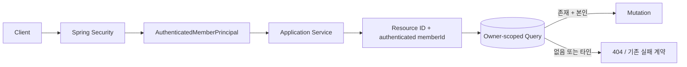

# PawCycle Authorization - Ownership Boundary

[[01. 로그인 보안과 Rate Limiting]]과 [[02. PawCycle Authentication - Edge Security]]에서는 사용자가 누구인지 확인하고 그 인증 상태를 안전하게 유지하는 **Authentication** 경계를 다뤘다.

AUTHZ-001에서는 그 다음 문제를 확인했다.

로그인한 사용자가 있다고 해서 그 사용자가 모든 데이터에 접근할 수 있는 것은 아니다. 서버는 요청마다 **현재 로그인한 사용자가 이 작업을 수행할 권한이 있는지**, 더 구체적으로는 **요청 대상 리소스가 정말 이 사용자의 것인지** 확인해야 한다.

PawCycle에서는 주문, 결제, 쿠폰, 리뷰, 상품 문의처럼 특정 회원에게 귀속되는 데이터가 많다. 이런 리소스는 단순히 로그인 여부만 확인해서는 부족하다.

```text
Authentication
"누구인가?"
        ↓
Authorization
"이 기능을 사용할 수 있는가?"
        ↓
Object-level Authorization / Ownership
"이 특정 리소스를 이 사용자가 다룰 수 있는가?"
```

AUTHZ-001의 핵심은 새로운 보안 프레임워크를 도입한 것이 아니다.

기존 PawCycle이 이미 사용하고 있던 `AuthenticatedMemberPrincipal(memberId, role)`을 기준으로 고객 소유 리소스의 조회와 잠금 경계를 다시 확인하고, 일부 경로에 남아 있던 **ID로 먼저 조회한 뒤 Java에서 소유자를 비교하는 구조**를 **리소스 ID와 인증된 memberId를 함께 조회 조건에 넣는 구조**로 바꾼 작업이다.

---

## Authentication과 Authorization은 다른 문제다

Authentication은 사용자의 신원을 확인한다.

PawCycle 로그인에 성공하면 Session의 SecurityContext에는 다음처럼 최소한의 Principal이 들어간다.

```java
public record AuthenticatedMemberPrincipal(
    Long memberId,
    MemberRole role
) {}
```

Controller는 클라이언트가 보내는 `memberId`를 신뢰해서 현재 사용자를 판단하지 않는다.

```java
@AuthenticationPrincipal
AuthenticatedMemberPrincipal principal
```

을 통해 서버가 이미 인증한 Principal을 받고 다음 계층으로 `principal.memberId()`를 전달한다.

예를 들어 결제 확인 요청에서도 사용자가 요청 Body로 다른 회원의 ID를 넣어서 자신을 가장하는 구조가 아니다.

```text
Browser Request
        ↓
Spring Security
        ↓
HttpSession / SecurityContext
        ↓
AuthenticatedMemberPrincipal.memberId
        ↓
Controller
        ↓
Application Service
```

여기까지가 “현재 요청을 보낸 사람이 누구인가”를 확정하는 Authentication 경계다.

하지만 이것만으로 Authorization이 끝나는 것은 아니다.

사용자 A가 로그인한 상태에서 다음과 같은 요청을 보낼 수 있다고 생각해 보자.

```text
PATCH /api/reviews/100
DELETE /api/product-questions/200
POST /api/payments/toss/confirm
memberCouponId = 300
```

`100`, `200`, `providerOrderId`, `300` 같은 값은 모두 특정 데이터 객체를 가리키는 **Object Reference**다.

로그인한 사용자 A가 이 값을 사용자 B의 리소스로 바꿨을 때 서버가 그대로 처리한다면 Authentication은 성공했지만 Authorization은 실패한 것이다.

---

## IDOR와 BOLA

이 문제는 흔히 **IDOR(Insecure Direct Object Reference)** 또는 API 보안 문맥에서 **BOLA(Broken Object Level Authorization)**라고 부른다.

예를 들어 다음 Endpoint가 있다고 하자.

```text
DELETE /api/reviews/100
```

`100`은 Review라는 객체를 직접 가리킨다.

만약 서버가 단순히:

```java
reviewRepository.findById(100);
reviewRepository.delete(...);
```

만 수행한다면 로그인한 사용자가 URL의 숫자만 바꾸면서 다른 회원의 Review를 삭제할 수 있다.

중요한 점은 ID가 숫자인지 UUID인지가 본질이 아니라는 것이다.

```text
123
550e8400-e29b-41d4-a716-446655440000
provider-order-abc
```

어떤 형식이든 서버가 그 Object에 대한 권한을 검사하지 않는다면 문제가 된다.

OWASP도 Object Reference를 처리하는 Endpoint마다 현재 사용자가 그 객체에 대한 권한을 가지는지 확인해야 하며, 단순히 복잡한 Identifier를 사용하는 것만으로 Access Control을 대신할 수 없다고 설명한다.

PawCycle에서 중요한 원칙은 다음과 같다.

```text
Client가 제공한 Resource Identifier
+
서버가 인증한 memberId
→ 함께 Authorization 판단
```

> 참고
> - [OWASP Insecure Direct Object Reference Prevention Cheat Sheet](https://cheatsheetseries.owasp.org/cheatsheets/Insecure_Direct_Object_Reference_Prevention_Cheat_Sheet.html)
> - [OWASP API1:2023 Broken Object Level Authorization](https://owasp.org/API-Security/editions/2023/en/0xa1-broken-object-level-authorization/)

---

## 기존 구조: 조회 후 소유자 비교

AUTHZ-001 전에도 PawCycle이 Ownership 검사를 전혀 하지 않았던 것은 아니다.

일부 경로는 다음과 같은 구조였다.

```text
1. Resource ID로 DB 조회
2. PESSIMISTIC_WRITE로 Row 잠금
3. 조회 결과에서 memberId 확인
4. 현재 로그인한 memberId와 Java에서 비교
5. 다르면 403
```

개념적으로 표현하면 다음과 같다.

```java
Resource resource = repository.findByIdForUpdate(resourceId)
    .orElseThrow(...);

if (resource.getMemberId() != authenticatedMemberId) {
    throw forbidden();
}
```

이 구조도 “타인의 데이터를 실제로 수정한다”는 가장 큰 문제는 막는다.

즉 기존 코드가 곧바로 IDOR 취약점이었다는 뜻은 아니다.

하지만 두 가지를 더 개선할 수 있었다.

첫째, **리소스 존재 여부와 소유권 실패가 서로 다른 응답으로 나타날 수 있다.**

```text
존재하지 않는 ID
→ 404

존재하지만 다른 회원 소유
→ 403
```

공격자가 많은 ID를 시도하면 이 차이를 이용해 해당 ID의 리소스가 실제로 존재하는지 추측할 수 있다.

둘째, 고객 요청에서 소유권을 확인하기 전에 이미 ID-only `PESSIMISTIC_WRITE` 조회가 수행된다.

Authorization 관점에서는 DB에서 조회하는 순간부터 고객이 접근 가능한 데이터 범위를 좁히는 편이 구조가 더 명확하다.

그래서 AUTHZ-001은 다음 방향을 선택했다.

```text
기존
resourceId
→ DB 조회/잠금
→ Java memberId 비교

변경
resourceId + authenticated memberId
→ DB 조회/잠금
→ 없으면 동일한 Not Found
```

---

## Ownership을 조회 조건으로 내린 이유

OWASP의 IDOR 방어 가이드도 전체 객체 집합에서 ID 하나만 찾은 뒤 권한을 나중에 확인하는 것보다, **현재 사용자가 접근 가능한 객체 집합 안에서 객체를 찾는 구조**를 권장한다.

PawCycle에서는 이를 Repository Query에 반영했다.

```text
"ID 100인 Review를 찾아라"
```

보다:

```text
"현재 로그인한 memberId가 소유한 Review 중 ID 100을 찾아라"
```

라는 Query가 고객용 Use Case의 의미에 더 가깝다.

이렇게 하면 Application Service도 “객체는 찾았는데 소유자가 누구지?”를 다시 판단하지 않아도 된다.

```text
조회 성공
→ 이 고객에게 허용된 객체

조회 실패
→ 존재하지 않거나 이 고객에게 허용되지 않은 객체
```

소유권 판단 위치가 Persistence Query에 포함되면서 Application Service의 상태 분기도 단순해진다.

---

## Payment Confirm

Payment는 이번 작업에서 가장 민감한 경계였다.

결제 확인 Endpoint는 Browser가 Toss 결제 결과로 받은 `providerOrderId`, `paymentKey`, `amount`를 서버에 전달한다.

그러나 `providerOrderId`가 요청에 들어 있다고 해서 현재 로그인한 회원의 결제라는 보장은 없다.

AUTHZ-001 전에는 개념적으로 다음 순서였다.

```text
providerOrderId
→ Payment PESSIMISTIC_WRITE 조회
→ 연결 Order의 memberId 확인
→ authenticated memberId와 비교
→ 다르면 PAYMENT_FORBIDDEN
```

AUTHZ-001에서는 Repository Query 자체가 회원 조건을 포함한다.

```java
@Lock(LockModeType.PESSIMISTIC_WRITE)
@Query(
    "select payment from PaymentEntity payment join fetch payment.order "
        + "where payment.providerOrderId = :providerOrderId "
        + "and payment.order.memberId = :memberId")
Optional<PaymentEntity> findByProviderOrderIdForUpdate(
    @Param("providerOrderId") String providerOrderId,
    @Param("memberId") long memberId);
```

Application Service는 이제 다음처럼 호출한다.

```java
payments.findByProviderOrderIdForUpdate(
    providerOrderId,
    memberId
);
```

그리고 결과가 없으면:

```text
404 PAYMENT_NOT_FOUND
```

로 처리한다.

따라서 다음 두 경우가 외부에서 구분되지 않는다.

```text
실제로 존재하지 않는 providerOrderId
→ 404 PAYMENT_NOT_FOUND

존재하지만 다른 회원의 providerOrderId
→ 404 PAYMENT_NOT_FOUND
```

여기서 중요한 것은 결제 상태 전이를 새로 설계한 것이 아니라는 점이다.

기존:

```text
READY
→ PROCESSING
→ Provider confirm
→ SUCCEEDED / FAILED / UNKNOWN
```

과 amount 검증, 성공 replay, Inventory·Coupon·Order 처리 구조는 유지했다.

즉 이번 작업은 **Payment State Machine을 건드리지 않고 Object Ownership 경계만 좁혔다.**

---

## Product Review

Review 수정과 삭제도 같은 방식으로 바뀌었다.

기존에는 ID-only lock 이후 Java에서 작성자를 비교했다.

AUTHZ-001에서는 고객용 Repository Query가 다음 두 조건을 모두 사용한다.

```text
reviewId
+
authenticated memberId
```

Repository는 `PESSIMISTIC_WRITE`로 해당 조건을 만족하는 Review를 조회한다.

```java
findByIdAndMemberIdForUpdate(
    reviewId,
    memberId
)
```

Application Service는 별도의:

```java
if (current.memberId() != memberId) {
    ...
}
```

비교를 하지 않는다.

결과가 없다면 모두:

```text
404 REVIEW_NOT_FOUND
```

이다.

따라서 고객 관점에서:

```text
없는 Review
다른 회원의 Review
```

를 구별하지 않는다.

반면 자신의 Review라면 기존 수정·삭제 동작은 그대로 수행한다.

---

## Product Question

Product Question은 Review보다 한 가지가 더 중요했다.

고객뿐 아니라 Admin도 Question을 다루기 때문이다.

고객 수정·삭제는 Ownership이 필요하다.

```text
questionId + memberId
→ owner-scoped lock
```

하지만 Admin 답변은 다른 회원의 Question을 관리하기 위한 기능이다.

Admin까지 같은 owner-scoped Query로 바꾸면 오히려 관리 기능이 깨진다.

그래서 두 경계를 명확하게 분리했다.

```text
Customer update/delete
→ lockOwnedQuestion(questionId, memberId)

Admin answer
→ lockQuestion(questionId)
```

이 차이가 중요하다.

보안 규칙은 모든 Endpoint에 같은 조건을 기계적으로 붙이는 것이 아니다.

```text
Customer
→ 자신의 객체만

Admin
→ 승인된 관리 권한 범위에서 다른 회원 객체도 접근 가능
```

처럼 Actor의 역할과 Use Case에 따라 접근 범위가 달라진다.

또 기존 정책도 유지했다.

```text
본인 Question + 아직 답변 없음
→ 수정/삭제 가능

본인 Question + 답변 완료
→ 409 PRODUCT_QUESTION_LOCKED

다른 회원 Question
→ 404 PRODUCT_QUESTION_NOT_FOUND
```

Admin의 답변 및 visibility 관리 동작도 그대로 유지됐다.

---

## Member Coupon

Checkout의 `memberCouponId` 역시 Object Reference다.

고객이 자신의 쿠폰 ID 대신 다른 회원의 `memberCouponId`를 요청에 넣을 수 있기 때문에 Checkout 단계에서 Ownership을 확인해야 한다.

기존 구조는 ID로 Coupon Assignment를 잠근 뒤:

```java
memberCoupon.getMemberId() != memberId
```

를 Java에서 확인했다.

AUTHZ-001에서는 Repository Query가:

```text
memberCouponId + memberId
```

를 함께 사용한다.

```java
@Lock(LockModeType.PESSIMISTIC_WRITE)
@Query(
    "select coupon from MemberCouponEntity coupon "
        + "where coupon.id = :memberCouponId "
        + "and coupon.memberId = :memberId")
```

그 뒤 기존 Coupon 상태 검사는 그대로 진행된다.

```text
AVAILABLE?
Coupon active?
현재 유효 기간인가?
reserveIfAvailable 성공?
```

외부 Checkout 계약도 새로 바꾸지 않았다.

다음은 모두 기존처럼:

```text
COUPON_UNAVAILABLE
```

로 처리된다.

```text
다른 회원 쿠폰
존재하지 않는 쿠폰
이미 사용한 쿠폰
현재 사용할 수 없는 쿠폰
```

Payment처럼 새 오류 계약이 필요한 곳과, 기존 제품 계약을 유지하는 것이 더 좋은 곳을 구분한 것이다.

---

## 왜 403 대신 404인가

`403 Forbidden`은 “요청한 리소스를 알고 있지만 현재 사용자가 접근할 수 없다”는 의미로 사용할 수 있다.

따라서 403 자체가 보안상 잘못된 응답이라는 뜻은 아니다.

하지만 고객 소유 리소스에서 다음 두 응답을 나누면:

```text
404
→ 그 ID는 없음

403
→ 그 ID는 실제로 있지만 네 것은 아님
```

리소스 존재 여부가 추가 정보가 될 수 있다.

AUTHZ-001에서는 Payment, Review, Product Question 고객 mutation에 대해:

```text
missing
non-owner
```

를 같은 Not Found 계약으로 수렴시켰다.

```text
Payment
→ 404 PAYMENT_NOT_FOUND

Review
→ 404 REVIEW_NOT_FOUND

Product Question
→ 404 PRODUCT_QUESTION_NOT_FOUND
```

이 방식은 “Forbidden을 숨겨야 보안이 된다”는 절대 규칙이 아니다.

현재 PawCycle의 고객 소유 객체에서는 **존재 여부를 외부에 구분해서 알려줄 제품상 이유가 없고**, 동일한 Not Found가 더 작은 정보 노출과 단순한 계약을 제공하기 때문에 선택한 것이다.

Admin처럼 다른 회원의 객체를 의도적으로 조회·관리해야 하는 경계에는 같은 규칙을 기계적으로 적용하지 않는다.

---

## Pessimistic Lock과 Ownership은 같은 개념이 아니다

이번 작업에서 Ownership Query와 `PESSIMISTIC_WRITE`가 같이 등장하기 때문에 둘을 하나로 생각하기 쉽다.

하지만 역할은 다르다.

```text
Ownership
→ 이 사용자가 이 객체를 다룰 수 있는가?

PESSIMISTIC_WRITE
→ 동시에 다른 Transaction이 이 Row를 변경하는 것을 어떻게 조정할 것인가?
```

Spring Data JPA에서는 Repository Query에 `@Lock`을 사용해 JPA Lock Mode를 지정할 수 있다.

PawCycle의 결제·리뷰·문의·쿠폰 경로 일부는 상태 변경 전에 현재 값을 안정적으로 확인해야 하므로 `PESSIMISTIC_WRITE`를 사용하고 있다.

```java
@Lock(LockModeType.PESSIMISTIC_WRITE)
```

AUTHZ-001의 핵심은 “Lock을 추가했다”가 아니라:

```text
고객 mutation에서
Locking Query의 검색 조건에도 Ownership을 포함
```

한 것이다.

> 참고
> - [Spring Data JPA - Locking](https://docs.spring.io/spring-data/jpa/reference/jpa/locking.html)
> - [MySQL 8.4 - Locking Reads](https://dev.mysql.com/doc/refman/8.4/en/innodb-locking-reads.html)

---

## `WHERE id AND memberId`가 모든 Lock 경합을 없애는 것은 아니다

이번 작업을 검토하면서 중요한 구분이 하나 더 있었다.

Query를 다음처럼 바꿨다고 하자.

```sql
WHERE id = ?
  AND member_id = ?
FOR UPDATE
```

이 구조는 Authorization 의미를 DB Query에 포함시킨다.

그러나 이것만 보고:

```text
"타인 요청은 다른 사람의 Row Lock과 절대로 상호작용하지 않는다"
```

라고 단정하면 안 된다.

InnoDB의 실제 Lock 대상과 대기 동작은:

```text
사용한 Index
Execution Plan
Transaction Isolation Level
검색 과정
```

등의 영향을 받는다.

MySQL 공식 문서도 `SELECT ... FOR UPDATE`가 검색 과정에서 만나는 Index Record에 Lock을 설정한다고 설명한다.

따라서 AUTHZ-001에서는 **Authorization 구조 개선**과 **DB 물리 Lock 경합 최적화**를 구분했다.

이번 작업에서 실제로 필요하다는 증거가 없는 Composite Index나 새 Migration을 추가하지 않았다.

향후 대규모 데이터·동시성 실험에서 다음과 같은 문제가 측정된다면 그때 별도 성능 문제로 다룬다.

```text
비소유 요청이 특정 Lock 경합을 만든다
Lock wait가 실제 latency를 악화시킨다
Execution Plan이 비효율적이다
```

그때는 `EXPLAIN`, Transaction 동시 실행, Lock Wait Evidence를 바탕으로 Index나 Query 구조를 판단하는 것이 맞다.

즉:

```text
AUTHZ-001
→ Authorization Boundary 개선

향후 Performance 단계
→ 실제 Lock Contention 측정
```

으로 책임을 분리했다.

---

## 왜 memberId를 Request에서 받지 않는가

Ownership 검사의 기준인 `memberId` 자체를 Client가 자유롭게 정할 수 있다면 Query에 memberId 조건을 넣어도 의미가 없다.

안전한 흐름은:

```text
Client
→ Resource Identifier만 요청에 포함

Spring Security
→ Session에서 인증 상태 복원

AuthenticatedMemberPrincipal
→ 서버가 memberId 확정

Application Service
→ Resource Identifier + authenticated memberId

Repository
→ Ownership Query
```

이다.

반대로 다음처럼 동작하면 위험하다.

```json
{
  "reviewId": 100,
  "memberId": 2
}
```

그리고 서버가 이 `memberId`를 그대로 Ownership 기준으로 사용하면 공격자가 값을 바꿀 수 있다.

PawCycle의 현재 고객 API는 서버 인증 Principal의 `memberId`를 사용한다.

이 구조가 AUTHZ-001의 전제다.

---

## Ownership과 Role Authorization도 구분해야 한다

PawCycle에는 일반 고객과 Admin이 있다.

둘은 서로 다른 종류의 Authorization이다.

```text
Role Authorization
→ ADMIN인가?
→ 관리 기능을 사용할 수 있는가?

Ownership Authorization
→ 이 Review / Question / Payment / Coupon이 현재 회원의 것인가?
```

예를 들어 `/api/admin/**`는 ADMIN Role을 기준으로 보호되고, Product Question 답변은 관리자가 다른 회원의 Question을 처리하는 것이 정상 동작이다.

반면 고객의 Review 삭제는 Role만 USER라고 확인해서는 부족하다.

```text
USER A
USER B
```

둘 다 같은 Role이지만 A가 B의 Review를 삭제할 수 있어서는 안 된다.

그래서 실제 Commerce 보안에서는:

```text
Authentication
+
Role
+
Object Ownership
+
Business State
```

가 함께 사용된다.

Product Question 하나만 봐도:

```text
로그인했는가?
→ Authentication

고객인가 Admin인가?
→ Role / Endpoint Authorization

이 Question의 작성자인가?
→ Ownership

이미 답변이 등록됐는가?
→ Business State
```

가 각각 다른 판단이다.

---

## Business Rule을 Authorization으로 착각하면 안 된다

AUTHZ-001은 보안 작업이지만 모든 실패가 Authorization 실패는 아니다.

예를 들어 Product Question은 작성자 본인이라도 답변이 이미 등록되었다면 수정할 수 없다.

```text
본인 여부
→ Ownership

답변 완료 여부
→ Business Rule
```

그래서:

```text
다른 회원
→ 404 PRODUCT_QUESTION_NOT_FOUND

본인 + 답변 완료
→ 409 PRODUCT_QUESTION_LOCKED
```

를 구분한다.

Coupon도 마찬가지다.

```text
내 쿠폰인가?
→ Ownership

AVAILABLE 상태인가?
→ Business State

활성 Coupon인가?
→ Business Rule

유효 기간인가?
→ Business Rule
```

보안 검사를 강화한다고 모든 실패를 하나의 `ACCESS_DENIED`로 바꾸면 오히려 Domain 의미가 사라질 수 있다.

---

## 회귀 테스트는 User A와 User B를 함께 사용했다

Object-level Authorization 검증에서는 한 사용자만으로 테스트하면 부족하다.

OWASP도 IDOR 검증 시 서로 다른 권한 범위를 가진 여러 사용자를 만들고, 한 사용자가 다른 사용자의 Object Reference를 사용해 보는 방식을 권장한다.

AUTHZ-001도 이 구조를 사용했다.

대표적으로:

```text
Member A
→ 자신의 Review / Question / Payment / Coupon 생성

Member B
→ A의 Resource Identifier로 mutation 시도

Expected
→ A의 데이터 변경 없음
→ 계약된 404 또는 COUPON_UNAVAILABLE
```

Review와 Question에서는:

```text
owner update/delete
non-owner update/delete
missing resource
answered Question
Admin answer
```

를 함께 검증했다.

Payment에서는 다른 회원의 `providerOrderId`가:

```text
PAYMENT_NOT_FOUND
```

로 처리되고 Payment 상태가 `READY`에서 변하지 않는 것을 확인했다.

Coupon에서는:

```text
본인 AVAILABLE Coupon
→ 정상 예약

다른 회원 Coupon
→ COUPON_UNAVAILABLE

없는 Coupon
→ COUPON_UNAVAILABLE

이미 사용할 수 없는 Coupon
→ COUPON_UNAVAILABLE
```

계약을 확인했다.

이런 테스트는 단순히 “정상 사용자가 성공한다”를 확인하는 테스트와 목적이 다르다.

**공격자 역할의 두 번째 사용자를 만들어 Object Reference를 바꿨을 때도 경계가 유지되는지 검증하는 Security Regression Test**다.

---

## Frontend Contract를 확인한 이유

이번 변경은 Backend Application Service와 Repository 중심이었지만 외부 HTTP 오류 계약 중 일부가:

```text
403
→ 404
```

로 바뀌었다.

따라서 Frontend가 기존 오류 코드에 특별한 분기를 가지고 있었다면 Backend만 고쳐서는 안 된다.

검토 결과 Frontend에는 다음 코드에 대한 의존 분기가 없었다.

```text
PAYMENT_FORBIDDEN
REVIEW_OWNER_REQUIRED
PRODUCT_QUESTION_OWNER_REQUIRED
```

Payment 실패는 기존 `ApiError.message` 경계에서 처리되고, Review 수정·삭제도 위 403 code에 의존하지 않았다.

그래서 Frontend 제품 코드는 수정하지 않았다.

다만 Repository Validation의 현재 변경 분류기는 Application Service에서 일어난 오류 코드 변경을 Frontend HTTP Contract 변화로 자동 감지하지 못해 Frontend lane을 `SKIPPED`했다.

이것은 AUTHZ-001의 제품 결함은 아니지만 Harness가 앞으로 보완할 수 있는 지점이다.

```text
현재 classifier
Controller / API DTO 중심

이번 사례
Application Service에서 HTTP error contract 변경
→ Frontend lane 자동 선택 안 됨
```

즉 AI Harness도 실제 작업을 하면서 사각지대를 발견하고 개선 후보를 얻는다.

---

## AUTHZ-001 실제 Evidence

작업:

```text
AUTHZ-001
```

PR:

```text
#297 fix(security): 회원 소유권 잠금 경계 강화
```

최종 PR HEAD:

```text
840b5fe2e58e9c63bcfa78804202f8e862fa91a6
```

Squash merge commit:

```text
f2732c2bbe7b73a670323b2f0127d2e61cf2d6fa
```

최종 검증은 다음과 같다.

```text
Repository Validation #1744
├─ Commit and PR conventions   PASS
├─ Harness validation          PASS
├─ Backend and MySQL           PASS
│  ├─ MySQL 8.4               PASS
│  ├─ Backend test             PASS
│  └─ Backend build            PASS
├─ Frontend                    SKIPPED
├─ Production contract         SKIPPED
└─ Application validation      PASS

PR Metadata Validation #498    PASS

CodeRabbit
→ HEAD 840b5fe... 검토
→ actionable finding 0
```

CodeRabbit의 Docstring Coverage 경고는 PawCycle 저장소의 필수 Java/CI 계약이 아닌 보조 경고였고, 실제 코드 finding은 없었다.

PR 본문 정리 과정에서 필수 label인 `실행 결과` / `실패·미실행` 형식을 잠시 깨뜨려 Metadata/Repository Validation이 실패한 적이 있었다.

원인은 제품 코드가 아니라 Harness PR Contract였다.

본문을 다음 형태로 복원했다.

```text
실행 결과: ...
실패·미실행: ...
```

그 뒤:

```text
PR Metadata #498
Repository Validation #1744
```

가 최신 PR 본문 기준으로 다시 성공한 것을 확인하고 병합했다.

---

## 현재 Evidence 수준

AUTHZ-001은 현재 다음 상태다.

```text
Implemented
→ YES

Verified
→ YES

Merged to main
→ YES

Production Verified
→ NO
```

실제 Production에 별도의 변경을 배포하거나 운영 DB를 수정한 작업이 아니다.

따라서 이번 작업을:

```text
Production 보안 검증 완료
```

라고 표현하면 안 된다.

정확한 표현은:

```text
Repository 구현 완료
+
실제 MySQL 기반 CI 검증 완료
+
최신 HEAD 독립 리뷰 완료
+
main 병합 완료
```

다.

---

## 이번 작업에서 유지한 것과 바꾼 것

| 영역 | 판단 | 이유 |
| --- | --- | --- |
| Session 기반 Principal | KEEP | 서버가 인증한 memberId를 신뢰 기준으로 사용 |
| Controller의 `principal.memberId()` 전달 | KEEP | Client 입력으로 소유자를 결정하지 않음 |
| Payment 상태 전이 | KEEP | Ownership과 결제 상태 머신은 별도 문제 |
| Question Admin ID-only 관리 경로 | KEEP | Admin은 cross-owner 관리가 정상 Use Case |
| Question 답변 후 409 | KEEP | Ownership이 아닌 Business State 규칙 |
| Coupon 외부 `COUPON_UNAVAILABLE` | KEEP | 기존 Checkout 계약 유지 |
| Customer ID-only lock 후 Java owner 비교 | CHANGE | Ownership을 Persistence Query 조건에 포함 |
| Non-owner 403 | CHANGE | missing과 같은 404로 수렴해 존재 정보 차이 축소 |
| Composite Ownership Index | DEFER | 현재 작업에서 필요하다는 측정 근거 없음 |
| Method Security 중복 추가 | DEFER | 현재 Controller/Security/Ownership 경계로 요구 충족 |
| ABAC/RBAC 재설계 | DEFER | 현재 문제보다 범위가 큼 |

---

## 최종 흐름

AUTHZ-001 이후 고객 소유 리소스의 핵심 흐름은 다음처럼 이해할 수 있다.



중요한 것은 `memberId`가 Client의 주장으로 들어오는 값이 아니라 **인증된 Session Principal에서 나온 값**이라는 점이다.

그리고 Admin처럼 다른 회원의 객체를 관리해야 하는 Use Case는 고객 Ownership Query와 분리한다.

---

## 최종 판단

이번 작업에서 가장 중요한 교훈은 Authorization을 하나의 `if` 문으로 생각하지 않는 것이다.

안전한 고객 소유 리소스 처리에는 다음 요소가 함께 연결된다.

```text
인증된 Principal
→ 신뢰할 memberId 확정

Object Reference
→ Client가 바꿀 수 있다고 가정

Ownership Query
→ Resource ID와 authenticated memberId를 함께 사용

HTTP Error Contract
→ 불필요한 존재 정보 차이를 줄임

Business Rule
→ Ownership과 별도로 유지

Admin Boundary
→ Customer Ownership과 분리

Regression Test
→ User A / User B / Missing / Admin 경계를 함께 검증
```

PawCycle에서는 이 원칙을 Payment, Review, Product Question, Member Coupon에 적용했다.

새로운 인증 기술을 도입한 것이 아니라 **이미 존재하는 Session Principal과 Domain 관계를 더 정확한 Authorization 경계로 연결한 것**이 이번 작업의 핵심이다.

> 참고
> - [OWASP Insecure Direct Object Reference Prevention Cheat Sheet](https://cheatsheetseries.owasp.org/cheatsheets/Insecure_Direct_Object_Reference_Prevention_Cheat_Sheet.html)
> - [OWASP API1:2023 Broken Object Level Authorization](https://owasp.org/API-Security/editions/2023/en/0xa1-broken-object-level-authorization/)
> - [Spring Data JPA - Locking](https://docs.spring.io/spring-data/jpa/reference/jpa/locking.html)
> - [MySQL 8.4 Reference Manual - Locking Reads](https://dev.mysql.com/doc/refman/8.4/en/innodb-locking-reads.html)
> - [PR #297](https://github.com/guseoh/pawcycle-commerce/pull/297)
