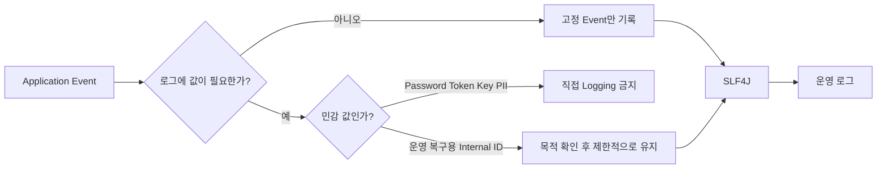

# PawCycle Logging - Sensitive Data Boundary

[[01. 로그인 보안과 Rate Limiting]], [[02. PawCycle Authentication - Edge Security]], [[03. PawCycle Authorization - Ownership Boundary]]에서는 외부 요청이 시스템 안으로 들어올 때의 인증·인가 경계를 다뤘다.

SEC-LOG-001에서는 그 다음 문제를 확인했다.

애플리케이션이 요청을 안전하게 처리하더라도 **운영 로그에 민감한 값이 남으면 또 다른 정보 노출 경로가 생길 수 있다.**

로그는 장애 분석, 운영 추적, 실패 복구에 꼭 필요하다. 반대로 로그는 애플리케이션 프로세스 밖으로 전달되고 장기간 보관될 수 있기 때문에, 요청 처리에 필요했던 값을 그대로 남기면 보안 경계가 다시 넓어진다.

이번 작업의 핵심은 “로그를 최대한 적게 남긴다”가 아니다.

```text
운영에 필요한 정보
→ 남긴다.

직접 남길 이유가 없는 credential / token / 개인정보
→ 남기지 않는다.

내부 식별자
→ 무조건 삭제하지 않고 실제 운영 가치에 따라 판단한다.

자동 검증
→ 현재 보장하는 범위만 정확하게 고정한다.
```

즉 **Observability와 Sensitive Data Protection 사이의 경계**를 코드와 테스트로 명시한 작업이다.

---

## 로그도 하나의 데이터 저장 경로다

애플리케이션에서 다음 값이 메모리에 잠깐 존재하는 것과 로그에 기록되는 것은 의미가 다르다.

```text
password
authKey
billingKey
paymentKey
session identifier
Authorization header
Cookie
배송지 개인정보
```

요청 처리 중 메모리에 존재하는 값은 해당 실행 흐름이 끝나면 사라질 수 있다.

하지만 로그에 남으면 상황이 달라진다.

```text
Application
→ stdout / file
→ Docker / VM log
→ 중앙 로그 수집
→ 검색 / 보존 / 백업
```

한 번 기록된 값은 애플리케이션 밖의 여러 시스템으로 복제될 수 있다.

그래서 로그 보안은 단순한 코딩 스타일이 아니라 **데이터 노출 범위를 결정하는 보안 설계**다.

OWASP Logging Cheat Sheet도 access token, authentication password, session identification value, 민감 개인정보처럼 직접 로그에 남길 필요가 없는 값은 제거·마스킹·해시·가명화 등을 고려해야 한다고 설명한다.

> 참고
> - [OWASP Logging Cheat Sheet](https://cheatsheetseries.owasp.org/cheatsheets/Logging_Cheat_Sheet.html)

---

## PawCycle에서 실제로 발견한 문제

SEC-LOG-001 전의 `BillingApplicationService`에는 다음과 같은 성공 로그가 있었다.

```java
String token = transaction.execute(
    status -> billing.createPreparation(memberId)
);

log.info(
    "Billing method preparation created. memberId={}",
    memberId
);
```

Billing method 등록이 끝난 뒤에도 같은 구조가 있었다.

```java
transaction.executeWithoutResult(
    status -> billing.register(
        memberId,
        prepareToken,
        billingKey
    )
);

log.info(
    "Billing method registration completed. memberId={}",
    memberId
);
```

여기서 `memberId`는 password나 billing key 같은 credential은 아니다.

그렇다고 routine success event를 확인하는 데 반드시 필요한 값도 아니었다.

실제로 운영자가 알고 싶은 핵심은:

```text
Billing preparation 생성 성공
Billing method 등록 성공
```

이지 반드시:

```text
회원 12345의 Billing preparation 생성 성공
```

까지는 아니었다.

따라서 가장 작은 수정은 로그 자체를 없애는 것도, 전역 로깅 시스템을 재설계하는 것도 아니었다.

```java
log.info("Billing method preparation created");

log.info("Billing method registration completed");
```

처럼 **event는 유지하고 불필요한 raw memberId만 제거**했다.

---

## 왜 memberId를 전역 금지하지 않았는가

초기 구현에서는 정적 계약 테스트에 `memberId`를 민감 값으로 넣어 모든 logger 호출에서 차단했다.

겉으로 보면 더 안전해 보인다.

하지만 이 정책은 이번 문제보다 범위가 컸다.

```text
이번 실제 문제
→ Billing routine success 로그의 불필요한 memberId

전역 정책
→ 모든 INFO/WARN/ERROR/DEBUG/TRACE에서 memberId 금지
```

이 둘은 같은 결정이 아니다.

예를 들어 장애 대응에서 특정 회원 데이터와 관련된 실패를 추적해야 하는 상황이 생길 수도 있다. 그런 사용까지 모두 금지하려면 별도의 로그 정책과 운영 요구를 확인해야 한다.

SEC-LOG-001에서는 근거가 있는 문제만 해결했다.

```text
Billing routine success memberId
→ CHANGE

모든 memberId logging
→ 전역 금지하지 않음
```

이 판단은 PawCycle의 기본 원칙인 “측정되거나 확인된 문제에 가장 작은 해결책을 적용한다”와 같다.

---

## 내부 식별자는 모두 민감정보인가

이번 작업에서 중요한 구분이 하나 더 있었다.

PawCycle에는 실제 장애 복구를 위해 다음과 같은 로그가 있다.

```text
Subscription reconciliation failed;
subscriptionId=...

Subscription order automation failed;
subscriptionId=...
scheduleId=...
```

`subscriptionId`, `scheduleId`는 내부 리소스 식별자다.

이 값들을 무조건 제거하면 보안은 단순해 보이지만 운영자는 다음 질문에 답하기 어려워진다.

```text
어떤 Subscription이 실패했는가?
어떤 Schedule 실행이 실패했는가?
어떤 데이터를 다시 확인해야 하는가?
재시도 대상은 무엇인가?
```

따라서 SEC-LOG-001에서는 다음처럼 구분했다.

```text
routine success에 불필요한 memberId
→ 제거

reconciliation / automation failure의
subscriptionId / scheduleId
→ KEEP
```

핵심은 “ID는 안전하다”도 아니고 “ID는 전부 민감하다”도 아니다.

**현재 로그의 목적과 장애 복구 가치가 무엇인지 확인한 뒤 남길 이유가 있는지 판단한다.**

---

## credential과 token은 왜 더 강하게 막는가

반면 아래 값들은 성격이 다르다.

```text
password
passwordHash
credential
prepareToken
authKey
billingKey
paymentKey
customerKey
sessionId / JSESSIONID
CSRF token
Authorization
Cookie
```

이 값들은 인증·결제·세션 처리에 직접 사용되거나 다른 인증 정보와 결합될 수 있다.

따라서 이번 계약에서는 이 이름 계열을 logger의 **직접 값 인자**로 넘기는 것을 자동으로 막는다.

예를 들어:

```java
log.info("billingKey={}", billingKey);
```

는 금지 대상이다.

하지만 다음과 같은 고정 event 문자열은 허용한다.

```java
log.info("Billing method registration completed");
```

즉 문자열 안에 “billing”이라는 단어가 있다는 이유로 차단하지 않는다.

---

## 단순 문자열 검색으로 검사하지 않은 이유

가장 단순한 회귀 테스트는 다음과 같은 방식일 수 있다.

```text
backend/src/main/java 전체에서
"password"
"billingKey"
"email"
검색
```

하지만 이 방식은 사용할 수 없다.

PawCycle 제품 코드는 실제로 다음 값을 정상적으로 다뤄야 하기 때문이다.

```java
request.email()
member.getPasswordHash()
provider.issueBillingKey(...)
```

이것까지 전부 실패시키면 “민감정보를 로그에 남기지 않는다”가 아니라 “민감정보를 애플리케이션에서 사용하지 못한다”가 된다.

그래서 `SensitiveLoggingContractTests`는 Java source를 JDK AST로 파싱해서:

```text
민감한 이름이 존재하는가?
```

가 아니라:

```text
SLF4J logger 호출의 값 인자로
민감한 값이 직접 전달되는가?
```

를 검사한다.

---

## JDK AST로 logger 호출 경계만 검사한다

테스트는 Backend production Java source를 읽은 뒤 JDK Compiler API를 이용해 AST를 만든다.

개념적으로는 다음 흐름이다.

```text
backend/src/main/java
→ JavaCompiler
→ JavacTask.parse()
→ CompilationUnitTree
→ Logger 선언 탐색
→ logger invocation 탐색
→ argument 검사
```

검사 대상 log level은:

```text
trace
debug
info
warn
error
```

이다.

SLF4J `Logger` 변수나 Lombok `@Slf4j`의 `log`를 찾아 실제 logger 호출만 본다.

예를 들어:

```java
String authKey = request.authKey();
consume(authKey);
```

는 logger 호출이 아니므로 계약 테스트의 대상이 아니다.

반면:

```java
log.info("authKey={}", authKey);
```

는 logger argument 경계에서 `authKey`를 확인해 실패한다.

---

## raw request를 왜 별도로 다뤘는가

처음 AST 테스트에서는 다음 이름을 raw request로 취급했다.

```text
request
httpRequest
servletRequest
requestBody
body
payload
```

문제는 AST가 argument 내부 identifier를 재귀적으로 검사한다는 점이었다.

그래서 다음처럼 안전한 메타데이터만 기록해도:

```java
log.info("method={}", request.getMethod());
```

`request`라는 identifier가 존재한다는 이유로 실패할 수 있었다.

하지만 우리가 막으려던 것은:

```text
HTTP request 객체 전체
request body
payload
```

이지 HTTP method 같은 비민감 메타데이터까지 무조건 막는 것이 아니다.

그래서 계약을 다시 좁혔다.

```text
request 자체
→ 금지

request.getBody()
→ 금지

request.getPayload()
→ 금지

request.getMethod()
→ 허용
```

---

## 변수명만 믿으면 안 되는 이유

두 번째 검토에서는 또 다른 문제가 발견됐다.

다음은 잡을 수 있었다.

```java
HttpServletRequest request;

log.info("request={}", request);
```

하지만 개발자가 이름만 바꾸면:

```java
HttpServletRequest req;

log.info("request={}", req);
```

단순 이름 규칙은 놓칠 수 있다.

그래서 최신 계약에서는 변수명뿐 아니라 타입도 확인한다.

```text
HttpServletRequest
ServletRequest
```

타입의 변수라면 이름이 `req`처럼 달라도 raw request object로 판단한다.

동시에 다음은 계속 허용한다.

```java
log.info("method={}", req.getMethod());
```

이 보정에서 중요한 점은 단순히 탐지 범위를 넓인 것이 아니다.

**금지할 대상과 허용할 대상을 둘 다 테스트해서 오탐도 회귀로 취급**했다.

---

## Positive Test와 Negative Test를 같이 두는 이유

보안 회귀 테스트는 공격적인 값을 잡는 것만 확인하면 부족하다.

예를 들어 “request 관련 모든 표현식을 금지”하면 raw request 노출은 잘 막지만 정상적인 운영 로그도 함께 막을 수 있다.

그래서 테스트는 양쪽을 모두 확인한다.

```text
Positive
→ 실제 위험 패턴은 반드시 검출

Negative
→ 승인된 안전 패턴은 검출하지 않음
```

대표적으로:

```java
log.info("request={}", req);
```

는 위반이다.

```java
log.info("body={}", req.getBody());
```

도 위반이다.

하지만:

```java
log.info("method={}", req.getMethod());
```

는 통과해야 한다.

이 구조가 있어야 정적 보안 계약이 시간이 지나면서 지나치게 넓어지는 것을 막을 수 있다.

---

## 실행형 Billing 로그 테스트도 따로 둔 이유

정적 AST 계약만으로는 실제 Billing 성공 흐름에서 어떤 문자열이 출력되는지 보장하기 어렵다.

그래서 `BillingApplicationServiceLoggingTests`는 실제 Application Service를 호출하면서 로그 출력을 캡처한다.

테스트에서는 실제 Secret을 사용하지 않고 synthetic sentinel을 사용한다.

```text
memberId
prepareToken
authKey
customerKey
billingKey
```

각각 눈에 띄는 테스트 전용 값을 넣고 Billing prepare / complete 흐름을 실행한다.

그 뒤:

```text
Billing method preparation created
Billing method registration completed
```

event는 존재해야 하지만 sentinel 값은 하나도 출력되지 않아야 한다.

즉 두 테스트가 서로 다른 책임을 가진다.

```text
BillingApplicationServiceLoggingTests
→ 실제 알려진 경로의 runtime 출력 검증

SensitiveLoggingContractTests
→ Backend production source 전체의 직접 logger 인자 회귀 검증
```

---

## exception stack trace는 왜 제거하지 않았는가

PawCycle의 여러 Exception Handler는 예상 밖의 오류를 다음처럼 기록한다.

```java
log.error(
    "Unexpected exception while processing ...",
    exception
);
```

여기서 exception 객체를 logger에 전달하면 stack trace와 exception message가 기록될 수 있다.

AUTH-004에서도 다음 한계가 남아 있었다.

```text
arbitrary exception message에
민감 값이 포함될 경우
일반적인 자동 redaction은 보장하지 않는다.
```

SEC-LOG-001에서 이 문제까지 해결하려면 다음 같은 선택이 필요할 수 있다.

```text
전역 Logback sanitizer
custom filter
exception wrapping
message redaction
logging architecture 변경
```

하지만 실제 제품 경로에서 Secret이나 credential이 exception message로 흐르는 재현 가능한 경로가 확인된 것은 아니었다.

반대로 stack trace를 단순히 제거하면 실제 장애 분석 능력을 크게 떨어뜨릴 수 있다.

따라서 이번에는:

```text
기존 exception stack trace
→ KEEP

arbitrary exception redaction
→ DEFER
```

로 결정했다.

---

## CodeRabbit이 지적한 alias 문제

CodeRabbit 수동 리뷰에서는 정적 테스트의 한계를 정확히 하나 지적했다.

현재 scanner는 logger argument의 이름과 표현식을 직접 검사한다.

그래서:

```java
log.info("authKey={}", authKey);
```

는 검출한다.

하지만:

```java
String value = authKey;
log.info("value={}", value);
```

처럼 별칭을 만들면 `value`라는 이름만 보게 되므로 원래 값이 `authKey`에서 왔다는 사실까지는 추적하지 않는다.

이 finding 자체는 기술적으로 맞다.

이를 해결하려면:

```text
Variable initializer
Assignment
Reassignment
Scope
Control flow
Data flow
```

를 따라가며 민감 정보의 출처를 전파해야 한다.

즉 단순 AST name scanner에서 작은 **taint analysis** 쪽으로 넘어간다.

SEC-LOG-001의 승인 범위는 여기까지가 아니었다.

그래서 CodeRabbit finding을 무시한 것이 아니라 다음처럼 처리했다.

```text
Finding의 사실성
→ 인정

이번 작업 범위인가?
→ 아니오

현재 보장 범위에 명시했는가?
→ 예

후속으로 확장 가능?
→ 예
```

PR과 보고서에 “별칭 데이터 흐름 추적은 하지 않는다”고 명시한 뒤 review thread에서 근거를 설명했다.

CodeRabbit도 최신 범위를 확인하고 기존 finding을 철회하며 thread를 resolved 처리했다.

이 과정은 AI Review를 “나오면 무조건 수정하는 도구”가 아니라 **현재 문제·승인 범위·복잡성 증가를 함께 판단하는 검토 수단**으로 사용하는 사례다.

---

## 자동 검증이 보장하는 것과 보장하지 않는 것

SEC-LOG-001 이후 자동 검증이 보장하는 범위는 다음과 같다.

### 보장하는 것

```text
직접 logger argument에서
password / credential / 주요 개인정보 /
Billing·Payment key /
session / CSRF /
Authorization / Cookie
이름 계열을 검출

HttpServletRequest / ServletRequest
객체 자체의 직접 logging 검출

body / payload 접근 검출

Billing routine success에서
memberId / token / key sentinel 미출력 검증
```

### 보장하지 않는 것

```text
String value = authKey;
log.info("{}", value);
같은 alias data flow

runtime object 내부 toString()

다른 logging framework의 모든 출력 경로

arbitrary exception message redaction

Production 중앙 로그 수집·보존·권한 정책
```

보안 테스트에서 중요한 것은 “모든 로그 보안 문제가 해결됐다”고 쓰는 것이 아니라 **정확히 어디까지 검증했는지를 명시하는 것**이다.

---

## 이번 작업에서 별도 라이브러리를 넣지 않은 이유

민감정보 검출만을 위해 새 정적 분석 라이브러리나 logging security dependency를 추가할 수도 있다.

하지만 현재 PawCycle의 문제는 크지 않았다.

```text
현재 production logger 호출 수
→ 제한적

확인된 실제 문제
→ Billing 성공 로그의 raw memberId

필요한 회귀
→ 직접 logger argument의 명확한 민감 값 차단
```

그래서 JDK 자체의 Compiler/AST API로 해결했다.

이 선택의 장점은:

```text
신규 dependency 없음
CI dependency graph 변화 없음
작은 테스트 범위
저장소 내부에서 계약을 직접 이해 가능
```

이다.

대신 alias data flow처럼 더 정교한 분석까지 필요해진다면 현재 scanner를 계속 비대하게 만들기보다 그 시점에 전문 정적 분석 도구나 다른 구조를 검토하는 것이 더 낫다.

---

## SEC-LOG-001 실제 진행 과정

처음 Codex 구현은 네 파일로 구성됐다.

```text
BillingApplicationService.java
BillingApplicationServiceLoggingTests.java
SensitiveLoggingContractTests.java
docs/reports/SEC-LOG-001/be-report.md
```

초기 방향 자체는 맞았다.

하지만 독립 검토에서 두 가지 과도한 계약을 발견했다.

### 1. memberId 전역 금지

초기 AST contract가 모든 logger level에서 `memberId`를 차단했다.

이번 실제 문제보다 정책 범위가 넓었으므로 제거했다.

Billing의 routine success 노출은 실행형 테스트가 계속 보호한다.

### 2. request safe projection 오탐

초기 raw request 규칙은 `request.getMethod()`도 `request`라는 identifier 때문에 실패시킬 수 있었다.

raw request 자체와 body/payload만 막고 안전한 metadata는 허용하도록 수정했다.

그 뒤 다시 검토하면서 **변수명 우회**를 발견했다.

```text
request
→ 검출

req
→ 기존 이름 기반 규칙만으로는 놓칠 수 있음
```

그래서 `HttpServletRequest` / `ServletRequest` 타입 기반 검출까지 추가했다.

즉 최종 구조는 한 번에 나온 것이 아니라:

```text
Codex 초기 구현
→ ChatGPT semantic review
→ 정책 과확장 수정
→ 오탐 수정
→ CodeRabbit review
→ finding 범위 판단
→ 추가 자체 review
→ 타입 기반 raw request 보강
→ 최신 HEAD 전체 CI
```

순으로 다듬어졌다.

---

## CI와 Review Evidence

작업:

```text
SEC-LOG-001
```

PR:

```text
#298 fix(security): Backend 민감 로그 경계 강화
```

최종 PR HEAD:

```text
803cb6690d9de54b8412fca81dec27d36785ea29
```

Squash merge commit:

```text
df74023e96a3afe37219ecd50d48adac8b7b3c60
```

최종 코드 HEAD 기준 검증:

```text
Repository Validation #1750
├─ Commit and PR conventions   PASS
├─ Classify validation changes PASS
├─ Harness validation          PASS
├─ Backend and MySQL           PASS
│  ├─ MySQL service            PASS
│  ├─ Backend test             PASS
│  └─ Backend build            PASS
├─ Frontend                    SKIPPED
├─ Production contract         SKIPPED
└─ Application validation      PASS

PR Metadata Validation #502    PASS
```

Ready 전환 과정에서 동일 HEAD에 workflow가 다시 실행됐지만, 코드 변경 없이 이미 #1750/#502에서 최신 코드 HEAD 전체 검증을 완료한 상태였다.

CodeRabbit에서는 alias data-flow finding 하나가 있었고, SEC-LOG-001의 명시된 직접 logger argument 계약과 taint-analysis 제외 범위를 확인한 뒤 finding을 철회하고 thread를 resolved 처리했다.

최종 병합은 예상 HEAD를 고정한 squash merge로 수행했다.

```text
expected HEAD
803cb6690d9de54b8412fca81dec27d36785ea29

merge commit
df74023e96a3afe37219ecd50d48adac8b7b3c60
```

---

## 현재 Evidence 수준

SEC-LOG-001의 현재 상태는 다음과 같다.

```text
Implemented
→ YES

Verified
→ YES

Merged to main
→ YES

Production Verified
→ NO
```

실제 Production의 중앙 로그를 조회해서 secret 유출 여부를 검증하거나 OCI 로그 수집 정책을 변경한 작업은 아니다.

따라서:

```text
Production 로그 보안 검증 완료
```

라고 표현하면 안 된다.

정확한 표현은:

```text
Repository logging contract 강화
+
실행형 Billing 로그 테스트
+
JDK AST 정적 회귀 검사
+
MySQL 포함 Backend 전체 CI
+
독립 검토 및 AI Review
+
main 병합 완료
```

다.

---

## CHANGE / KEEP / DEFER

| 영역 | 판단 | 이유 |
| --- | --- | --- |
| Billing 성공 INFO의 raw memberId | CHANGE | event 확인에 불필요한 직접 식별자 |
| Billing 성공 event 자체 | KEEP | 운영 흐름 확인에 가치가 있음 |
| password/credential/token/key 직접 logger 인자 | CHANGE | 회귀 계약으로 금지 |
| raw HttpServletRequest/ServletRequest 직접 logging | CHANGE | 요청 전체 노출 가능성을 줄임 |
| request body/payload logging | CHANGE | 민감 요청 데이터 노출 가능 |
| request.getMethod() 같은 안전 metadata | KEEP | raw request와 다른 운영 정보 |
| subscriptionId/scheduleId 장애 로그 | KEEP | 실패 대상 식별·복구에 실제 필요 |
| exception stack trace | KEEP | 현재 장애 진단 가치가 크고 구체적 유출 경로 미확인 |
| memberId 전역 logging 금지 | DEFER | 현재 근거보다 넓은 정책 |
| alias/taint analysis | DEFER | 작은 AST contract보다 복잡도가 크게 증가 |
| 전역 sanitizer/filter | DEFER | 실제 필요성을 먼저 증명해야 함 |
| 중앙 로그 보존·접근권한 정책 | DEFER | Production 운영 영역 |
| arbitrary exception message redaction | DEFER | 일반 해결에는 전역 logging 설계 판단 필요 |

---

## 최종 흐름

SEC-LOG-001 이후 로그 경계는 다음처럼 이해할 수 있다.



그리고 자동 회귀 검증은 별도로:

```text
Backend Java Source
→ JDK AST
→ Logger 호출 탐색
→ 직접 Argument 검사
→ 민감 값 / raw request 계약 위반 시 테스트 실패
```

한다.

---

## 최종 판단

이번 작업에서 가장 중요한 교훈은 **보안 강화가 항상 더 많은 값을 금지하는 것은 아니라는 점**이다.

실제 시스템에서는 보안과 운영성이 같이 존재한다.

```text
너무 많이 기록
→ 정보 노출 위험

너무 적게 기록
→ 장애 원인과 복구 대상 추적 어려움
```

그래서 PawCycle에서는 다음 기준으로 로그를 판단했다.

```text
이 값이 실제 운영에 필요한가?
→ 아니면 제거

credential/token/직접 개인정보인가?
→ logger 직접 인자 금지

내부 ID인가?
→ 용도에 따라 판단

자동 검증이 정확히 무엇을 보장하는가?
→ 문서에 범위를 명시

더 강한 분석이 필요한가?
→ 측정된 필요가 생길 때 확장
```

SEC-LOG-001은 Logback sanitizer나 전문 taint-analysis 도구를 도입한 작업이 아니다.

**현재 PawCycle에서 실제로 확인된 노출을 가장 작은 변경으로 제거하고, 앞으로 같은 종류의 직접 로깅이 다시 들어오지 않도록 회귀 경계를 만든 작업**이다.

그리고 그 과정에서 정적 보안 테스트 자체도 오탐과 정책 과확장을 만들 수 있다는 점을 확인했다.

보안 테스트도 제품 코드와 마찬가지로:

```text
무엇을 막으려는가
→ 실제 위험

무엇은 허용해야 하는가
→ 정상 운영

어디까지 자동으로 증명하는가
→ 검증 범위

무엇은 아직 증명하지 못하는가
→ 남은 한계
```

를 분리해서 설계해야 한다.

> 참고
> - [OWASP Logging Cheat Sheet](https://cheatsheetseries.owasp.org/cheatsheets/Logging_Cheat_Sheet.html)
> - [SLF4J Manual](https://www.slf4j.org/manual.html)
> - [Java Compiler Tree API](https://docs.oracle.com/en/java/javase/25/docs/api/jdk.compiler/com/sun/source/tree/package-summary.html)
> - [PR #298](https://github.com/guseoh/pawcycle-commerce/pull/298)
