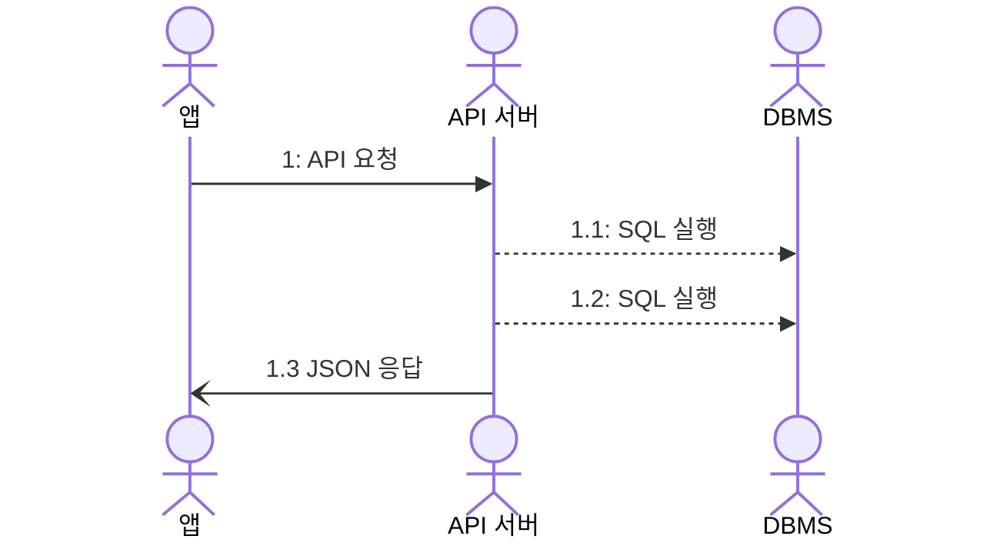

### 응답 시간

응답 시간은 **사용자의 요청을 처리하는 데 걸리는 시간**을 의미한다. 아래 그림은 전형적인 API 호출 과정을 나타낸 것이다. 이 API를 호출하고 전체 JSON 응답을 받을 때 까지 소요된 시간이 바로 응답 시간이다.

```mermaid
sequenceDiagram
actor 앱
actor API 서버
actor DBMS
앱->>API 서버: 1: API 요청
API 서버-->>DBMS: 1.1: SQL 실행
API 서버-->>DBMS: 1.2: SQL 실행
API 서버-)앱: 1.3 JSON 응답

```
