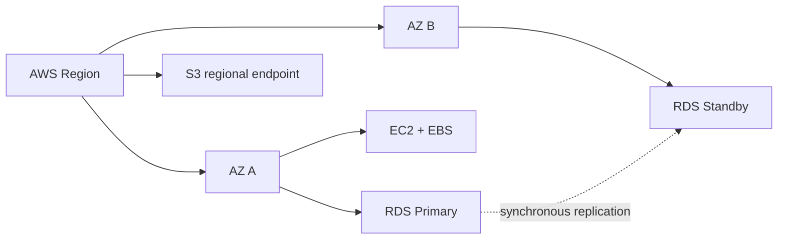

# AWS 전체 구조와 책임 경계

AWS를 사용한다는 말은 물리 서버를 직접 구매하지 않는다는 뜻이지, 운영 책임이 사라진다는 뜻은 아니다. AWS는 data center, 물리 network, host hardware와 서비스 control plane을 운영한다. 사용자는 선택한 서비스에 따라 identity, network rule, operating system, application, data, backup과 복구를 책임진다. EC2처럼 제어 범위가 큰 서비스는 OS patch와 process 복구까지 사용자가 맡지만, RDS는 database host와 일부 engine lifecycle을 AWS가 맡는다. 그렇더라도 schema, query, connection, backup retention, restore 검증과 application의 장애 대응은 여전히 사용자 책임이다.

이 구분이 Shared Responsibility다. 보안뿐 아니라 가용성에도 같은 원리가 적용된다. AWS가 Availability Zone을 제공한다고 해서 애플리케이션이 자동으로 여러 AZ에 분산되는 것은 아니다. 단일 EC2와 Single-AZ RDS를 선택했다면 해당 zonal resource의 장애를 견딜 구조를 사용자가 만들지 않은 것이다.

> [AWS 공식 — Shared Responsibility Model for Resiliency](https://docs.aws.amazon.com/wellarchitected/latest/reliability-pillar/shared-responsibility-model-for-resiliency.html)

## Region과 Availability Zone을 failure domain으로 보기

Region은 AWS가 독립적으로 운영하는 지리적 영역이다. Availability Zone은 한 Region 안에서 전력·냉각·물리 시설 등의 장애 범위를 분리하도록 구성한 위치다. 같은 Region의 AZ들은 낮은 지연으로 연결되므로 동기 복제나 active/standby 구성을 만들 수 있다.

서비스마다 장애 경계가 다르다. EC2 instance와 EBS volume은 특정 AZ에 놓이는 zonal resource다. 반면 S3는 Regional service이며 사용자는 개별 storage host나 AZ를 선택하지 않는다. RDS Single-AZ instance는 특정 AZ에 있고, RDS Multi-AZ deployment는 다른 AZ의 standby를 사용해 database host 장애 범위를 넓힌다.

가용성을 검토할 때는 서비스 기능보다 사용자 요청 전체 경로를 봐야 한다. Database만 Multi-AZ여도 요청을 받는 EC2가 한 대라면 EC2 장애 시 서비스는 중단된다. 반대로 Application을 여러 AZ에 배치해도 database가 Single-AZ이고 복구 시간이 길다면 data tier가 전체 가용성을 제한한다.

## 관리형 서비스가 바꾸는 책임

관리형 서비스는 책임을 없애지 않고 경계를 이동시킨다.

| 영역 | EC2에서 직접 운영 | RDS·S3 같은 관리형 서비스 |
| --- | --- | --- |
| 물리 host | AWS | AWS |
| OS·daemon patch | 사용자 | AWS가 상당 부분 담당 |
| network 접근 | 사용자 | 사용자 |
| data schema·정합성 | 사용자 | 사용자 |
| backup 기능 | 사용자가 도구와 저장소 구성 | 서비스가 기능 제공, 사용자가 retention·복구 검증 |
| 장애 복구 | process·host·data 경계를 직접 설계 | 서비스 기능과 application 재연결을 함께 설계 |

따라서 “RDS를 사용하면 백업이 해결된다”는 표현은 부족하다. automated backup과 PITR capability는 생기지만 retention이 0이면 사용할 수 없고, restore는 기존 instance를 제자리에서 되돌리는 것이 아니라 보통 새 DB instance를 만든다. Application이 새 endpoint에 연결하고 schema와 data가 맞는지 확인하는 절차는 별도다.

## Architecture를 평가하는 질문

Cloud 구조를 볼 때 다음 질문을 순서대로 던지면 서비스 이름에 끌려가지 않는다.

- 사용자의 요청이 어느 Region과 AZ의 어떤 resource를 지나는가?
- 각 resource가 zonal인지 Regional인지, 어느 장애를 공유하는가?
- AWS가 관리하는 부분과 우리가 설정·검증해야 하는 부분은 어디인가?
- backup capability와 실제 restore evidence가 모두 있는가?
- component 하나의 HA가 end-to-end availability를 얼마나 개선하는가?
- 비용이 늘어나는 지점은 instance 수, data transfer, public IPv4, NAT, storage, log retention 중 어디인가?

PawCycle은 이 질문을 실제로 겪었다. 초기에는 한 EC2 안에 Nginx, Spring Boot, Next.js와 MySQL을 함께 두어 비용과 운영 구조를 단순하게 만들었다. 이후 backup·복구와 DB lifecycle 부담이 커지자 RDS Single-AZ로 database failure domain을 분리했다. 그러나 Application EC2가 한 대였기 때문에 Multi-AZ RDS만 추가해도 전체 HA가 되지 않는다고 판단했다. 이 과정은 [[09. PawCycle Architecture Decision과 Trade-off]]에 정리했다.

> [AWS 공식 — Fault Isolation Boundaries](https://docs.aws.amazon.com/whitepapers/latest/aws-fault-isolation-boundaries/)
> [AWS 공식 — Availability Zone IDs](https://docs.aws.amazon.com/global-infrastructure/latest/regions/az-ids.html)
