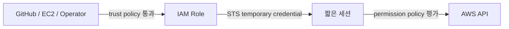

# IAM과 임시 자격 증명

IAM은 “누가 어떤 AWS API를 어떤 조건에서 호출할 수 있는가”를 결정한다. 운영에서 중요한 것은 User, Role, Policy를 이름으로 외우는 것이 아니라, 인증 주체와 권한 부여와 신뢰 관계를 분리해서 보는 것이다.

IAM User는 AWS account 안의 장기 identity다. access key를 발급하면 폐기할 때까지 사용할 수 있으므로 사람의 일상 작업이나 CI에 고정 key를 배포하는 방식은 노출·회전 부담이 크다. IAM Role은 고정 credential을 직접 갖지 않고, 허용된 주체가 assume하면 STS가 만료 시간이 있는 temporary credential을 발급한다. EC2, GitHub Actions, 다른 AWS account와 운영자 session은 서로 다른 trust condition으로 Role을 assume할 수 있다.

Policy는 허용할 action, resource와 condition을 표현한다. Identity policy는 Role이나 User가 무엇을 할 수 있는지 정하고, Role의 trust policy는 누가 그 Role을 assume할 수 있는지 정한다. 권한 policy가 넓지 않더라도 trust policy가 외부 전체에 열려 있으면 공격자가 Role을 얻을 수 있고, trust가 좁아도 permission이 `*`이면 침해 후 피해 범위가 커진다.



> [AWS 공식 — IAM을 언제 사용하는가](https://docs.aws.amazon.com/IAM/latest/UserGuide/when-to-use-iam.html)
> [AWS 공식 — OIDC temporary credential](https://docs.aws.amazon.com/IAM/latest/UserGuide/id_credentials_temp_request.html)

## Least Privilege는 action만 줄이는 일이 아니다

최소 권한은 `s3:GetObject`처럼 action 수를 줄이는 것에서 끝나지 않는다. 어느 bucket과 prefix인지, 어느 Region과 tag의 EC2인지, 어느 SSM Document version과 parameter path인지, 어느 GitHub repository·branch·environment가 Role을 assume할 수 있는지를 함께 제한해야 한다.

예를 들어 backup용 EC2 Role은 backup bucket의 특정 prefix에 `PutObject`와 `GetObject`만 필요할 수 있다. bucket policy나 lifecycle을 매번 바꾸는 권한, 다른 bucket을 나열하는 권한, object delete 권한까지 주면 backup script의 버그나 credential 탈취가 더 큰 피해로 이어진다. 필요한 control-plane 변경은 별도 운영자 Role로 분리하는 편이 안전하다.

Permission Boundary를 설계할 때는 정상 경로뿐 아니라 실패 시 수행할 수 있는 일도 본다. “cleanup을 위해 delete가 필요하다”는 이유로 Production Role에 광범위한 delete를 주기보다, 부분 object가 lifecycle로 만료되게 만들거나 정확한 resource만 별도 승인으로 정리하는 선택이 가능하다.

## GitHub Actions OIDC

OIDC federation을 사용하면 GitHub Actions secret에 장기 AWS access key를 저장하지 않고, workflow 실행 시점의 signed token을 STS에 제시해 temporary credential을 받을 수 있다. AWS는 token의 issuer, audience와 subject claim을 trust policy condition에 대조한다.

여기서 핵심은 “OIDC를 썼다”가 아니라 `sub`를 얼마나 좁혔는가다. AWS 공식 문서도 GitHub OIDC Role의 subject를 특정 organization, repository, branch 또는 protected environment로 제한하도록 안내한다. GitHub Environment approval과 deployment branch rule을 함께 사용하면 사용자가 승인한 Production workflow만 Role을 assume하게 만들 수 있다.

```text
GitHub Actions
→ GitHub OIDC token
→ AWS IAM trust policy가 repository/environment 확인
→ STS temporary credential
→ 제한된 SSM SendCommand
```

PawCycle은 이 구조에서 arbitrary shell이나 instance ID를 workflow input으로 받지 않고, 40자 release SHA와 승인된 SSM Document·target tag만 전달하도록 제한했다. 실제 배포 command는 EC2 안의 검증된 script가 수행했다. 상세 과정은 [[03. PawCycle 배포 보안과 관측성]]과 [[06. SSM 배포 자동화 Troubleshooting]]에서 본다.

> [AWS 공식 — GitHub OIDC를 위한 Role 구성](https://docs.aws.amazon.com/IAM/latest/UserGuide/id_roles_create_for-idp_oidc.html)

## EC2 Instance Role과 SSM

EC2 application이 S3, SSM Parameter Store나 CloudWatch API를 호출해야 할 때도 access key 파일을 instance에 복사하지 않는다. EC2 instance profile에 Role을 연결하면 SDK와 AWS CLI가 instance metadata 경로에서 temporary credential을 얻는다. 이 credential은 자동으로 회전되며, 권한은 Role policy로 제한한다.

Session Manager와 Run Command에는 EC2가 Systems Manager control plane과 통신할 권한, Agent 실행, DNS와 outbound HTTPS 경로가 필요하다. Session Manager는 inbound SSH port나 SSH private key 없이 접속할 수 있지만 “network가 필요 없다”는 뜻은 아니다. public internet, NAT 또는 VPC endpoint 중 하나로 SSM endpoint에 도달해야 한다.

권한 문제와 network 문제를 구분하려면 다음 순서가 유용하다.

1. instance에 의도한 Role/profile이 연결됐는지 확인한다.
2. SSM Agent가 실행되고 managed node로 등록됐는지 확인한다.
3. DNS와 outbound 443, SSM 관련 endpoint 도달을 확인한다.
4. operator identity가 해당 node와 document에 필요한 API 권한을 갖는지 확인한다.
5. command가 node까지 도착했다면 그다음부터는 OS user, shell, filesystem ownership과 process environment를 조사한다.

PawCycle의 SSM 장애는 상위 AWS 호출이 성공했지만 EC2 안에서 처음 실행된 Git command가 실패한 사례였다. 이는 IAM 문제가 아니라 SSM Agent root process와 repository ownership 사이의 `safe.directory` 경계였다. AWS control plane 성공과 host 내부 script 성공을 같은 것으로 보면 원인을 찾기 어렵다.

> [AWS 공식 — Session Manager](https://docs.aws.amazon.com/systems-manager/latest/userguide/session-manager.html)
> [AWS 공식 — EC2의 Systems Manager 권한](https://docs.aws.amazon.com/systems-manager/latest/userguide/setup-instance-permissions.html)
