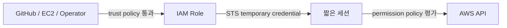

# IAM과 임시 자격 증명

IAM은 “누가 어떤 AWS API를 어떤 조건에서 호출할 수 있는가”를 결정한다. 운영에서 중요한 것은 User, Role, Policy 이름을 외우는 것이 아니라 **누가 인증되는가, 그 주체가 어떤 권한을 받는가, 누가 Role을 맡을 수 있는가**를 분리해서 보는 것이다.

IAM User는 AWS 계정 안에 오래 존재하는 자격 주체다. Access Key를 발급하면 폐기하거나 회전하기 전까지 사용할 수 있으므로 사람의 일상 작업이나 CI에 장기 Key를 배포하면 노출과 회전 부담이 커진다. AWS는 현재 사람의 접근도 가능하면 외부 Identity Provider나 IAM Identity Center를 통해 Role을 맡아 임시 자격 증명(temporary credential)을 사용하는 방식을 권장한다. IAM User와 장기 Access Key는 Role이나 federation으로 해결할 수 없는 예외적인 요구가 있을 때 별도로 관리하는 편이 안전하다.

IAM Role은 장기 Access Key를 직접 가지지 않는다. 신뢰 정책(trust policy)이 허용한 주체가 Role을 맡으면 STS가 만료 시간이 있는 임시 자격 증명을 발급한다. EC2, GitHub Actions, 다른 AWS 계정과 운영자 세션은 서로 다른 신뢰 조건으로 같은 원리를 사용할 수 있다. 권한 정책(permission policy)은 그 세션이 어떤 AWS API를 어느 리소스에 어떤 조건으로 호출할 수 있는지 정한다. 따라서 **Role을 맡을 수 있는 조건과 Role을 맡은 뒤 할 수 있는 일은 서로 다른 보안 경계**다.



> [AWS 공식 — IAM을 언제 사용하는가](https://docs.aws.amazon.com/IAM/latest/UserGuide/when-to-use-iam.html)
> [AWS 공식 — IAM 보안 모범 사례](https://docs.aws.amazon.com/IAM/latest/UserGuide/best-practices.html)
> [AWS 공식 — OIDC temporary credential](https://docs.aws.amazon.com/IAM/latest/UserGuide/id_credentials_temp_request.html)

## Least Privilege는 action만 줄이는 일이 아니다

최소 권한은 `s3:GetObject`처럼 action 수를 줄이는 것에서 끝나지 않는다. 어느 bucket과 prefix인지, 어느 Region과 tag의 EC2인지, 어느 SSM Document version과 parameter path인지, 어느 GitHub repository·branch·environment가 Role을 assume할 수 있는지를 함께 제한해야 한다.

예를 들어 backup용 EC2 Role은 backup bucket의 특정 prefix에 `PutObject`와 `GetObject`만 필요할 수 있다. bucket policy나 lifecycle을 매번 바꾸는 권한, 다른 bucket을 나열하는 권한, object delete 권한까지 주면 backup script의 버그나 credential 탈취가 더 큰 피해로 이어진다. 필요한 control-plane 변경은 별도 운영자 Role로 분리하는 편이 안전하다.

Permissions Boundary를 설계할 때는 정상 경로뿐 아니라 실패 시 수행할 수 있는 일도 본다. “정리를 위해 delete가 필요하다”는 이유로 Production Role에 광범위한 삭제 권한을 주기보다, 부분 object가 lifecycle로 만료되게 만들거나 정확한 리소스만 별도 승인으로 정리하는 선택이 가능하다.

AWS 권한 평가는 기본적으로 **허용되지 않으면 거부**에서 시작한다. 적용 가능한 정책에 명시적인 `Allow`가 있어야 요청이 허용되고, 어느 정책에서든 요청에 적용되는 명시적인 `Deny`가 있으면 `Allow`보다 우선한다. Identity policy와 S3 bucket policy 같은 resource policy가 함께 적용될 수도 있고, Permissions Boundary·Session Policy·AWS Organizations SCP가 있다면 이미 부여된 권한의 상한을 더 좁힐 수 있다. 특히 Permissions Boundary는 권한을 새로 주는 정책이 아니라 **Identity policy가 줄 수 있는 최대 범위를 제한하는 경계**라는 점이 중요하다.

그래서 `AccessDenied`가 발생했을 때 Policy JSON만 무작정 넓히면 안 된다. 먼저 현재 요청 주체를 `sts get-caller-identity` 등으로 확인하고, Role을 얻는 단계에서 막혔는지, Role을 얻은 뒤 특정 API 권한에서 막혔는지, resource/condition이 실제 대상과 맞는지, 상위 Boundary나 SCP가 제한하고 있는지를 나눠 본다. OIDC 배포라면 “GitHub가 Role을 맡는 단계”와 “그 Role 세션이 SSM을 호출하는 단계”가 서로 다른 실패 지점이다.

> [AWS 공식 — IAM 정책 평가 로직](https://docs.aws.amazon.com/IAM/latest/UserGuide/reference_policies_evaluation-logic.html)
> [AWS 공식 — Permissions Boundary](https://docs.aws.amazon.com/IAM/latest/UserGuide/access_policies_boundaries.html)

## GitHub Actions OIDC

OIDC federation을 사용하면 GitHub Actions Secret에 장기 AWS Access Key를 저장하지 않고, Workflow 실행 시점의 서명된 OIDC Token을 STS에 제시해 임시 자격 증명을 받을 수 있다. AWS는 Token의 issuer, audience와 subject claim을 Trust Policy 조건에 대조한다.

여기서 핵심은 “OIDC를 썼다”가 아니라 `sub`를 얼마나 좁혔는가다. AWS 공식 문서도 GitHub OIDC Role의 subject를 특정 organization, repository, branch 또는 protected environment로 제한하도록 안내한다. GitHub Environment approval과 deployment branch rule을 함께 사용하면 사용자가 승인한 Production workflow만 Role을 assume하게 만들 수 있다.

```text
GitHub Actions
→ GitHub OIDC token
→ AWS IAM trust policy가 repository/environment 확인
→ STS temporary credential
→ 제한된 SSM SendCommand
```

PawCycle은 이 구조에서 arbitrary shell이나 instance ID를 workflow input으로 받지 않고, 40자 release SHA와 승인된 SSM Document·target tag만 전달하도록 제한했다. 실제 배포 command는 EC2 안의 검증된 script가 수행했다. 상세 과정은 [[03. PawCycle 배포 보안과 관측성]]과 [[06. SSM 배포 자동화 Troubleshooting]]에서 본다.

> [AWS 공식 — GitHub OIDC를 위한 Role 구성](https://docs.aws.amazon.com/IAM/latest/UserGuide/id_roles_create_for-idp_oidc.html)

## EC2 Instance Role과 SSM

EC2 application이 S3, SSM Parameter Store나 CloudWatch API를 호출해야 할 때도 access key 파일을 instance에 복사하지 않는다. EC2 instance profile에 Role을 연결하면 SDK와 AWS CLI가 instance metadata 경로에서 temporary credential을 얻는다. 이 credential은 자동으로 회전되며, 권한은 Role policy로 제한한다.

Session Manager와 Run Command에는 EC2가 Systems Manager control plane과 통신할 권한, Agent 실행, DNS와 outbound HTTPS 경로가 필요하다. Session Manager는 inbound SSH port나 SSH private key 없이 접속할 수 있지만 “network가 필요 없다”는 뜻은 아니다. public internet, NAT 또는 VPC endpoint 중 하나로 SSM endpoint에 도달해야 한다.

권한 문제와 network 문제를 구분하려면 다음 순서가 유용하다.

1. instance에 의도한 Role/profile이 연결됐는지 확인한다.
2. SSM Agent가 실행되고 managed node로 등록됐는지 확인한다.
3. DNS와 outbound 443, SSM 관련 endpoint 도달을 확인한다.
4. operator identity가 해당 node와 document에 필요한 API 권한을 갖는지 확인한다.
5. command가 node까지 도착했다면 그다음부터는 OS user, shell, filesystem ownership과 process environment를 조사한다.

PawCycle의 SSM 장애는 상위 AWS 호출이 성공했지만 EC2 안에서 처음 실행된 Git command가 실패한 사례였다. 이는 IAM 문제가 아니라 SSM Agent root process와 repository ownership 사이의 `safe.directory` 경계였다. AWS control plane 성공과 host 내부 script 성공을 같은 것으로 보면 원인을 찾기 어렵다.

> [AWS 공식 — Session Manager](https://docs.aws.amazon.com/systems-manager/latest/userguide/session-manager.html)
> [AWS 공식 — EC2의 Systems Manager 권한](https://docs.aws.amazon.com/systems-manager/latest/userguide/setup-instance-permissions.html)
