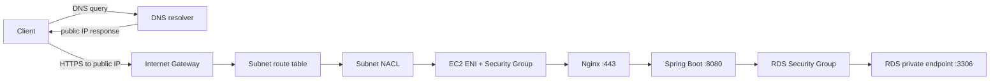

# VPC와 네트워크 흐름

VPC는 AWS account 안에서 IP address range, routing과 network access boundary를 정의하는 논리 network다. `10.0.0.0/16` 같은 CIDR은 VPC가 사용할 수 있는 주소 범위를 뜻하고, subnet은 그 범위의 일부를 특정 Availability Zone에 배치한다. Subnet을 public 또는 private이라고 부르는 기준은 개별 instance의 public IP 보유 여부가 아니라 해당 subnet의 route table이 Internet Gateway로 직접 route를 가지는지다.

Public subnet은 일반적으로 route table에 `0.0.0.0/0 → Internet Gateway` 같은 direct internet route가 있다. 다만 그 subnet에 있다는 사실만으로 EC2가 IPv4 인터넷과 직접 통신할 수 있는 것은 아니다. Instance가 직접 IPv4 internet traffic을 주고받으려면 public IPv4 또는 Elastic IP 같은 public address가 필요하고, Security Group·NACL·host listener와 application 상태도 맞아야 한다.

Private subnet의 instance가 package나 image를 받기 위해 인터넷 outbound가 필요하면 public subnet의 NAT Gateway를 경유할 수 있다. NAT는 내부에서 시작한 연결의 응답을 돌려주지만 인터넷이 private instance에 직접 새 연결을 시작하게 하지는 않는다. NAT Gateway는 AZ 단위 리소스이고 시간당 사용료와 처리 데이터 비용이 생기므로 “private subnet에는 항상 NAT”라고 자동 선택하지 않는다. S3 Gateway Endpoint나 SSM용 Interface Endpoint처럼 목적에 맞는 private path가 더 적합할 수 있다.

VPC의 Route Table에는 VPC CIDR로 향하는 `local` route가 기본적으로 존재한다. 여러 route가 동시에 목적지와 일치하면 AWS는 **가장 구체적인 CIDR, 즉 longest prefix match**를 우선한다. 예를 들어 `10.0.0.0/16 → local`과 `0.0.0.0/0 → Internet Gateway`가 함께 있어도 `10.0.2.10` 같은 VPC 내부 주소는 더 구체적인 `/16` local route를 따른다. 그래서 Public Subnet의 Backend가 Private RDS로 연결할 때 인터넷을 돌아서 가는 것이 아니라 VPC 내부 경로로 통신한다.

> [AWS 공식 — VPC 생성 옵션과 public/private subnet](https://docs.aws.amazon.com/vpc/latest/userguide/create-vpc-options.html)
> [AWS 공식 — Route table](https://docs.aws.amazon.com/vpc/latest/userguide/RouteTables.html)
> [AWS 공식 — Route 우선순위와 longest prefix match](https://docs.aws.amazon.com/vpc/latest/userguide/route-tables-priority.html)
> [AWS 공식 — NAT Gateway 기본](https://docs.aws.amazon.com/vpc/latest/userguide/nat-gateway-basics.html)

## 요청과 응답이 지나가는 경로

외부 사용자가 public EC2의 Nginx에 HTTPS 요청을 보내는 경우를 따라가 보자.

DNS resolver는 domain에 대응하는 public IP를 Client에 돌려준다. 그다음 실제 HTTPS packet이 해당 public IP를 향해 전송되고 Internet Gateway를 거쳐 VPC 안으로 들어온다. Internet Gateway는 VPC와 인터넷 사이의 route target이고, subnet route table은 목적지에 맞는 next hop을 선택한다. NACL이 subnet 경계에서 packet을 검사하고, ENI에 연결된 Security Group이 resource의 connection을 검사한다. EC2 host의 443 listener가 실제로 열려 있어야 TCP 연결이 성립한다.

Nginx가 Backend에 연결하는 구간과 Backend가 RDS에 연결하는 구간은 별도의 TCP connection이다. Backend와 RDS가 같은 VPC의 private address로 통신하면 RDS에 public IP가 없어도 `local` route를 통해 연결할 수 있다. RDS가 private이라는 것은 Application에서 도달할 수 없다는 뜻이 아니라 인터넷에서 직접 route되지 않는다는 뜻이다.

## Security Group과 NACL

Security Group은 ENI 같은 resource에 연결하는 stateful allow-list firewall이다. Inbound rule이 허용한 connection의 return traffic은 별도 outbound 반대 규칙 없이 상태를 따라 허용된다. 반대로 outbound에서 시작한 connection의 return traffic도 state에 의해 처리된다.

NACL은 subnet에 연결하고 stateless하게 packet을 검사한다. allow와 deny rule을 번호 순서로 평가하며, 요청과 응답 방향을 각각 허용해야 한다. ephemeral port range를 고려하지 않은 NACL은 요청 packet은 통과시키고 응답 packet을 막는 식으로 보일 수 있다.

| 비교 | Security Group | Network ACL |
| --- | --- | --- |
| 적용 위치 | ENI/resource | subnet |
| 상태 | Stateful | Stateless |
| rule | Allow만 | Allow와 deny |
| 평가 | 모든 rule을 종합 | 번호 순 첫 일치 |
| 다른 SG 참조 | 가능 | CIDR 중심 |
| 일반 역할 | workload별 주 접근 제어 | subnet 전체 guardrail·보조 deny |

EC2에서 RDS로 연결할 때는 RDS SG inbound 3306의 source를 EC2 SG로 지정할 수 있다. 이것은 특정 IP를 고정하는 것보다 “이 애플리케이션 역할을 가진 ENI에서 오는 3306 연결”이라는 관계를 표현하기 쉽다. EC2가 교체돼 private IP가 달라져도 새 ENI에 같은 EC2 SG가 붙으면 관계를 유지할 수 있다.

여기서 **SG를 source로 지정한다고 상대 SG의 규칙이 복사되는 것은 아니다.** 참조된 SG가 붙은 ENI/instance의 private IP에서 시작한 트래픽을 해당 protocol/port 방향으로 허용하는 관계가 생기는 것이다. 또한 “A가 B를 참조하고 B가 C를 참조하니 A가 C에도 자동 접근한다” 같은 전이적 신뢰가 생기는 것도 아니다. 각 통신 구간마다 실제 source/destination SG rule을 따로 봐야 한다.

> [AWS 공식 — VPC infrastructure security와 SG/NACL 비교](https://docs.aws.amazon.com/vpc/latest/userguide/infrastructure-security.html)
> [AWS 공식 — Security Group referencing](https://docs.aws.amazon.com/vpc/latest/userguide/security-group-rules.html#security-group-referencing)

## DNS와 connection 장애를 구분하는 순서

`Communications link failure` 하나만 보고 Security Group을 넓히면 원인을 가린다. 다음 계층을 순서대로 확인한다.

1. hostname이 의도한 private IP로 해석되는가?
2. source와 destination이 같은 VPC 또는 연결된 network에 있고 route가 존재하는가?
3. source ENI의 outbound SG와 destination RDS SG inbound가 맞는가?
4. NACL이 양방향 packet과 ephemeral port를 허용하는가?
5. DB가 `available`이고 실제 3306 listener가 준비됐는가?
6. TCP는 연결되지만 TLS handshake나 MySQL authentication이 실패하는가?
7. Hikari timeout이면 network 연결 실패인지 pool 내부 대기인지 metric으로 구분되는가?

TCP connect 자체가 timeout이면 route, SG, NACL을 우선 본다. 연결 직후 TLS 오류가 나면 certificate, protocol과 client mode를 본다. MySQL access denied면 network가 이미 통과했을 가능성이 크므로 user/host grant와 credential을 조사한다. Hikari pending이 증가하지만 RDS CPU와 latency가 낮다면 RDS 서버 포화가 아니라 애플리케이션 동시성, transaction hold time 또는 pool sizing 문제일 수 있다.

PawCycle은 RDS를 public으로 열지 않고 private subnet group과 EC2 SG source-only 3306을 사용했다. 두 isolated subnet을 서로 다른 AZ에 두되 실제 DB는 Single-AZ로 배치했다. 자세한 프로젝트 적용은 [[04. Docker MySQL에서 RDS Single-AZ까지]]를 참고한다.
