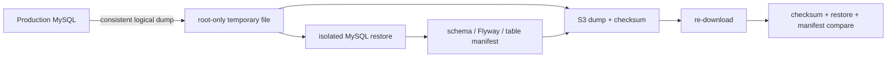

# S3 기반 백업과 복구

S3는 file system이나 block device가 아니라 key로 object를 저장하고 API로 읽는 Regional object storage다. Application이 directory처럼 보이는 prefix를 사용할 수 있지만 directory inode나 random block update가 있는 것은 아니다. 이 특성은 dump, log archive와 immutable artifact를 보관하는 데 적합하지만, S3에 object를 올렸다는 사실만으로 복구 가능성이 증명되지는 않는다.

Backup에는 최소 세 가지 질문이 있다.

1. 올바른 source의 일관된 snapshot을 만들었는가?
2. 저장된 object가 손상되거나 잘못된 대상에서 읽히지 않았는가?
3. 실제 DB engine에 restore한 결과가 schema와 data 관점에서 source snapshot과 같은가?

이 셋을 분리하지 않으면 upload 성공을 restore 성공으로 오해한다.

## Access, encryption과 retention

Backup bucket은 public access가 필요하지 않다. Block Public Access를 유지하고, EC2 instance role은 특정 bucket과 prefix의 필요한 object action으로 제한한다. Bucket policy로 TLS transport와 server-side encryption을 강제할 수 있다. SSE-S3는 AWS가 관리하는 key로 at-rest encryption을 제공하지만, credential misuse나 operator deletion을 자동으로 막는 기능은 아니다.

Versioning은 overwrite와 delete 이전 version을 남길 수 있지만 storage 비용과 lifecycle 복잡성이 늘어난다. Versioning을 끄고 14일 lifecycle을 선택할 수도 있지만, 이는 장기 보존이나 실수 삭제 복구를 포기한 선택이다. Retention은 “오래 보관할수록 좋다”가 아니라 RPO, 규정, 비용과 복구 시나리오를 기준으로 정한다.

> [AWS 공식 — S3 access control과 Block Public Access](https://docs.aws.amazon.com/AmazonS3/latest/user-guide/access-control-overview.html)

## 논리 백업의 일관성

MySQL `mysqldump --single-transaction`은 InnoDB transaction snapshot을 이용해 일반 row write를 막지 않고 일관된 dump를 만들 수 있다. 그러나 backup 중 DDL이 실행되면 table 구조와 snapshot 전제가 깨질 수 있으므로 migration, `ALTER`, `DROP`, `RENAME`, `TRUNCATE`가 없는 window를 잡아야 한다.

Dump 이후 live DB의 row count를 manifest로 만들면 backup snapshot과 시점이 달라질 수 있다. 더 안전한 방법은 방금 만든 dump를 격리 DB에 restore하고 그 복원본에서 schema fingerprint, Flyway history와 핵심 table count manifest를 생성하는 것이다. 그러면 dump와 manifest가 같은 snapshot을 설명한다.

Completion marker는 dump, checksum, manifest upload와 재다운로드 검증이 모두 성공한 뒤 마지막에 기록한다. Restore 도구는 marker가 없는 object set을 불완전한 backup으로 취급해야 한다. 부분 upload를 자동 삭제할 권한을 Production Role에 주지 않고 lifecycle로 만료시키는 것도 최소 권한 trade-off가 될 수 있다.

## Restore 검증과 Production restore는 다르다

격리 restore는 backup object가 DB engine에서 열리고 schema와 data aggregate가 맞는지 확인한다. Production volume이나 endpoint는 건드리지 않는다. 실제 Production restore는 traffic·write 중단, current data의 보존, application compatibility, endpoint/volume 전환, 실패 시 복귀와 데이터 divergence 처리가 필요하다.

| 단계 | 바꾸는 대상 | 증명하는 것 |
| --- | --- | --- |
| Backup upload | S3 object | object가 저장됨 |
| Isolated restore | 임시 DB/volume | backup을 DB로 복원 가능 |
| Production restore rehearsal | candidate DB/volume | 전환 절차와 application 검증 가능 |
| Actual Production restore | active DB target | 실제 서비스 복구 |

RPO와 RTO도 실행 증거 없이 선언하지 않는다. 14일 보존은 RPO가 14일이라는 뜻이 아니고, 한 번 restore한 시간이 미래 장애의 RTO를 자동 보장하지 않는다. Backup 주기, 마지막 성공 시각, object availability, restore 시간과 application validation 시간을 합쳐 평가한다.

PawCycle은 Docker MySQL 논리 dump를 private S3에 저장하고 `network none` 임시 MySQL에 복원해 schema·Flyway·핵심 table manifest를 비교했다. 메모리 부족 때문에 Application을 잠시 중지하고 임시 swap을 사용한 일회성 예외도 있었다. 실제 운영 DB restore와 자동 schedule, cross-region, 장기 보존은 별도로 미검증 상태로 남겼다. 자세한 내용은 [[05. PawCycle Backup과 Restore 운영]]에서 본다.
