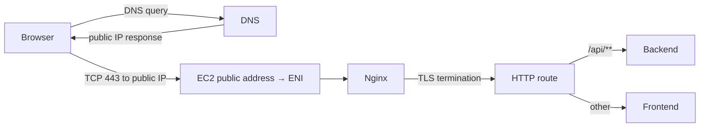

# DNS와 Nginx와 HTTPS

사용자가 `https://example.com/api/products`를 호출하면 브라우저가 Spring Controller를 바로 찾는 것이 아니다. DNS로 address를 찾고, TCP connection을 만들고, TLS handshake로 server identity와 암호화 조건을 협상한 다음 HTTP request를 보낸다. Public EC2에서는 Security Group과 Nginx가 이 연결을 먼저 받으며, Nginx가 별도 connection으로 Backend에 proxy한다.

DNS는 domain에 대응하는 address를 Client에게 알려 주지만 이후 TCP/TLS traffic을 대신 전달하지 않으며, port를 열거나 service health를 보장하지 않는다. Public address가 바뀌었는데 DNS TTL 동안 이전 값이 cache되면 일부 client는 과거 instance로 갈 수 있다. Elastic IP를 사용하면 address를 고정할 수 있지만 public IPv4 비용과 release 위험이 생긴다.

## TLS termination과 내부 연결

Nginx가 certificate와 private key를 가지고 TLS handshake를 처리하면 browser와 Nginx 사이에서 암호화 connection이 끝난다. Nginx에서 Backend까지는 별도 HTTP 또는 HTTPS connection이다. 같은 host의 private Docker network라고 해서 보안 검토가 사라지는 것은 아니지만, public internet 구간과 동일한 threat model을 그대로 적용하지는 않는다.

TLS certificate는 domain ownership과 server identity를 연결한다. Let's Encrypt HTTP-01은 CA가 public port 80의 challenge path에 접근할 수 있어야 한다. 이 때문에 port 80을 무조건 닫기보다 challenge 경로를 제공하고 나머지 요청을 HTTPS로 redirect하는 구성이 흔하다.

Certificate 발급, Nginx config 활성화와 application smoke는 서로 다른 단계다. Certificate file이 생겼어도 SAN이 요청 domain과 맞지 않거나, Nginx reload가 실패하거나, 새 worker는 떴지만 upstream path가 실패할 수 있다. 안전한 순서는 다음과 같다.

1. HTTP bootstrap과 challenge webroot를 확인한다.
2. 외부 CA 발급을 수행한다.
3. certificate SAN과 유효기간을 검증한다.
4. candidate Nginx config에 대해 `nginx -t`를 실행한다.
5. HTTPS config를 활성화하고 reload한다.
6. Frontend와 API, HTTP redirect를 각각 외부 경로에서 확인한다.

갱신도 Certbot 성공만으로 끝나지 않는다. Disk의 certificate가 바뀌었지만 worker가 이전 certificate를 memory에 유지할 수 있고, reload 뒤 새 certificate가 적용됐더라도 application route가 실패할 수 있다. Certificate volume, running worker와 실제 client handshake를 구분해서 확인해야 한다.

## Nginx를 장애 계층으로 보기

Reverse proxy는 투명한 pipe가 아니다. Client↔Nginx와 Nginx↔Backend는 별도 connection이므로 timeout, buffering, upstream keepalive, DNS resolution과 socket 사용량이 전체 성능에 영향을 준다.

- Nginx 502와 `connect() failed`는 upstream connection 생성 실패일 수 있다.
- Backend health가 정상이어도 proxy의 ephemeral port pressure가 먼저 발생할 수 있다.
- Backend가 재시작되면 Docker DNS가 새 address를 반환해도 Nginx의 resolution 방식에 따라 갱신 시점이 달라질 수 있다.
- `X-Forwarded-*` header와 Spring proxy 설정이 맞지 않으면 HTTPS 외부 요청이 내부 HTTP로 잘못 인식될 수 있다.

PawCycle은 DuckDNS hostname과 Let's Encrypt, Nginx TLS termination을 사용했고 외부에는 80·443만 공개했다. `3306`, `8080`, `3000`은 host에 publish하지 않았다. Certificate 발급·수동 갱신·재부팅 복구는 운영 검증했지만 자동 갱신 schedule과 certificate backup은 당시 미완료였다. 프로젝트 구조는 [[02. PawCycle 초기 AWS Production 아키텍처]]를 참고한다.

기존 Nginx 학습 자료와 함께 읽으면 좋다.

- [[1. 웹 서버가 왜 필요한가]]
- [[2. 요청은 어떻게 Spring Boot까지 가는가]]
- [[3. Nginx 설정은 어떻게 구성되는가]]
