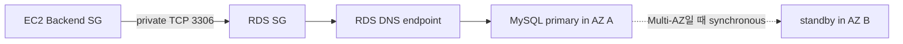

# RDS MySQL과 Managed Database

EC2나 Docker에서 MySQL을 직접 운영하면 database process뿐 아니라 OS patch, storage, backup tool, restore 환경, host 장애와 monitoring을 운영자가 책임진다. RDS는 이 중 host와 database service lifecycle의 상당 부분을 AWS가 관리하도록 옮긴다. 그러나 database schema, query, account, connection pool, application compatibility와 복구 절차는 사용자가 계속 책임진다.

RDS 도입 이유를 “관리형이라 편하다”로 끝내면 어떤 문제가 해결되는지 알 수 없다. 실제로 줄어드는 책임은 host 교체, automated backup, snapshot, maintenance와 Multi-AZ failover capability다. 새로 생기는 책임은 VPC·subnet·Security Group, DB parameter, endpoint/TLS, service 비용, migration과 rollback이다.

## VPC 안의 RDS 연결 구조

RDS DB instance는 DB subnet group의 subnet 중 하나에 network interface를 두고 endpoint DNS를 제공한다. DB subnet group은 한 Region의 최소 두 Availability Zone에 subnet을 포함해야 한다. Single-AZ instance도 이 group을 사용하지만 active DB는 한 AZ에 존재한다.

RDS에 public access가 없어도 EC2와 같은 VPC의 private route로 통신할 수 있다. RDS SG inbound의 source를 EC2 SG로 제한하면 Application resource만 3306 connection을 시작할 수 있다. DB subnet에 Internet Gateway나 NAT default route가 없더라도 VPC local route는 남아 있으므로 EC2와 RDS의 private 통신은 가능하다.

TLS는 network reachability와 별개의 계층이다. `sslMode=REQUIRED`는 encrypted connection을 요구하지만 server certificate identity까지 검증하는 `VERIFY_CA`나 `VERIFY_IDENTITY`와 같지 않다. 요구 수준에 따라 RDS CA bundle과 client trust material을 준비해야 한다.

> [AWS 공식 — RDS를 VPC에서 사용하고 DB subnet group 구성](https://docs.aws.amazon.com/AmazonRDS/latest/UserGuide/USER_VPC.WorkingWithRDSInstanceinaVPC.html)
> [AWS 공식 — RDS MySQL TLS](https://docs.aws.amazon.com/AmazonRDS/latest/UserGuide/mysql-ssl-connections.html)

## Backup, Snapshot과 PITR

RDS automated backup은 storage volume snapshot과 transaction log를 사용해 retention window 안의 point-in-time restore를 가능하게 한다. Manual snapshot은 사용자가 삭제하기 전까지 별도로 유지할 수 있다. Restore는 대개 기존 instance의 시간을 되감는 것이 아니라 새 DB instance를 만든다.

| 기능 | 목적 | 운영자가 여전히 해야 하는 일 |
| --- | --- | --- |
| Automated backup | retention 안의 PITR 기반 | retention과 window 결정, LatestRestorableTime 확인 |
| Manual snapshot | 특정 시점 장기 보존 | 생성·보존·삭제와 비용 관리 |
| PITR | 지정 시점의 새 DB 생성 | 새 endpoint 연결, schema/data/application 검증 |
| Logical dump | engine-level 이식·세부 비교 | 일관성, 암호화 저장, import와 manifest 검증 |

Automated backup이 ON이라는 설정만으로 복구가 Verified가 되는 것은 아니다. 별도 target에 restore하고, schema와 Flyway history, 핵심 데이터 aggregate를 확인하고, application connection과 smoke까지 통과해야 실제 절차를 평가할 수 있다.

> [AWS 공식 — RDS resilience, backup과 PITR](https://docs.aws.amazon.com/AmazonRDS/latest/UserGuide/disaster-recovery-resiliency.html)

## Single-AZ와 Multi-AZ

Single-AZ DB instance는 비용과 구조가 작지만 instance/AZ 장애 시 자동 standby failover가 없다. Multi-AZ DB instance deployment는 다른 AZ의 standby에 동기 복제하고, primary 장애나 특정 maintenance 상황에서 RDS가 standby로 failover한다. Application은 같은 DB endpoint를 계속 사용하지만 endpoint의 address가 바뀔 수 있으므로 connection이 끊기고 DNS cache와 connection pool이 새 primary에 재연결할 시간이 필요하다.

Multi-AZ standby는 read replica가 아니다. Standby는 high availability를 위한 동기 복제 대상이며 일반 read traffic을 받지 않는다. Read replica는 read scale과 reporting을 위한 비동기 복제본이고 replication lag가 있으며 별도 endpoint를 사용한다. 장애 시 자동 primary failover와 같은 개념으로 보면 안 된다.

| 항목 | Single-AZ | Multi-AZ standby | Read replica |
| --- | --- | --- | --- |
| 주 목적 | 비용·단순성 | HA와 failover | Read scale·reporting |
| 복제 | 없음 | 동기 | 비동기 |
| read traffic | Primary | Standby는 일반 read 불가 | 가능 |
| 장애 전환 | 직접 복구 | RDS 자동 failover | 수동 promote 가능 |
| 비용 | 가장 작음 | 추가 standby 비용 | replica instance 비용 |

AWS는 Multi-AZ failover가 보통 수십 초에서 수 분 걸릴 수 있다고 설명하며, transaction recovery나 workload 상태에 따라 길어질 수 있다. 따라서 failover가 “무중단”을 뜻하지 않는다. Connection error, transaction rollback, retry/idempotency와 DNS TTL을 application 수준에서 검증해야 한다.

> [AWS 공식 — RDS Multi-AZ failover](https://docs.aws.amazon.com/AmazonRDS/latest/UserGuide/Concepts.MultiAZ.Failover.html)
> [AWS 공식 — RDS read replica](https://docs.aws.amazon.com/AmazonRDS/latest/UserGuide/USER_ReadRepl.html)

## Parameter Group, connection과 성능

RDS parameter group은 database engine configuration을 관리한다. 어떤 parameter는 즉시 적용되고 어떤 것은 reboot가 필요하다. 작은 instance에서 connection 수나 buffer를 단순히 크게 만들면 memory pressure가 커질 수 있다. Hikari pool을 키우는 결정도 RDS maximum connection만 보고 할 수 없다. Application thread, transaction hold time, query latency와 DB CPU·memory를 함께 봐야 한다.

주요 CloudWatch metric은 다음처럼 해석한다.

- `CPUUtilization`: DB host CPU 사용률이다. 낮다고 query가 항상 빠른 것은 아니다.
- `DatabaseConnections`: client network connection 수다. Application pool max와 일치할 수 있지만 DB capacity 포화를 직접 뜻하지 않는다.
- `FreeableMemory`: OS가 사용할 수 있는 memory와 reclaim 가능한 cache를 포함한다.
- `ReadLatency` / `WriteLatency`: I/O operation latency다.
- `ReadIOPS` / `WriteIOPS`: 초당 I/O 수다.
- `FreeStorageSpace`, `DiskQueueDepth`, network throughput도 workload에 따라 함께 본다.

Application에서 Hikari `active=max`, `pending` 증가가 보여도 RDS CPU와 latency가 낮다면 DB instance 자체가 먼저 포화됐다는 근거는 약하다. Thread 증가, connection hold time, container memory와 request queueing이 먼저 문제일 수 있다.

> [AWS 공식 — RDS CloudWatch metric](https://docs.aws.amazon.com/AmazonRDS/latest/UserGuide/rds-metrics.html)

## PawCycle에서 Single-AZ를 선택한 이유

PawCycle은 Docker MySQL의 host·engine lifecycle, automated backup/PITR 부재와 Application/DB 동일 host 장애 영역을 줄이기 위해 private RDS MySQL Single-AZ를 선택했다. 당시 Application은 단일 EC2였기 때문에 DB만 Multi-AZ로 바꿔도 end-to-end HA가 되지 않았고, 비용 대비 우선순위가 낮았다.

이는 Multi-AZ가 불필요하다는 일반 결론이 아니다. Availability 목표, 장애 비용, 복구 시간과 Application multi-instance가 요구되면 Multi-AZ를 다시 평가해야 한다. 당시의 실제 결정과 migration 경계는 [[04. Docker MySQL에서 RDS Single-AZ까지]]와 [[09. PawCycle Architecture Decision과 Trade-off]]에 정리했다.
