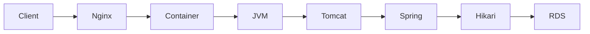

# CloudWatch와 계층별 관측성

Monitoring은 숫자를 모으는 일이고, observability는 외부 출력과 내부 signal을 이용해 “왜 이런 상태가 되었는가”를 좁힐 수 있는 능력이다. CloudWatch는 EC2, EBS와 RDS가 제공하는 metric, application이 보내는 custom metric, log와 alarm을 다룬다. 그러나 AWS resource metric만으로 Spring thread, Hikari pending이나 business backlog를 알 수는 없다.

Metric은 시간에 따른 수치다. Log는 개별 event와 context를 보존한다. Alarm은 metric이나 log query를 일정 window와 threshold로 평가해 상태를 만든다. Dashboard는 signal을 함께 보여주지만 원인을 자동으로 판정하지 않는다.

> [AWS 공식 — CloudWatch metric](https://docs.aws.amazon.com/AmazonCloudWatch/latest/monitoring/working_with_metrics.html)
> [AWS 공식 — CloudWatch alarm](https://docs.aws.amazon.com/AmazonCloudWatch/latest/monitoring/CloudWatch_Alarms.html)

## EC2, RDS와 Application signal의 차이

한 요청의 문제를 찾으려면 다음 계층을 연결한다.

| 계층 | 대표 signal | 알 수 있는 것 |
| --- | --- | --- |
| Client/k6 | actual RPS, p95/p99, error, dropped | 사용자 관점 결과와 load generator 한계 |
| Nginx | status, upstream error, connection | ingress와 upstream 연결 문제 |
| EC2/OS | CPU, memory, disk, socket, kernel log | host와 cgroup 자원 문제 |
| Docker | health, restart count, memory limit | workload lifecycle과 제한 |
| JVM/Tomcat | heap, non-heap, GC, thread, worker | Java runtime와 request concurrency |
| Hikari | active, idle, pending, timeout | connection pool 내부 대기 |
| RDS | CPU, connection, memory, latency, IOPS | database host와 storage 상태 |

예를 들어 EC2 CPU가 낮아도 특정 container가 memory limit으로 OOM kill될 수 있다. RDS `DatabaseConnections=10`이 보여도 10이 DB maximum이 아니라 Application Hikari max일 수 있다. Hikari pending은 DB가 느려서 생길 수도 있지만, Application이 너무 많은 request thread를 만들거나 transaction을 오래 잡아도 생긴다.

## Alarm과 진단의 차이

Alarm은 운영자에게 조사할 사건을 알려준다. Root cause까지 말해 주는 것은 아니다. EC2 `StatusCheckFailed` alarm은 host 또는 instance reachability 문제를 알릴 수 있지만, Application HTTP가 500을 반환하거나 JVM이 OOM 난 상황을 모두 감지하지 않는다. 반대로 application health alarm만으로 EBS queue나 RDS failover event를 알 수 없다.

Alarm 설계에는 threshold 외에도 evaluation period, missing data 처리, 복구 알림과 notification channel이 필요하다. 너무 민감하면 noise 때문에 무시되고, 너무 느리면 장애가 사용자에게 먼저 보인다. 자동 복구 action은 alert보다 영향이 크므로 잘못된 signal에서 반복 재시작이나 data operation을 하지 않도록 별도 검증한다.

## Pull 기반 Prometheus와 CloudWatch를 함께 볼 때

PawCycle은 AWS resource metric에는 CloudWatch를 사용하고, Application/JVM/Hikari와 business metric에는 Prometheus와 Grafana를 사용했다. Production Backend의 actuator endpoint를 public으로 열지 않고 별도 metrics-proxy를 통해 Observability EC2만 접근하게 했다.

이 구조는 다음 장점과 비용이 있다.

- Application metric을 상세히 볼 수 있지만 Prometheus/Grafana 자체 resource와 storage를 운영해야 한다.
- 별도 Observability EC2는 Application host 자원 경쟁을 줄이지만 instance 비용과 network/security 경계가 늘어난다.
- metrics-proxy를 Application release와 같은 Compose가 소유하면 관측 bridge 수정이 Application/DB migration과 결합될 수 있다.

실제로 PawCycle은 metrics-proxy lifecycle을 별도 Compose project로 분리했다. Prometheus command가 Docker Compose에서 잘못 tokenization되어 restart한 문제, metrics-proxy를 최신 Application control과 함께만 활성화할 수 있어 범위가 커진 문제를 각각 수정했다. 프로젝트 근거는 [[03. PawCycle 배포 보안과 관측성]]에서 확인한다.
