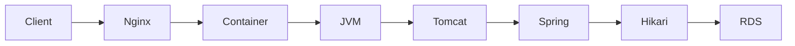

# CloudWatch와 계층별 관측성

모니터링은 시스템 상태를 수치와 로그로 계속 확인하는 활동이고, 관측성(observability)은 여러 신호를 조합해 “왜 이런 상태가 되었는가”를 좁힐 수 있는 능력에 가깝다. CloudWatch는 EC2, EBS, RDS가 보내는 Metric과 애플리케이션이 보내는 Custom Metric, Log와 Alarm을 다룬다. 그러나 AWS 리소스 지표만으로 Spring Thread, Hikari pending이나 비즈니스 처리 지연까지 알 수는 없다.

Metric은 시간에 따른 수치이고 Log는 개별 사건과 문맥을 보존한다. Alarm은 Metric이나 Query를 일정 기간과 조건으로 평가해 상태를 만들며, Dashboard는 여러 신호를 한 화면에 묶어 준다. 이 도구들이 Root Cause를 자동으로 결정해 주는 것은 아니다.

> [AWS 공식 — CloudWatch metric](https://docs.aws.amazon.com/AmazonCloudWatch/latest/monitoring/working_with_metrics.html)
> [AWS 공식 — CloudWatch alarm](https://docs.aws.amazon.com/AmazonCloudWatch/latest/monitoring/CloudWatch_Alarms.html)

## Metric을 읽을 때 같이 봐야 하는 것

CloudWatch Metric은 이름 하나만으로 식별되지 않는다. **Namespace + Metric Name + Dimension 조합**이 어떤 시계열을 보고 있는지를 결정한다. 예를 들어 `AWS/EC2`의 `CPUUtilization`도 `InstanceId`가 다르면 서로 다른 Metric이고, RDS 역시 어떤 DB instance의 값인지 Dimension으로 구분한다. Custom Metric에 Dimension 값을 지나치게 많이 만들면 시계열 수와 비용이 함께 늘어날 수 있으므로 “무엇을 구분해야 실제 운영 판단에 필요한가”를 먼저 정해야 한다.

`Period`는 Metric을 어느 시간 간격으로 묶어 볼지 결정하고, `Average`, `Maximum`, `Sum`, percentile 같은 Statistic은 그 구간의 값을 어떤 방식으로 요약할지 결정한다. 5분 Average CPU가 낮다고 10초 동안의 짧은 포화가 없었다는 뜻은 아니다. 반대로 Maximum만 보면 단발성 spike가 전체 구간의 대표 상태처럼 보일 수 있다. 장애 분석에서는 부하 발생 시각과 맞는 Period를 선택하고 Average와 Maximum, 필요한 경우 percentile을 함께 비교해야 한다.

EC2가 기본으로 CloudWatch에 보내는 리소스 Metric만으로는 OS의 메모리 사용량이나 파일시스템 사용량을 충분히 볼 수 없다. 이런 Host 내부 지표가 필요하면 CloudWatch Agent 같은 별도 수집 경로를 구성해야 한다. “CloudWatch를 사용한다”와 “필요한 OS 지표가 실제로 수집되고 있다”를 같은 뜻으로 보면 안 된다.

> [AWS 공식 — CloudWatch Metric 개념과 Dimension/Period/Statistic](https://docs.aws.amazon.com/AmazonCloudWatch/latest/monitoring/cloudwatch_concepts.html)
> [AWS 공식 — CloudWatch Agent가 수집할 수 있는 Metric](https://docs.aws.amazon.com/AmazonCloudWatch/latest/monitoring/metrics-collected-by-CloudWatch-agent.html)

## EC2, RDS와 Application signal의 차이

한 요청의 문제를 찾으려면 다음 계층을 연결한다.

| 계층 | 대표 signal | 알 수 있는 것 |
| --- | --- | --- |
| Client/k6 | actual RPS, p95/p99, error, dropped | 사용자 관점 결과와 load generator 한계 |
| Nginx | status, upstream error, connection | ingress와 upstream 연결 문제 |
| EC2/OS | CPU, memory, disk, socket, kernel log | host와 cgroup 자원 문제 |
| Docker | health, restart count, memory limit | workload lifecycle과 제한 |
| JVM/Tomcat | heap, non-heap, GC, thread, worker | Java runtime와 request concurrency |
| Hikari | active, idle, pending, timeout | connection pool 내부 대기 |
| RDS | CPU, connection, memory, latency, IOPS | database host와 storage 상태 |

예를 들어 EC2 CPU가 낮아도 특정 container가 memory limit으로 OOM kill될 수 있다. RDS `DatabaseConnections=10`이 보여도 10이 DB maximum이 아니라 Application Hikari max일 수 있다. Hikari pending은 DB가 느려서 생길 수도 있지만, Application이 너무 많은 request thread를 만들거나 transaction을 오래 잡아도 생긴다.

## Alarm과 진단의 차이

Alarm은 운영자에게 조사할 사건을 알려준다. Root cause까지 말해 주는 것은 아니다. EC2 `StatusCheckFailed` alarm은 host 또는 instance reachability 문제를 알릴 수 있지만, Application HTTP가 500을 반환하거나 JVM이 OOM 난 상황을 모두 감지하지 않는다. 반대로 application health alarm만으로 EBS queue나 RDS failover event를 알 수 없다.

Alarm 설계에는 threshold만 있는 것이 아니다. `Period`가 한 Data Point의 시간 범위를 정하고, `Evaluation Periods`는 최근 몇 개 구간을 평가할지 정한다. 서비스 특성에 따라 “최근 5개 중 3개가 임계치를 넘으면 ALARM”처럼 일부 구간만 위반해도 경보하도록 구성할 수 있다. 이 값을 이해하지 않고 threshold만 조정하면 순간 spike에 지나치게 민감하거나, 반대로 실제 장애를 너무 늦게 알릴 수 있다.

Missing Data 처리도 중요하다. Metric이 없어졌을 때 그것을 정상으로 볼지, 장애로 볼지, 이전 상태를 유지할지는 Metric의 의미에 따라 달라진다. 요청 수처럼 트래픽이 없으면 값이 없는 Metric과, 주기적으로 반드시 와야 하는 heartbeat 성격의 Metric은 같은 정책을 쓸 수 없다. 복구 알림과 notification channel도 함께 검증해야 한다.

자동 복구 Action은 단순 Alert보다 영향이 크다. 잘못된 신호로 반복 재시작이나 데이터 변경이 실행되면 원래 장애보다 더 큰 문제를 만들 수 있으므로, Alarm이 무엇을 감지하는지와 자동 조치가 안전한지를 별도로 검증한다.

> [AWS 공식 — CloudWatch Alarm evaluation](https://docs.aws.amazon.com/AmazonCloudWatch/latest/monitoring/alarm-evaluation.html)
> [AWS 공식 — Alarm의 Missing Data 처리](https://docs.aws.amazon.com/AmazonCloudWatch/latest/monitoring/alarms-and-missing-data.html)

## Pull 기반 Prometheus와 CloudWatch를 함께 볼 때

PawCycle은 AWS 리소스 Metric에는 CloudWatch를 사용하고, Application/JVM/Hikari와 비즈니스 Metric에는 Prometheus와 Grafana를 사용했다. Production Backend의 Actuator endpoint를 public으로 열지 않고 별도 metrics-proxy를 통해 Observability EC2만 접근하게 했다.

이 구조는 다음 장점과 비용이 있다.

- Application metric을 상세히 볼 수 있지만 Prometheus/Grafana 자체 resource와 storage를 운영해야 한다.
- 별도 Observability EC2는 Application host 자원 경쟁을 줄이지만 instance 비용과 network/security 경계가 늘어난다.
- metrics-proxy를 Application release와 같은 Compose가 소유하면 관측 bridge 수정이 Application/DB migration과 결합될 수 있다.

실제로 PawCycle은 metrics-proxy lifecycle을 별도 Compose project로 분리했다. Prometheus command가 Docker Compose에서 잘못 tokenization되어 restart한 문제, metrics-proxy를 최신 Application control과 함께만 활성화할 수 있어 범위가 커진 문제를 각각 수정했다. 프로젝트 근거는 [[03. PawCycle 배포 보안과 관측성]]에서 확인한다.
