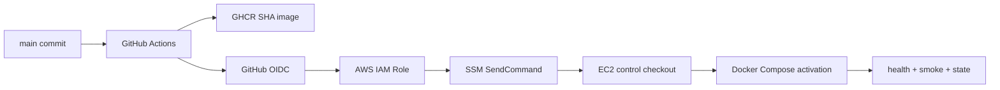

# GitHub Actions에서 EC2까지의 배포

배포 자동화는 workflow 한 번으로 container를 교체하는 일이 아니다. 어떤 source commit을 build했고, 누가 Production 실행을 승인했으며, 어느 AWS identity가 어떤 instance의 어떤 command를 실행했고, 실패하면 어느 상태로 돌아가는지를 추적하는 control system이다.

PawCycle과 같은 EC2·Docker Compose 구조에서는 다음 경로를 만들 수 있다.

## Build identity와 release identity

Backend와 Frontend를 같은 commit SHA tag로 build하면 한 release의 application 조합을 추적할 수 있다. 그러나 tag는 registry에서 다시 가리킬 수 있으므로 image의 OCI revision label과 registry digest를 함께 확인한다. 서버가 이전에 같은 SHA의 digest를 기록했다면 새 pull 결과와 비교해 drift를 막을 수 있다.

`latest` tag나 Backend·Frontend의 서로 다른 SHA를 허용하면 현재 실행 중인 조합을 재현하기 어렵다. Base image도 mutable tag만 사용하면 같은 application SHA에서 다른 runtime content가 생길 수 있어 digest pinning을 검토한다.

## Secret과 configuration materialization

Secret을 image나 Git repository에 넣지 않는다. SSM Parameter Store의 SecureString을 instance role로 읽어 root-only runtime file에 materialize할 수 있다. 이때 다음 경계를 둔다.

- parameter prefix와 Region을 제한한다.
- 누락, 빈 값, 여러 줄과 예상하지 않은 key를 거부한다.
- MySQL root credential을 Backend file에 넣지 않는다.
- file과 directory permission을 확인한다.
- 임시 bundle을 완성한 뒤 symlink를 원자적으로 교체한다.
- 동시 materialization을 lock으로 막는다.
- stdout와 shell trace에 값을 출력하지 않는다.

이 구조는 Secret을 Git에서 분리하지만 EC2 disk에는 복호화된 runtime file이 존재한다. Host root가 침해되면 읽힐 수 있으므로 host 권한과 disk를 안전하게 관리해야 한다.

## Preflight, activation과 rollback

Preflight는 running service를 바꾸기 전에 실패해야 한다. Target SHA, image 존재와 digest, runtime bundle, Compose config, 현재 release의 복귀 가능성, DB migration boundary를 확인한다. Activation은 검증한 local image만 사용하고 dependency health, Nginx route와 HTTP smoke를 통과한 뒤 마지막에 current release state를 기록한다.

Rollback은 Application image rollback과 Database restore를 구분한다. 이전 image로 되돌려도 이미 적용된 destructive schema migration이 자동으로 되돌아가는 것은 아니다. Target과 current commit의 Production contract가 다르면 자동 rollback을 멈추고 별도 migration·restore 판단을 받아야 한다.

같은 SHA에서 runtime만 Docker MySQL에서 RDS로 바꾸는 경우도 있다. “현재 SHA와 target SHA가 같으니 아무것도 하지 않는다”는 최적화가 있으면 runtime activation이 막힐 수 있다. 반대로 same-SHA를 무조건 허용하면 승인되지 않은 control script나 Secret 변경이 숨어들 수 있다. Current application SHA, old/new control SHA, contract SHA와 quiesce 상태를 따로 검증해야 한다.

## 실패를 계층별로 나누기

| 실패 위치 | 대표 증상 | 우선 확인 |
| --- | --- | --- |
| GitHub/OIDC | Role assume 실패 | token subject, audience, trust policy, Environment |
| SSM control plane | command 전송 실패 | target tag, Role permission, document/version |
| SSM Agent | invocation exit 1·빈 output | generated script, shell, user/env, filesystem ownership |
| Registry | pull/digest 실패 | image visibility, SHA tag, digest drift |
| Compose | config/health 실패 | runtime file, network, volume, dependency health |
| Application | smoke 실패 | logs, migration, datasource, route |
| State publication | service는 떴지만 marker 실패 | atomic write, current/previous/contract state |

배포 workflow 성공은 Production Verified와 같지 않다. Command가 success여도 external HTTPS와 사용자 기능, DB target과 state marker를 별도로 확인해야 한다. PawCycle의 실제 OIDC·SSM 구조와 여섯 번의 SSM Document 수정은 [[06. SSM 배포 자동화 Troubleshooting]]에 정리했다.
