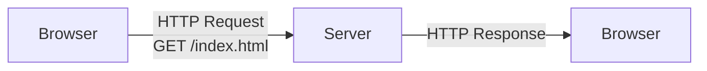
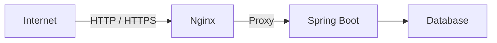
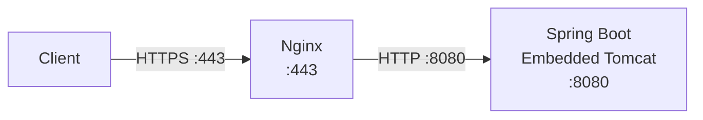
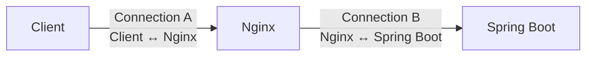
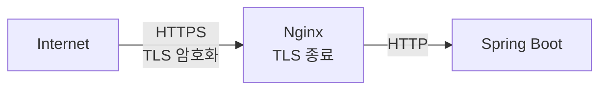

### 웹 서비스를 제공한다는 것은 결국 HTTP 요청을 받을 프로그램이 있다
```text
https://example.com/index.html
```
브라우저에서 위 주소를 입력하면
- DNS를 통해 서버의 IP 주소를 알어내고 TCP 연결을 만든다.
- HTTPS라면 TLS 연결까지 만들어지고 브라우저는 서버 측에 HTTP 요청을 전달한다.
- 요청을 받은 컴퓨터 안에는 그 **요청을 읽고 HTTP 규칙에 맞게 응답을 만들어 줄 프로그램**이 실행되고 있어야 한다.

우리는 일상적으로 "서버"라는 말을 두 가지 의미로 섞어서 사용한다. EC2 같은 컴퓨터 자체를 서버라고 부르기도 하지만, Nignx나 Tomcat처럼 요청을 받아 서비스를 제공하는 **서버 프로그램**도 서버라고 부른다.

이 둘을 구분해야 한다. EC2 한대 안에서도 Nginx 프로세스와 Spring Boot 프로세스가 동시에 실행되기 때문이다.

### 웹 서버는 왜 등장했을까
초기 웹에서 가장 기본적인 작업은 **클라이언트가 요청한 문서를 찾아 반환**하는 것이었다. 예를 들어 브라우저가 `/hello.html`을 요청했다면 서버는 디스크에 해당 파일을 찾아 HTTP 응답으로 돌려주면 된다.  

HTML, CSS, JavaScript처럼 요청하기 전에 이미 만들어져 있는 파일을 보통 정적 콘텐츠(static content)**라고 한다. "정적"은 요청이 들어올 때마다 프로그램이 내용을 새로 계산해서 만들어내지 않아도 된다는 뜻에 가깝다.

이런 HTTP 요청을 받아 파일이나 HTTP 응답을 제공하는 프로그램이 **Web Server, 웹 서버**다

> [Web Server vs WAS(Web Application Server)](https://cobook.tistory.com/107)


### 웹은 단순히 파일만 내려주는 시스템으로 끝나지 않는다
게시판을 보면, 사용자가 `/posts/1`을 요청했다고 해서 서버의 디스크에 반드시 `posts/1.html`이라는 완성된 파일이 존재하는 것은 아니다.  

이처럼 요청이 들어온 뒤 프로그램을 실행하여 결과를 만드는 콘텐츠를 **동적 콘텐츠(dynamic content)**라고 부른다. 로그인 요청을 처리하거나, DB에서 회원을 조회하거나 같은 현재 시각에 따라 다른 결과를 반환하는 작업이 여기에 해당한다.

웹이 단순 문서 전송에서 애플리케이션 실행으로 발전하면서 웹 서버 외에 **애플리케이션을 실행하는 역할**이 중요해졌다. 


### Web Server와 WAS를 “정적 vs 동적”만으로 외우면 왜 부족할까
- 웹 서버(Web Server)는 **외부 HTTP 트래픽을 받아 HTTP 수준에서 처리하는 역할**에 강한 프로그램
- 애플리케이션 서버(Web Application Server)는 **우리의 애플리케이션 코드를 실행하여 비즈니스 결과를 만드는 역할에 중심**을 둔 프로그램

```image-grid
![[Pasted image 20260915140628.png]]
![[Pasted image 20260915140635.png]]
```

웹 서버와 Spring Boot의 Controller은 **HTTP 요청을 받는다**는 공통점이 있지만, 웹 서버는 애플리케이션 밖의 HTTP 트래픽 처리, Controller는 애플리케이션 안의 요청-기능 연결을 한다.

### Spring Boot만으로 서비스하면 안 될까
```Bash
java -jar app.jar
```
Spring Boot에서 위처럼 애플리케이션을 실행하면 내장 Tomcat이 HTTP 연결을 받을 수 있다.

그러면 여기서 궁금증이 생긴다. Spring Boot 혼자서 서비스할 수 있는데도 운영 환경에서는 왜 앞에 Nginx 같은 프로그램을 하나 더 두는 경우가 많을까?

### 애플리케이션이 성장하면 "비즈니스 로직이 아닌 HTTP 입구의 일"이 많아진다
	개발 초기에는 애플리케이션이 요청을 받고 Controller를 실행해서 응답하면 충분해 보인다. 하지만 운영 환경으로 넘어가면 사용자의 요청이 Controller에 도착하기 전에도 처리해야 할 문제가 계속 생긴다.

```
https://api.example.com
```
사용자는 `8080`같은 애플리케이션 내부 포트를 알 필요가 없으며, HTTPS를 위한 TLS 인증서도 관리해야 한다. 트래픽이 늘어나 Spring Boot 인스턴스를 여러 대 실행한다면 어떤 인스턴스로 요청을 전달할지도 결정해야 하고, 큰 이미지나 JavaScript 파일을 어떻게 제공할지도 고민해야 한다.

특정 URL에 대한 접근을 막거나, 업로드 크기를 제한하거나, 요청 기록을 남기거나 등의 백엔드 문제도 생긴다. 이것들은 비즈니스 규칙은 아니지만 서비스를 운영하기 위해 필요한 HTTP 트래픽 관리 문제다.

- 외부에서 들어오는 HTTP/HTTPS 트래픽을 애플케이션보다 앞에서 받아 제어할 수 있는 별도의 계층을 만드는 것이다.
- **웹 서버/Nginx 쪽**: 모든 요청에 공통으로 적용되는 네트워크·HTTP 수준 정책  
    예: 최대 요청 크기, IP 차단, 특정 외부 경로 차단, access log, timeout, rate limit
- **Spring Boot 쪽**: 사용자·권한·도메인 상태를 알아야 판단할 수 있는 정책  
    예: 관리자만 `/admin` 접근, 회원 등급별 업로드 제한, 특정 게시글 작성자만 수정 가능


### Reverse Proxy가 필요해진다
Nginx를 Spring Boot 앞에 놓으려면 Nginx가 요청을 받아 Spring Boot로 전달해야 한다. 여기서 등장한 개념이 [**Reverse Proxy, 역방향 프록시**](https://nginxstore.com/training/nginx-reverse-proxy-%EB%A1%9C-%EC%84%A4%EC%A0%95%ED%95%98%EA%B8%B0/)다.

Proxy(대신하다)는 **클라이언트와 서버가 직접 통신하지 않고 중간 프로그램이 대신 통신하는 구조**이다.

Forward Proxy에서는 프록시가 클라이언트 쪽을 대표한다. 외부 서버에서는 여러 클라이언트 대신 Proxy가 요청하는 형태가 될 수 있다.
```
Client A ──┐
Client B ──┼──→ Forward Proxy ──→ Internet Server
Client C ──┘
```

Reverse Proxy에서는 위치가 반대다. 서버들 앞에 Proxy가 서서 **백엔드 서버를 대표해서 외부 요청을 받는다.** 클라이언트는 뒤에 애플리케이션 서버가 한 대인지 세 대인지 알 필요가 없다. Reverse Proxy가 어떤 서버로 요청을 전달할지를 결정하고, 응답도 다시 받아 클라이언트에게 전달한다.
```
                         ┌── Application Server A
                         │
Client ──→ Reverse Proxy ├── Application Server B
                         │
                         └── Application Server C
```

```image-grid
![[Pasted image 20260915144003.png]]
![[Pasted image 20260915144010.png]]
```

### Nginx 정의
- HTTP 요청을 받아 처리할 수 잇는 웹 서버
- 다른 애플리케이션 서버로 요청을 전달하는 Reverse Proxy
- 여러 서버에 트래픽을 나누는 Load Balancer
- 응답을 저장하는 HTTP Cache
Nginx를 하나의 역할로 고정해서 이해해서는 안되며, 사용자가 어떤 설정을 하느냐에 따라 같은 Nginx 프로세스가 정적 파일 서버가 될 수도 있고, Spring Boot 앞의 Revrese Proxy가 될 수도 있으며, Load Balancer로 동작할 수도 있다.

### Spring Boot 앞의 Nginx는 실제로 무엇을 하는가

클라이언트는 Spring Boot의 `8080`포트에 직접 접속하지 않는다.
1. Nginx가 먼저 TCP 연결과 HTTP 요청을 받는다.
2. HTTPS를 Nginx에서 종료하도록 구성했다면 TLS 처리는 이 지점에서 이루어진다.
3. Nginx는 자신의 설정을 확인한 뒤 요청을 백엔드 Spring Boot로 전달한다.

```Nginx
server {
    listen 443 ssl;
    server_name api.example.com;

    location / {
        proxy_pass http://127.0.0.1:8080;
    }
}
```
**`api.example.com`의 443 포트로 들어오는 요청을 받고, `/`에 해당하는 요청을 내부의 `127.0.0.1:8080` 서버로 전달한다**는 의미다.

`proxy_pass`는 실제로 Nginx의 HTTP Proxy Module이 다른 서버로 요청을 전달하도록 지정하는 설정이다. 즉,**현재 Nginx가 받은 요청을 다른 서버로 전달하라**는 의미다.


[NGINX 공식 — ngx_http_proxy_module](https://nginx.org/en/docs/http/ngx_http_proxy_module.html)

### Nginx는 요청을 "그대로 통과시키는 파이프"가 아니다
Reverse Proxy를 보면 Nginx를 단순한 중계기로 생각하기 쉽다. 하지만 실제로는 **클라이언트와 Nginx 사이의 연결, Nginx와 Spring Boot 사이의 연결은 서로 구분**된다.


이 구조 때문에 Nginx가 클라이언트 요청을 받아 Header를 수정하거나, 요청을 버퍼링하거나, timeout을 적용하거나, 응답을 캐싱하거나, 다른 백엔드로 전달할 수 있다.

Nginx를 단순히 “앞에 하나 붙이는 프로그램”으로만 보면 안 되고, HTTP 요청과 응답이 실제로 Nginx를 한 번 더 통과하기 때문에 Nginx의 buffering, timeout, gzip, connection 설정 등이 애플리케이션의 통신 동작에 영향을 줄 수 있다.  [우아한형제들 기술블로그 — BFF 서버에 SSE를 도입한 이유](https://techblog.woowahan.com/26507/?utm_source=chatgpt.com), [Tecoble — Spring에서 Server-Sent Events 구현하기](https://tecoble.techcourse.co.kr/post/2022-10-11-server-sent-events/?utm_source=chatgpt.com)

즉, **Proxy를 하나 추가했다 = Nginx라는 중간 HTTP 처리 지점을 하나 추가했다.**

### 정적 파일을 왜 계속 Nginx의 대표 사례로 등장할까
```
                       ┌── /images/*
                       │
                       ▼
Client ──→ Nginx ──→ Static File
             │
             │ /api/*
             ▼
        Spring Boot
```

Nginx는 해당 요청을 직접 파일에 매핑할 수 있다.
- 불필요한 작업 경로를 줄일 수 있다.
- 이미 존재하는 파일을 전달하는 데 Spring MVC의 비즈니스 로직을 통과시킬 필요가 없다면 그 요청을 앞단에서 끝낼 수 있기 때문이다.

올리브영 기술 블로그에서는 실제 백오피스 프론트엔드 최적화 과정에서 Nginx를 이용한 정적 파일 제공, gzip 압축, 정적 파일 캐싱을 사용했다. [올리브영 테크블로그 — B2B 물류 스쿼드 백오피스 프론트엔드 성능 개선](https://oliveyoung.tech/2023-09-25/oliveyoung-b2b-logistics-front-improvement/?utm_source=chatgpt.com)

이미지를 WAS에서 변환한 뒤 Nginx의 Reverse Proxy Cache에 저장하고, 이후 동일한 요청은 WAS까지 보내지 않고 Nginx에서 응답하도록 변경했다. [Tecoble — 이미지 스토리지 서버 구축 및 최적화](https://tecoble.techcourse.co.kr/post/2022-09-13-image-storage-server/?utm_source=chatgpt.com)


### HTTPS 처리도 Nginx 앞단에 두는 이유가 뭘까
HTTPS는 HTTP 메시지를 그대로 인터넷으로 보내는 것이 아니라 [TLS]{온라인 네트워크에서 데이터를 안정하게 주고받기 위한 암호화 프로토콜}라는 암호화 계층 위에서 전송한다. 따라서 서버는 인증서와 개인 키를 가지고 TLS Handshake를 처리해야 한다. [그림으로 쉽게 보는 HTTPS, SSL, TLS](https://brunch.co.kr/@swimjiy/47)

Nginx가 외부 연결을 받는 구조에서는 TLS를 Nginx에서 처리한 뒤 내부 애플리케이션으로 HTTP 요청을 전달하도록 구성할 수 있다. [TLS(Transport Layer Security)](https://docs.tosspayments.com/resources/glossary/tls)

이를 TLS Termination(TLS 종료)라고 한다. "종료"라고 부르는 이유는 **클라이언트와 형성한 TLS 연결이 Nginx에서 끝나고, 뒤쪽 서버와는 별도의 연결을 만들기 때문**이다. (내부 구간까지 HTTPS로 다시 암호화하는 구성도 가능하다.)

### 왜 Nginx가 많이 사용하게 됐을까
2000년대 초 웹 트래픽이 빠르게 증가하면서 하나의 서버가 매우 많은 연결을 동시에 유지해야 하는 문제가 중요해졌다. 이를 대표하는 표현이 **C10K Problem**이다.

C10K 문제는 서버 한 대가 **10,000개 이상의 동시 연결(concurrent connections)을 어떻게 효율적으로 처리할 것인가**라는 문제다.

서버가 연결 하나를 받을 때마다 운영체제의 Thread나 Process 하나를 연결 전용으로 사용하는 구조를 단순하게 생각해보자.
```
Connection 1  ──→ Thread 1
Connection 2  ──→ Thread 2
Connection 3  ──→ Thread 3
Connection 4  ──→ Thread 4
...
Connection N  ──→ Thread N
```
구조 자체는 이해하기 쉽다. 한 Thread가 한 Client의 요청을 담당하면 프로그램 흐름도 직관적으로 작성할 수 있다.

이 방식은 이해하기 쉽지만, 동시 연결 수가 많아지면 문제가 생긴다. 웹 연결은 CPU 연산보다 **클라이언트 입력, 백엔드 응답, 네트워크 전송 가능 상태를 기다리는 시간**이 많은데, 기다리는 연결마다 Thread를 유지하면 메모리가 낭비된다.

그런데 연결 수와 함께 Thread나 Process가 계속 증가하면 각 실행 단위가 사용하는 메모리뿐 아니라 운영체제가 어떤 Thread를 CPU에서 실행할지 바꾸는 **Context Switch, 문맥 교환** 비용도 함께 증가한다.

Nginx는 이를 해결하기 위해 **적은 수의 Worker가 많은 연결을 Event-driven 방식으로 관리**하도록 설계되었다.
```
Client 1 ─┐
Client 2 ─┤
Client 3 ─┼─→ Worker
Client 4 ─┤
Client 5 ─┘
```
 - Worker는 연결마다 계속 붙어서 기다리는 것이 아니라, **데이터가 도착하거나 응답을 보낼 수 있는 등 실제 처리할 이벤트가 발생했을 때 작업**한다.

> **Nginx는 연결마다 Thread를 하나씩 두는 방식보다 적은 수의 Worker로 많은 네트워크 연결을 효율적으로 처리할 수 있었기 때문에 대규모 동시 연결 환경에서 강점을 가졌다.**

### Event-driven, Non-blocking 방식
Event-driven을 그대로 번역하면 **이벤트 기반**이고, 여기서 Event는 “이 연결에서 읽을 데이터가 생겼다”, “새 연결이 들어왔다”, “이 Socket에 데이터를 쓸 수 있다”처럼 **지금 처리할 일이 생겼다는 사건**을 의미한다.
[](https://grip.news/archives/1304/)

한 Worker가 하나의 연결을 맡아서 계속 기다리는 구조가 아니라, **많은 Connection을 관찰하면서 실제 처리할 수 있는 Connection이 생기면 그 작업을 수행**한다.
```
                    ┌── Connection A
                    │      현재 읽을 데이터 없음
                    │
                    ├── Connection B
                    │      데이터 도착 → 처리
                    │
Nginx Worker ───────┼── Connection C
                    │      현재 대기
                    │
                    ├── Connection D
                    │      전송 가능 → 처리
                    │
                    └── Connection E
                           현재 대기
```
Connection A에 데이터가 아직 도착하지 않았다고 해서 Worker 전체가 그곳에서 멈춰 있지 않는다. A를 기다리는 동안 B나 D처럼 처리 가능한 다른 Connection의 이벤트를 처리할 수 있다.

이것이 **Non-blocking I/O, 비차단 입출력**과 이어진다. 
- 데이터가 준비될 때까지 현재 실행 흐름 전체가 멈추는 방식이 아닌
- **준비되지 않았다면 다른 일을 하고 운영체제가 해당 I/O의 상태 변화를 알려주면 다시 처리하는 방향이다.**
```image-grid
![[Pasted image 20260915164403.png]]
![[Pasted image 20260915164408.png]]
```

### Master와 Worker는 왜 나누어져 있을까
```
nginx: master process
    │
    ├── nginx: worker process
    ├── nginx: worker process
    ├── nginx: worker process
    └── nginx: worker process
```
Master Process는 실제 HTTP 요청을 하나씩 처리하는 역할에 집중하지 않는다. 설정 파일을 읽고 검증하고, 필요한 포트에 bind하며, Worker Process를 만들고 관리하는 것이 핵심 역할이다.

반면 Worker Process가 실제 Client Connection을 처리하고, 파일을 읽고 쓰며, 필요하다면 Backend Server와 통신한다.

이 구조는 단순 성능만을 위한 것이 아니다. 설정을 변경한 뒤 `nginx -s reload`를 실행하면 Master가 새 설정을 읽어 새로운 Worker를 만들고, 기존 Worker는 이미 처리 중이던 요청을 마친 뒤 종료하는 **Graceful Reload**가 가능하다.

예를 들어 Spring Boot 애플리케이션을 `8080`과 `8081` 두 포트에 번갈아 실행한다고 생각해보자. 새 버전을 8081에 먼저 실행하고 정상 동작을 확인한 뒤 Nginx의 Proxy 목적지만 8080에서 8081로 바꾸면, Client의 URL은 그대로 유지하면서 실제 요청을 받는 Spring Boot 인스턴스를 교체할 수 있다.
```
                      ┌── Spring Boot BLUE :8080
Client ──→ Nginx ─────┤
                      └── Spring Boot GREEN :8081
```
따라서 Nginx의 Reverse Proxy는 단순히 “요청을 Spring으로 전달한다”에서 끝나지 않는다. 

**클라이언트와 실제 애플리케이션의 위치를 분리해 놓기 때문에, 뒤의 서버를 교체하거나 늘리거나 나누더라도 외부 Client에게 동일한 진입점을 제공할 수 있다.**


