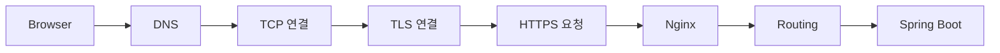
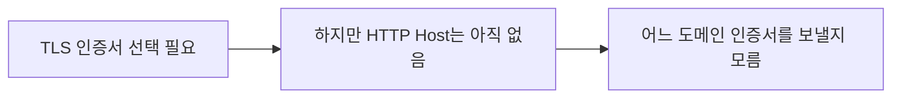
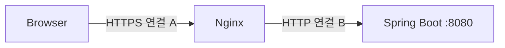

```
https://api.example.com/posts/1
```
사용자가 브라우저에 위 URL을 입력하였을 때, 최종 목적은 Spring Boot의 `/posts/1` Controller를 실행하는 것이다. 하지만 브라우저는 `Controller`가 어디 있는지 모르며, Nginx가 설치되어 있다는 사실조차 알 필요가 없다.


- **DNS**:  어느 컴퓨터로 갈 것인가
- **TCP**: 그 컴퓨터의 프로그램과 데이터를 어떻게 안정적으로 주고받을 것인가
- **TLS**: 그 상대를 믿을 수 있는지와 통신 내용을 어떻게 보호할 것인가
- **HTTP**: 실제로 어떤 지원을 요청할 것인가
[NAVER D2 — 최신 브라우저의 내부 살펴보기 2: 내비게이션 과정에서 일어나는 일](https://d2.naver.com/helloworld/9274593?utm_source=chatgpt.com)

### 연결부터 HTTPS까지
`api.example.com`이라는 문자열만으로는 인터넷 패킷을 어디에 보내야 할지 결정할 수 없다. 인터넷에서 목적지를 찾을 때는 IP 주소가 필요하기 때문에 브라우저는 [DNS](https://www.ibm.com/kr-ko/think/topics/dns)를 통해 도메인 이름에 대응하는 IP 주소를 알아낸다.

```
api.example.com → 203.0.113.10
```
- 이제 브라우저는 목적지 컴퓨터가 어디 있는지 알게 되었다. 
- 하지만 IP 주소만으로는 충분하지 않다. 한 컴퓨터에서는 Nginx, SSH 서버, MySQL 등 여러 네트워크 프로그램이 동시에 실행될 수 있으므로 **어느 프로그램과 통신할 것인지도 지정**해야 한다.

그 역할을 하는 것이 **Port, 포트**이고 HTTPS의 기본 포트는 `443`이다.

HTTP/1.1이나 HTTP/2를 HTTPS로 사용하는 일반적인 흐름에서는 브라우저가 먼저 `203.0.113.10`과 TCP 연결을 만든다.
```
203.0.113.10:443
        │
        └─ Nginx가 이 포트에서 연결을 기다리는 중
```

[TCP]{데이터를 순서대로 전달하고 손실된 데이터를 전송하는 등의 기능을 제공한다.} 자체는 통신 내용을 암호화하거나 "현재 연결한 서버가 정말 `api.example.com` 인가?"를 확인해 주지는 않는다.

일반 HTTP를 그대로 보낸다면 네트워크 중간에 있는 공격자가 상황에 따라 내용을 읽거나 변경할 수 있다. 로그인 요청의 경우 Cookie나 Credential이 노출될 수 있고, 서버가 보내는 응답 자체가 변조될 가능성도 있다.

**TLS(Transport Layer Security, 전송 계층 보안)** 는 이런 신뢰할 수 없는 네트워크 위에서 안전하게 통신하기 위해 사용되는 보안 프로토콜이다. TLS가 해결하려는 핵심 문제는 서로 연결되어 있다.
- **기밀성(confidentiality)**: 통신 내용을 제3자가 읽을 수 없다.
- **무결성(Integrity)**: 전송 중 내용이 몰래 변경되었는지 확인
- **인증(Authentication)**: 현재 연결된 상대가 실제 원하는 서버인지 확인

[](https://www.ttukttak-coding.dev/posts/29-https-request-flow-and-tls-handshake?utm_source=chatgpt.com)

### TLS 연결은 무엇을 만드는가

새로운 물리적인 연결을 하나 더 만든다는 뜻은 아니다. HTTP/1.1·HTTP/2 기준에서는 이미 만든 TCP 연결 위에서 이후 **데이터를 어떤 방식으로 암호화할지 협상하고, 서버의 신원을 확인하고, 실제 데이터를 암호화할 키를 만들어 TLS 상태를 구성**한다는 의미다.

이 초기 협상 과정을 **TLS Handshake, TLS 핸드셰이크**라고 한다.

![[Pasted image 20260916141524.png|400]]<center>[TLS Handshake와 인증서 구조](https://somaz.tistory.com/412)</center>

- `ClintHello`에는 자신이 지원하는 TLS 버전과 암호화 방식, 키 합의에 필요한 정보 등이 담긴다.
- `ServerHello`에서 사용할 TLS 설정을 결정하고 키 합의를 진행하며, 이후 자신의 인증서와 인증을 위한 정보를 전달한다.
- TLS 1.3에서 인증서를 사용하는 일반적인 서버 인증 방식에서는 `Certificate`, `CertificateVerify`, `Finished` 등의 메시지가 사옹된다.

### 인증서는 왜 필요한가

인증서의 매우 중요한 역할은 **현재 접속한 서버가 내가 접속하려던 서버가 맞는지 판단할 근거를 제공하는 것**이다.

사용자는 `api.example.com`에 접속하려고 할 때, 공격자가 네트워크 중간에서 자신에게 연결을 돌려놓고 "내가 `api.example.com` 이다." 라고 주장한다면 단순히 암호화만 해서는 문제가 해결되지 않는다. 그러면 사용자는 공격자와 안전하게 암호화 통신을 하게 되는 문제가 발생한다. 이런 공격을 **중간자 공격(Man-in-the-Middle Attack, MITM)** 이라고 한다.

그래서 서버는 TLS 인증서를 제시한다. 인증서에는 서버의 공개키와 인증 대산 도메인 등에 관한 정보가 들어 있고, 이 정보는 신뢰할 수 있는 **CA(Certificate Authority, 인증 기관)** 가 디지털 서명한다.
- 브라우저나 운영체제에는 신뢰할 수 있는 Root CA 정보가 미리 들어 있다.
- 서버가 보내 온 인증서 체인을 따라가면서 이 인증서를 신뢰할 수 있는지 검증할 수 있다.
- 인증서는 현재 접속하려는 호스트 이름에 유효한지, 유효 기간은 지나지 않았는지 등의 조건도 확인한다.

인증서 안에는 외부에 공개해도 되는 **공개키(Public Key)** 가 포함될 수 있지만, 그 공개키와 쌍을 이루는 개인키(Private Key)는 서버만 가지고 있어야 한다. TLS 1.3에서는 서버가 `CertificateVerify` 과정에서 해당 개인키를 실제로 가지고 있음을 서명을 통해 증명한다.

그리고 실제 HTTP 요청과 응답 전체를 서버의 공개키로 매번 암호화하는 것은 아니다. TLS Handshake 과정에서 양쪽이 공유할 수 있는 비밀을 만들고, 여기서 파생된 **대칭키 기반의 세션 키**를 이용해 이후 애플리케이션 데이터를 효율적으로 보호한다. [](https://engineering.linecorp.com/ko/blog/best-practices-to-secure-your-ssl-tls?utm_source=chatgpt.com)

### SNI는 왜 필요한가
```Nginx
server {
    listen 443 ssl;
    server_name api.example.com;

    ssl_certificate     /cert/api/fullchain.pem;
    ssl_certificate_key /cert/api/privkey.pem;
}

server {
    listen 443 ssl;
    server_name admin.example.com;

    ssl_certificate     /cert/admin/fullchain.pem;
    ssl_certificate_key /cert/admin/privkey.pem;
}
```

하나의 Nginx 서버가 두 서비스를 동시에 운영한다고 가정하자. 두 도메인이 DNS에서 같은 IP 주소를 가리킬 수도 있다.

```
api.example.com   ─┐
                   ├─→ 203.0.113.10:443
admin.example.com ─┘
```
HTTP만 사용한다면 큰 문제가 없다. TCP 연결을 만든 뒤 브라우저가 HTTP 요청을 보내면서 `Host` Header를 전달할 수 있기 때문이다.

하지만 HTTPS는 HTTP 요청을 안전하게 보내려면 먼저 **TLS Handshake가 끝나야 한다.** 그런데 서버는 TLS Handshake 중에 클라이언트에게 인증서를 제시해야 한다. 아직 HTTP 요청이 오지 않았으므로 `Host` Header도 볼 수 없다.


브라우저는 `api.example.com`에 접속하려 하지만, 실제 TCP 연결은 DNS로 알아낸 서버의 IP 주소인 `203.0.113.10`의 `443` 포트에 연결하는 방식으로 이루어진다. 

따라서 Nginx는 TCP 연결만 보고는 브라우저가 어떤 도메인에 접속하려는지 알 수 없다. 같은 IP와 Port에 여러 HTTPS 사이트가 있다면 이것만 가지고는 `api.example.com` 인증서를 보낼지 `admin.example.com` 인증서를 보낼지 결정하기 어렵다.

<details>
<summary>부가 설명</summary>

여러 도메인이 같은 IP를 가리킬 수 있다.

```text
api.example.com   ───┐
admin.example.com ───┼── DNS → 203.0.113.10
www.example.com   ───┘
```

Nginx 한 대에서 여러 웹 사이트를 운영하는 **가상 호스팅(Virtual Hosting)**이 대표적이다.

</details>

**SNI(Server Name Indication, 서버 이름 표시)** 는 이 순서 문제를 해결하기 위해 TLS에 추가된 확장이다.
- 클라이언트가 HTTP 요청을 보내기 전에, TLS Handshake의 첫 메시지인 `ClientHello`에 자신이 접속하려는 호스트 이름을 담아 보내는 것이다.
```
ClientHello
    SNI = api.example.com
```
Nginx는 이제 HTTP 요청이 오기 전에도 사용자가 `api.example.com`에 접속하려 한다는 사실을 알 수 있다. 따라서 해당 도메인의  TLS 설정과 인증서를 선택해 Handshake를 계속할 수 있다.

![[Pasted image 20260916153258.png|400]]
- `ClientHello` 안에 `server_name`이 있고, HTTP Request는 그보다 훨씬 뒤에 있다.

### SNI와 Host는 다르다
| 구분            | SNI                                 | `Host`                 |
| ------------- | ----------------------------------- | ---------------------- |
| 계층            | TLS                                 | HTTP                   |
| 전달 시점         | TLS Handshake의 `ClientHello`        | TLS 연결 이후 HTTP 요청      |
| 주요 목적         | TLS 서버/인증서 선택에 사용                   | HTTP 가상 호스트와 요청 처리에 사용 |
| HTTPS에서 외부 노출 | 일반 SNI는 전통적으로 ClientHello에서 보일 수 있음 | TLS 내부에서 암호화됨          |
```
TLS ClientHello     : SNI  = api.example.com
HTTP Request Header : Host = api.example.com
```
SNI와 Host가 프로토콜적으로 동일한 필드는 아니다. RFS 6066 역시 애플리케이션 프로토콜에서 다른 이름이 제시될 가능성을 언급하며, 두 값이 같아야 한다는 전제에 의존하는 서버 구현은 이를 확인해야 한다고 설명한다.

### Nginx가 요청을 고르는 과정

TLS Handshake가 성공했다면 브라우저와 Nginx 사이에는 이제 암호화된 통신을 할 수 있는 상태가 만들어졌다. 그제야 브라우저가 실제 HTTP 요청을 보낸다.
```
GET /posts/1?page=2 HTTP/1.1
Host: api.example.com
```
```Nginx
server {
    listen 443 ssl;
    server_name api.example.com;

    ssl_certificate     /etc/nginx/certs/fullchain.pem;
    ssl_certificate_key /etc/nginx/certs/privkey.pem;

    location / {
        proxy_pass http://127.0.0.1:8080;
    }
}
```
- `listen 443 ssl`은 Nginx가 HTTPS 연결을 받을 주소와 포트에 관계
- `server_name api.example.com`은 해당 이름을 처리할 가상 서버 설정에 관계

이제 Nginx는 HTTP 요청 내용을 볼 수 있으므로 URI를 기준으로 `location`을 선택할 수 있다.
```Nginx
location /api/ {
    proxy_pass http://127.0.0.1:8080;
}

location /images/ {
    root /var/www;
}
```
`/api/posts/1` 요청이라면 `/api/` 처리 규칙으로 보내고, `/images/logo.png`라면 `/images/` 규칙을 사용할 수 있다. 바로 이 지점에서 Nginx가 단순 TLS 서버를 넘어 **HTTP Router** 역할까지 수행한다.

### Nginx에서 Spring Boot로

```Nginx
location / {
    proxy_pass http://127.0.0.1:8080;
}
```
- 브라우저가 만든 TCP/TLS 연결이 그대로 Spring Boot까지 관통하는 것은 아니다.
- Nginx는 Client와의 연결에서의 서버이고, Spring Boot와의 관계에서는 다시 HTTP 요청을 보내는 **클라이언트**가 된다.


- Reverse Proxy 구조를 이해하는 핵심이다.

Nginx는 브라우저에게 받은 HTTPS 요청을 복호화하고 HTTP 메시지를 해석한 뒤, `proxy_pass`에 지정된 Backend로 별도의 연결을 만들거나 기존 [upstream]{Nginx가 클라이언트의 요청을 전달하는 뒤쪽의 Backend 서버} 연결을 재사용해 요청을 보낸다.

브라우저에서 Nginx까지 HTTPS를 사용했다고 해서 Nginx와 Spring Boot 사이도 반드시 HTTPS여야 하는 것은 아니다. **두 두간은 서로 다른 연결이고 각각 독립적인 보안 정책을 적용할 수 있다는 것**이 핵심이다.

이 때문에 Proxy를 추가하면 원래 Client 정보가 일부 사라질 수 있다는 문제도 생긴다. Spring Boot가 실제 Socket 연결만 보면 요청을 보낸 상대는 사용자의 브라우저가 아니라 Nginx이며, 내부 요청이 `http://127.0.0.1:8080`으로 들어왔다면 원래 사용자가 `https://api.example.com`으로 접근했다는 사실도 그대로는 알 수 없다.

```Nginx
location / {
    proxy_pass http://127.0.0.1:8080;

    proxy_set_header Host $host;
    proxy_set_header X-Forwarded-For $proxy_add_x_forwarded_for;
    proxy_set_header X-Forwarded-Proto $scheme;
}
```
- Nginx에서는 보통 원래 요청 정보를 Header에 전달한다.