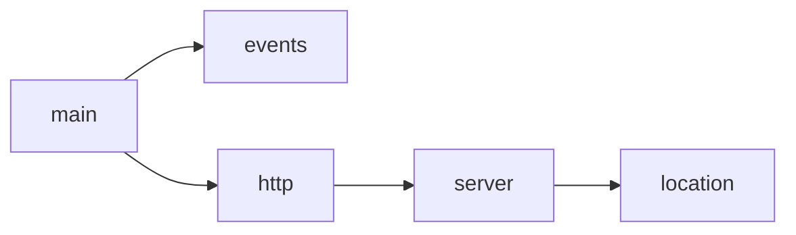

Nginx는 어떻게 "443 포트는 HTTPS로 받고, `api.example.com`은 이 서버 설정을 쓰고, `/api/` 요청은 Spring Boot로 보내라"는 사실을 알고 있을까?

그 정보를 전달하는 것이 **Nginx configuration, 설정 파일**이다.

`nginx.conf`는 Java처럼 요청이 들어올 때마다 위에서 아래로 실행되는 프로그램이 아니다.
- Nginx의 Master Process는 시작하거나 설정을 reload할 때 설정 파일을 읽고 평가하고, 각 모듈이 사용할 설정을 준비한다. 
- 실제 요청이 들어오면 HTTP 처리 모듈은 이미 만들어진 설정을 바탕으로 어떤 `server`, 어떤 `location`을 사용할지 결정한다.

즉, 설정 파일은 단순한 "옵션 모음"보다 **Nginx가 연결과 HTTP 요청을 어떻게 처리할지 미리 정의한 구조**이다.

### Directive와 Context
```Nginx
worker_processes auto;

events {
    worker_connections 1024;
}

http {
    server {
        listen 80;

        location / {
            proxy_pass http://127.0.0.1:8080;
        }
    }
}
```
**Directive(디렉티브, 지시어)**는 Nginx에게 어떤 동작이나 값을 설정하는 하나의 지시라고 생각하면 된다. 예를 들어 아래는 모두 Directive다.
```nginx
worker_processes auto;
worker_connections 1024;
listen 80;
proxy_pass http://127.0.0.1:8080;
```

Directive를 크게 두 형태로 나눈다.
- 이름과 매개변수를 적고 `;`로 끝나는 것을 **simple directive**
- 내부에 다른 Directive를 `{ }`로 포함하는 형태를 **block directive**

다른 Directive를 포함하면서 하나의 설정 영역을 만드는 block을 **Context(컨텍스트, 설정 범위)**라고 부른다. 대표적으로 `events`, `http`, `server`, `location`이 여기에 해당한다.

### 설정 계층


- 참고로 `main` 블록은 직접 작성하는 것이 아니다.

`main`에는 Nginx 프로세스 전체에 영향을 주는 설정이 들어간다. 대표적으로 `worker_processes` 같은 설정이 여기에 위치한다.

`events`는 HTTP 요청 내용이 아니라 **Nginx가 Connection을 처리하는 방식**에 관한 설정 영역이다. 공식 Core Module 문서 역시 `events`를 Connection processing에 영향을 주는 Directive들을 두는 Context로 정의한다.
```nginx
events {
    worker_connections 1024;
}
```
왜 `events`가 `http` 안에 있지 않고 옆에 있는지:
- Connection을 받는 기능은 HTTP에만 필요한 것이 아니기 때문

`http`부터는 HTTP라는 프로토콜을 어떻게 처리할지가 중심이 된다. HTTP 로그 형식, MIME type, 압축, timeout, 여러 가상 서버 같은 HTTP 관련 설정들이 이 영역에 들어간다.

```nginx
http {
    include       /etc/nginx/mime.types;
    access_log    /var/log/nginx/access.log;

    server {
        ...
    }
}
```

하나의 Nginx 프로세스가 여러 사이트나 서비스를 처리할 수 있으므로 `http` 하나 안에 여러 `server`가 들어갈 수 있다.

`location`은 선택된 Virtual Server 안에서 **어떤 URI를 어떤 방식으로 처리할 것인지** 정의한다.
```nginx
server {
    listen 80;
    server_name api.example.com;

    location /api/ {
        proxy_pass http://127.0.0.1:8080;  // Reverse Proxy 역할
    }

    location /images/ {
        root /var/www;
    }
}
```
- `api.example.com`으로 들어온 HTTP 요청을 URL 경로에 따라 서로 다르게 처리하는 Nginx 설정.
- **외부 클라이언트와 내부 Backend 사이에서 서버 측의 대표 창구가 되어 요청을 받고 Backend로 전달**하기 때문에 Reverse Proxy이다.
	- 클라이언트 관점에서는 사실상 Nginx가 서버처럼 보인다.

### Context는 Java Scope와 같지 않다

`http → server → location`처럼 중첩되어 있으므로 Java의 Scope처럼 “부모에 작성한 모든 값이 자식에게 자동 상속된다”고 생각하기 쉽다.

Nginx에서는 **Directive마다 상속 규칙이 다르다.**

예를 들어 어떤 Directive는 상위 Context의 값을 그대로 사용할 수 있지만, 현재 Context에 같은 종류의 Directive를 하나라도 선언하면 상위 값들이 더 이상 상속되지 않는 경우도 있다.

```nginx
http {
    proxy_set_header Host $host;
    proxy_set_header X-Real-IP $remote_addr;

    server {
        listen 80;

        location /api/ {
            proxy_set_header X-Custom-Header hello;

            proxy_pass http://127.0.0.1:8080;
        }
    }
}
```
- `location`에  `proxy_set_header` 하나 더 추가하면 상위의  `proxy_set_header` 목록에서 하나가 추가되는 것이 아니다.
- 현재 `location` Context에 `proxy_set_header`를 직접 선언했기 때문에 상위 Context의 `proxy_set_header` 설정은 상속되지 않는다.

### 파일은 왜 여러 개일까
