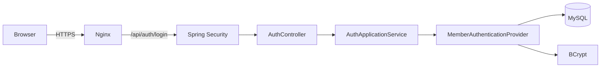
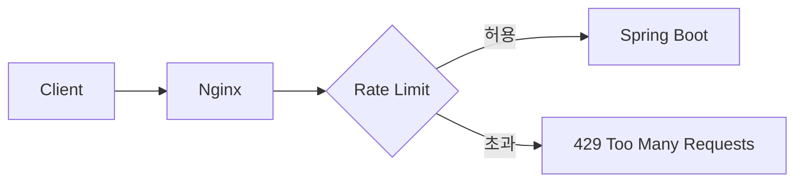
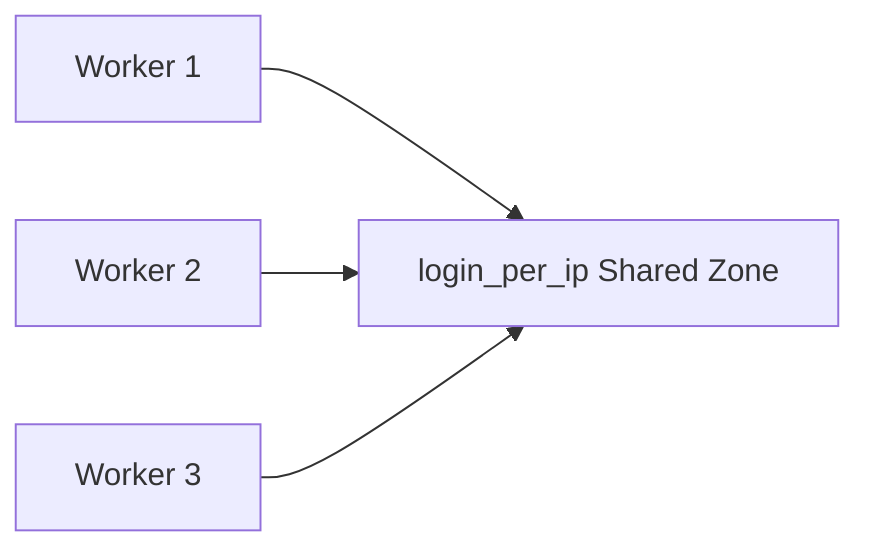

# 로그인 보안과 Rate Limiting

PawCycle의 로그인 보안을 강화할 때 가장 먼저 떠올릴 수 있는 방법 중 하나가 **Rate Limiting(요청 속도 제한)**이다.

단순히 "로그인 요청을 몇 번 이상 막는다"는 설정으로만 보면 이해하기 쉽지만, 실제로는 왜 필요한지부터 이해해야 한다.

PawCycle의 로그인 요청은 현재 대략 다음 경로로 들어온다.



현재 Production에서는 Nginx가 외부 요청의 진입점이고 Spring Boot Backend는 외부에 직접 8080 포트를 공개하지 않는다.

따라서 로그인 요청에 대한 첫 번째 방어를 **Nginx에서 수행할 수 있다.**

---

## 왜 로그인 요청을 제한해야 하는가

로그인은 일반 API 요청과 조금 다르다.

상품 목록 조회를 반복한다고 해서 바로 계정이 탈취되지는 않지만, 로그인 요청은 공격자가 인증 정보를 계속 시험해 볼 수 있는 지점이다.

대표적인 공격은 다음과 같다.

### Brute Force

하나의 계정에 대해 수많은 비밀번호를 계속 대입하는 공격이다.

```text
user@example.com
    +
password1
password2
password3
password4
...
```

비밀번호 후보를 계속 바꿔 가면서 맞는 값을 찾으려고 한다.

### Password Spraying

Brute Force와 반대로, 몇 개의 흔한 비밀번호를 많은 계정에 시험한다.

```text
password123
    ↓
user1@example.com
user2@example.com
user3@example.com
user4@example.com
...
```

특정 계정에 실패 횟수를 많이 쌓지 않으면서 여러 계정을 공격할 수 있다는 특징이 있다.

### Credential Stuffing

다른 서비스에서 유출된 이메일과 비밀번호 조합을 그대로 다시 사용하는 공격이다.

```text
다른 서비스에서 유출

user1@example.com / qwer1234
user2@example.com / hello123
user3@example.com / password!

             ↓

PawCycle 로그인 API에 자동 대입
```

사용자가 여러 서비스에서 같은 비밀번호를 재사용하면 공격이 성공할 수 있다.

---

## 현재 PawCycle 인증에서 이미 잘하고 있는 부분

PawCycle은 존재하지 않는 이메일이라고 해서 즉시 로그인 실패를 반환하지 않는다.

개념적으로 다음과 같은 흐름이다.

```java
Optional<Member> candidate = memberRepository.findByEmail(email);

String passwordHash =
    candidate.map(Member::getPasswordHash)
        .orElse(dummyPasswordHash);

boolean passwordMatches =
    passwordEncoder.matches(password, passwordHash);

if (candidate.isEmpty() || !passwordMatches) {
    throw new InvalidCredentialsException();
}
```

존재하지 않는 계정에도 BCrypt 비교를 수행하는 이유는 **계정 존재 여부를 응답 시간 차이로 추측하기 어렵게 만들기 위해서**다.

잘못 구현하면 다음 차이가 생길 수 있다.

```text
존재하지 않는 이메일
→ DB 조회
→ 바로 실패
→ 매우 빠름

존재하는 이메일 + 틀린 비밀번호
→ DB 조회
→ BCrypt 비교
→ 실패
→ 상대적으로 느림
```

공격자가 요청을 매우 많이 보내고 응답 시간을 통계적으로 비교하면 특정 이메일이 가입되어 있는지를 추측할 가능성이 생긴다.

이런 문제는 **Account Enumeration(계정 열거)**과 연결된다.

PawCycle은 실패 시에도 동일한 `401 INVALID_CREDENTIALS` 응답을 사용하고 dummy BCrypt를 수행해 이 차이를 줄이고 있다.

---

## BCrypt는 왜 일부러 느린가

일반적인 Hash 함수는 빠른 계산이 장점이다.

하지만 비밀번호 저장에서는 너무 빠른 Hash가 오히려 문제가 될 수 있다.

공격자가 비밀번호 Hash를 탈취했다고 가정하면 매우 빠른 Hash는 대량의 비밀번호 후보를 빠르게 시험할 수 있게 한다.

```text
password 후보
      ↓
빠른 Hash
      ↓
Hash 비교
      ↓
다음 후보
```

BCrypt는 일부러 계산 비용을 높인다.

```text
password
   ↓
BCrypt
   ↓
의도적으로 비용이 큰 계산
```

따라서 공격자가 비밀번호 후보를 하나 확인할 때마다 더 많은 CPU 시간을 소비하게 만든다.

하지만 이 성질은 서버에도 동일하게 적용된다.

로그인 요청이 들어올 때마다 PawCycle Backend 역시 BCrypt 계산 비용을 낸다.

그래서 공격자가 로그인 API에 요청을 계속 보내면 두 문제가 동시에 생긴다.

1. 비밀번호를 계속 대입할 수 있다.
2. Backend CPU를 계속 사용하게 만들 수 있다.

즉 로그인 반복 요청은 **인증 공격이면서 동시에 자원 고갈 문제**가 될 수 있다.

---

## Rate Limiting이란

Rate Limiting은 일정 시간 동안 요청할 수 있는 속도를 제한하는 방법이다.

예를 들어 다음 정책을 생각할 수 있다.

```text
IP 203.0.113.10

로그인 요청
→ 일정 속도까지 허용
→ 순간적인 소량 초과는 허용
→ 계속 초과하면 429 Too Many Requests
```

중요한 목적은 모든 요청을 Spring Boot까지 보내지 않는 것이다.



Rate Limit을 Nginx에서 수행하면 초과 요청은 BCrypt까지 도달하지 않는다.

---

## 왜 Nginx에서 먼저 제한하는가

현재 PawCycle 구조에서는 Nginx가 외부 요청의 첫 HTTP 진입점이다.

```text
Internet
   ↓
Nginx :443
   ↓
Spring Boot :8080
```

Spring Boot에서도 Rate Limit을 구현할 수 있다.

하지만 Spring까지 요청이 들어오면 이미 다음 비용이 발생한다.

- TCP/HTTP 처리
- Servlet/Spring Security Filter
- Controller/Application 흐름
- 경우에 따라 DB 조회
- BCrypt

반면 Nginx에서 먼저 막으면 Backend에 도달하기 전에 요청을 차단할 수 있다.

따라서 **대량 로그인 요청에 대한 1차 방어선**으로 적절하다.

다만 Nginx IP Rate Limit 하나만으로 로그인 공격 전체가 해결되는 것은 아니다.

---

## Nginx에서 사용하는 기본 코드

PawCycle에 적용할 수 있는 기본 형태는 다음과 같다.

```nginx
limit_req_zone $binary_remote_addr
    zone=login_per_ip:10m
    rate=10r/m;
```

HTTPS Server 내부에는 로그인 전용 Location을 둔다.

```nginx
location = /api/auth/login {
    limit_req zone=login_per_ip burst=5 nodelay;
    limit_req_status 429;

    proxy_pass http://backend:8080;
    proxy_http_version 1.1;

    proxy_set_header Host $http_host;
    proxy_set_header X-Real-IP $remote_addr;
    proxy_set_header X-Forwarded-For $proxy_add_x_forwarded_for;
    proxy_set_header X-Forwarded-Host $http_host;
    proxy_set_header X-Forwarded-Proto https;

    proxy_read_timeout 60s;
}
```

기존의 일반 API Proxy는 그대로 유지한다.

```nginx
location /api/ {
    proxy_pass http://backend:8080;
    ...
}
```

따라서 로그인만 별도의 제한 정책을 받는다.

---

## `limit_req_zone`

```nginx
limit_req_zone $binary_remote_addr
    zone=login_per_ip:10m
    rate=10r/m;
```

이 Directive는 **요청 제한 상태를 어떻게 저장하고 어떤 속도로 제한할 것인지 정의**한다.

여기에서 세 가지를 분리해서 이해해야 한다.

### `$binary_remote_addr`

Rate Limiter는 "누구의 요청을 묶어서 계산할 것인가"라는 기준이 필요하다.

이를 **Key**라고 생각할 수 있다.

PawCycle의 첫 적용에서는 Client IP를 Key로 사용한다.

```text
IP A → 자신의 제한 상태
IP B → 자신의 제한 상태
IP C → 자신의 제한 상태
```

`$remote_addr`도 Client IP를 의미하지만 문자열 형태다.

`$binary_remote_addr`는 IP를 고정된 Binary 형태로 저장하기 때문에 Shared Memory 사용량을 줄이기 좋다.

IPv4 주소는 4 Byte, IPv6 주소는 16 Byte 크기로 저장할 수 있다.

---

## Shared Memory Zone

```nginx
zone=login_per_ip:10m
```

Nginx는 Client별 요청 상태를 기억해야 한다.

예를 들어:

```text
login_per_ip

IP A → 현재 요청 상태
IP B → 현재 요청 상태
IP C → 현재 요청 상태
```

이 상태를 보관하는 공간이 Shared Memory Zone이다.

여기에서:

- 이름: `login_per_ip`
- 크기: `10m`

이다.

왜 Shared Memory가 필요할까?

Nginx는 여러 Worker Process가 요청을 처리할 수 있다.



Worker마다 별도 제한 정보를 가지면 공격 요청이 여러 Worker에 나뉘면서 동일한 제한을 제대로 적용하기 어렵다.

그래서 Worker들이 같은 제한 상태를 공유한다.

---

## `rate=10r/m`

```nginx
rate=10r/m;
```

의미는 다음과 같다.

```text
10 requests / minute
```

하지만 이것을 단순히 다음처럼 이해하면 정확하지 않다.

```text
1분 동안 Counter를 10까지 올리고
다음 1분이 시작되면 0으로 초기화
```

Nginx `limit_req`는 요청 속도를 **Leaky Bucket 방식**으로 제어한다.

---

## Leaky Bucket

물이 빠지는 통을 생각하면 이해하기 쉽다.

```text
요청 요청 요청
 ↓    ↓    ↓

┌──────────┐
│ ● ● ● ●  │
│          │
└────┬─────┘
     ↓
 일정한 속도로 처리
```

요청이 순간적으로 들어와도 처리 가능한 평균 속도는 일정하게 유지한다.

이 개념 때문에 Nginx의 `rate`, `burst`, `nodelay`를 함께 이해해야 한다.

---

## `burst`

```nginx
limit_req zone=login_per_ip burst=5 nodelay;
```

사용자가 로그인할 때 항상 정확히 일정한 간격으로 요청하지는 않는다.

예를 들어:

```text
로그인
→ 비밀번호 오타
→ 다시 로그인
→ Caps Lock 발견
→ 다시 로그인
```

정상 사용자에게도 순간적으로 여러 요청이 발생할 수 있다.

`burst=5`는 이러한 **순간적인 초과 요청을 허용하는 여유 공간**이다.

정리하면:

```text
rate  = 지속 가능한 요청 속도
burst = 순간적으로 허용하는 초과량
```

---

## `nodelay`

burst에 들어온 요청을 어떻게 처리할지도 선택할 수 있다.

기본 방식에서는 초과 요청을 바로 Backend로 보내지 않고 기다리게 할 수 있다.

```text
요청
 ↓
Nginx
 ↓
대기
 ↓
Backend
```

로그인에서는 사용자가 이유 없이 오래 기다리는 UX보다,
허용할 요청은 바로 처리하고 제한을 넘어선 요청은 즉시 거절하는 편이 이해하기 쉽다.

그래서:

```nginx
nodelay
```

를 사용한다.

```text
허용 범위
→ 즉시 Backend

제한 초과
→ 즉시 거절
```

---

## 왜 429인가

```nginx
limit_req_status 429;
```

HTTP `429 Too Many Requests`는 Client가 너무 많은 요청을 보냈다는 의미다.

서버 장애를 의미하는 `503 Service Unavailable`과 구분된다.

```text
503
→ 서버가 요청을 정상 처리할 수 없는 상태

429
→ 요청자가 너무 많은 요청을 보낸 상태
```

따라서 로그인 Rate Limit에는 429가 의미상 더 적절하다.

---

## 왜 Exact Match Location인가

```nginx
location = /api/auth/login {
    ...
}
```

`=`는 Exact Match를 의미한다.

```text
/api/auth/login       → 적용
/api/auth/login/test  → 적용 안 함
/api/products         → 적용 안 함
```

현재 해결하려는 문제는 **로그인 반복 요청**이다.

그래서 모든 `/api/` 요청을 제한하지 않고 로그인 Endpoint만 제한하는 것이 가장 작은 변경이다.

---

## 왜 Account Lock부터 넣지 않는가

한 계정에서 비밀번호를 5번 틀리면 30분 동안 잠그는 방법도 생각할 수 있다.

하지만 공격자가 피해자의 Email을 안다면 일부러 틀린 비밀번호를 반복할 수 있다.

```text
victim@example.com
+ 틀린 비밀번호 반복
↓
계정 잠금
```

공격자가 계정을 탈취하지 않아도 피해자의 로그인을 방해할 수 있다.

즉 Account Lock 기능 자체가 **서비스 거부(DoS)** 수단이 될 수 있다.

그래서 첫 단계에서는 더 작은 해결책인 Nginx IP Rate Limit부터 검토한다.

---

## IP Rate Limiting의 한계

IP 기반 제한은 완벽하지 않다.

공격자가 여러 IP를 사용하면:

```text
IP A → victim@example.com
IP B → victim@example.com
IP C → victim@example.com
IP D → victim@example.com
```

각 IP는 제한 범위 아래에서 요청할 수 있다.

따라서 Nginx IP Rate Limit은 **1차 방어선**이다.

향후 실제 문제가 확인된다면 다음 계층을 추가로 고려할 수 있다.

```text
Nginx IP Rate Limit
        ↓
Spring Account/Email 기반 제한
        ↓
추가 인증 방어
```

하지만 Redis, WAF, 분산 Rate Limiter 등을 처음부터 도입할 이유는 없다.

PawCycle은 현재 단일 Production Application 환경이므로 가장 작은 해결책부터 적용하고 실제 결과를 측정하는 것이 맞다.

---

## PawCycle에서의 판단

현재 문제:

```text
/api/auth/login은 공개 Endpoint
+
로그인마다 BCrypt 비용 발생
+
명시적인 요청 속도 제한 없음
```

가설:

```text
Public Ingress인 Nginx에서 로그인 Endpoint만 제한하면
Backend에 도달하는 자동 반복 요청과 BCrypt CPU 비용을 줄일 수 있다.
```

가장 작은 해결책:

```text
Nginx
/api/auth/login
IP 기반 Rate Limit
```

검증해야 할 것:

- Nginx 설정 문법이 유효한가
- 정상 로그인 요청은 그대로 통과하는가
- 순간적인 소수 retry가 정상 처리되는가
- 초과 요청이 429인가
- 일반 `/api/products`에는 제한이 적용되지 않는가
- Production 적용 후 실제 정상 사용에 영향이 없는가

---

## 참고 자료

### 한글

- [LINE Engineering - 고 처리량 분산 비율 제한기](https://engineering.linecorp.com/ko/blog/high-throughput-distributed-rate-limiter/)
  - Rate Limiting을 왜 사용하는지와 분산 환경에서의 확장 개념을 이해하기 좋다.
  - PawCycle은 아직 분산 Rate Limiter가 필요하다는 의미가 아니라 기본 개념 참고용이다.

- [OWASP Seoul](https://owasp.org/www-chapter-seoul/)
  - OWASP 관련 한글 보안 자료와 번역 자료를 찾을 때 참고한다.

### 공식 문서

- [Nginx - ngx_http_limit_req_module](https://nginx.org/en/docs/http/ngx_http_limit_req_module.html)
  - `limit_req_zone`, `limit_req`, `burst`, `nodelay`, `limit_req_status`의 기준 문서.

- [OWASP Authentication Cheat Sheet](https://cheatsheetseries.owasp.org/cheatsheets/Authentication_Cheat_Sheet.html)
  - 로그인 Throttling과 인증 공격 방어 배경.

- [OWASP Credential Stuffing Prevention Cheat Sheet](https://cheatsheetseries.owasp.org/cheatsheets/Credential_Stuffing_Prevention_Cheat_Sheet.html)
  - Credential Stuffing과 단일 IP 제한의 한계를 이해할 때 참고한다.

---

## 정리

- 로그인 API는 Brute Force, Password Spraying, Credential Stuffing의 주요 공격 지점이다.
- PawCycle은 dummy BCrypt와 동일 실패 응답으로 Account Enumeration을 어느 정도 방어하고 있다.
- BCrypt는 비밀번호 보호에는 유리하지만 로그인 요청 하나당 서버 CPU 비용이 든다.
- Nginx가 Public Ingress이므로 초과 로그인 요청을 Spring Boot 전에 막는 것이 작은 첫 해결책이다.
- `limit_req_zone`은 제한 상태와 속도를 정의한다.
- `$binary_remote_addr`는 Client IP를 Rate Limit Key로 사용한다.
- Shared Memory Zone은 여러 Nginx Worker가 제한 상태를 공유하게 한다.
- `rate`는 지속 요청 속도, `burst`는 순간 여유, `nodelay`는 지연 없이 허용/거절하는 설정이다.
- 429는 "서버 장애"가 아니라 "요청이 너무 많음"을 의미한다.
- IP Rate Limit은 1차 방어선이며 분산 IP 공격까지 완전히 해결하지는 않는다.
- PawCycle에서는 작은 Nginx 설정부터 적용하고 검증한 뒤 추가 보안이 실제로 필요한지 판단한다.
